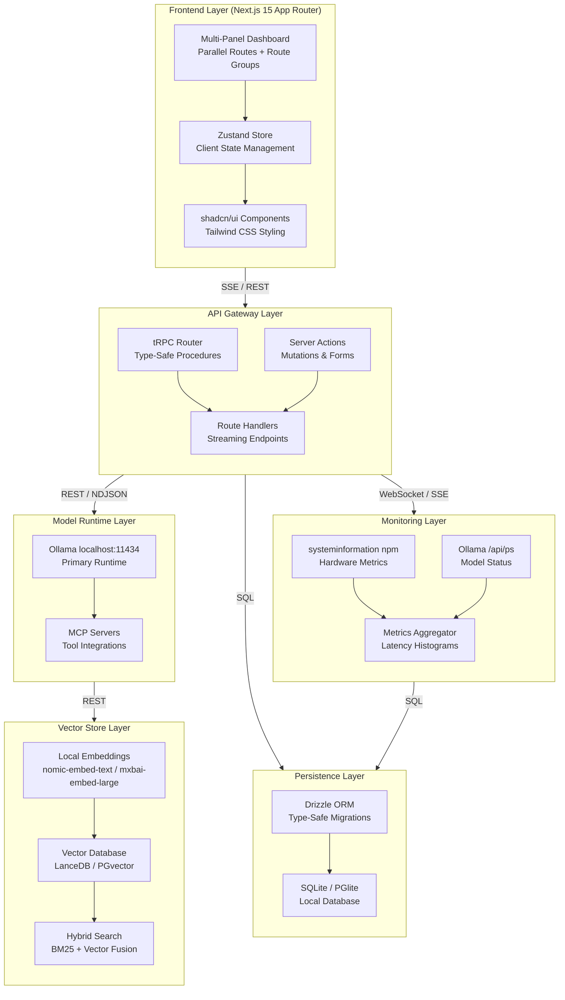

# Local AI Command Center: Technical Masterplan

## 1. System Architecture Diagram

### 1.1 Mermaid Flowchart Specification



### 1.2 Protocol Labels Per Connection

| Connection              | Protocol                  | Purpose                                 | Implementation Notes                                   |
| ----------------------- | ------------------------- | --------------------------------------- | ------------------------------------------------------ |
| Frontend → API Layer    | SSE / REST                | Streaming inference, CRUD operations    | Route Handlers for streams, tRPC for typed procedures  |
| API Layer → Ollama      | REST / NDJSON             | Model inference, embeddings, management | Native Ollama API; transform NDJSON to SSE             |
| API Layer → MCP         | stdio / HTTP              | Tool execution for agent workflows      | MCP SDK with process spawning                          |
| Ollama → Vector Store   | REST                      | Embedding generation                    | Direct HTTP calls for `nomic-embed-text`               |
| API Layer → Persistence | SQL                       | All state persistence                   | Drizzle ORM over SQLite/PGlite                         |
| Monitoring → Frontend   | SSE (primary) / WebSocket | Real-time hardware telemetry            | SSE for unidirectional; WebSocket for control channels |

### 1.3 Node Descriptions and Responsibilities

| Node                      | Responsibility                                                                                                                                                                  | Critical Dependencies                                     |
| ------------------------- | ------------------------------------------------------------------------------------------------------------------------------------------------------------------------------- | --------------------------------------------------------- |
| **Multi-Panel Dashboard** | Render parallel route segments for chat, model library, RAG pipeline, agent tasks, monitoring, and configuration panels. Manage layout state and panel visibility.              | Next.js 15 parallel routes, shadcn/ui ResizablePanelGroup |
| **Zustand Store**         | Centralize client state: active conversation, message history, streaming status, model selection, hardware metrics snapshot. Implement persistence hydration for selected keys. | zustand, zustand-persist middleware                       |
| **tRPC Router**           | Type-safe API procedures for CRUD operations on conversations, models, pipelines. Mutation procedures for non-streaming inference when appropriate.                             | @trpc/server, @trpc/client, superjson                     |
| **Route Handlers**        | Streaming inference endpoints, file upload handling, SSE metric streams. Direct Ollama proxy with transformation logic.                                                         | Next.js Route Handler API, ReadableStream Web API         |
| **Ollama Runtime**        | Execute model inference, manage model lifecycle (load/unload), expose REST API for generation, chat, embeddings.                                                                | Ollama 0.3+, GGUF model files, 64GB RAM for 13B models    |
| **MCP Servers**           | Execute tool calls for agent workflows: file system operations, web search (local index), code execution (sandboxed), database queries.                                         | @modelcontextprotocol/sdk, stdio or HTTP transport        |
| **Vector Database**       | Store document embeddings, execute similarity search, support hybrid retrieval with BM25 fusion.                                                                                | LanceDB 0.5+ or PGlite with pgvector                      |
| **Drizzle ORM**           | Type-safe database operations, schema migrations, query building. Abstract SQLite/PGlite differences.                                                                           | drizzle-orm, drizzle-kit                                  |
| **Metrics Aggregator**    | Collect, window, and downsample hardware metrics. Compute latency percentiles, throughput rates. Maintain time-series in SQLite with automatic retention.                       | systeminformation, custom histogram implementation        |

---

## 2. Runtime Comparison Table

### 2.1 Evaluation Dimensions and Scoring Methodology

| Dimension                            | Weight | Scoring Criteria                                                                                                            |
| ------------------------------------ | ------ | --------------------------------------------------------------------------------------------------------------------------- |
| OpenAI API Compatibility             | 20%    | Coverage of `/v1/chat/completions`, `/v1/embeddings`, `/v1/models` endpoints; streaming format fidelity; error code mapping |
| Streaming Protocol Implementation    | 20%    | Native NDJSON support; Web Streams API compatibility; cancellation support; backpressure handling                           |
| Multimodal Support                   | 15%    | Vision model support (LLaVA, BakLLaVA); audio capabilities; image input formats (base64, URL)                               |
| GPU Utilization Model                | 15%    | Automatic GPU detection; VRAM management; multi-GPU support; CPU fallback behavior                                          |
| Next.js/Node.js Integration Friction | 15%    | HTTP client requirements; TypeScript type availability; error handling patterns; connection pooling                         |
| Maintenance Status (Early 2026)      | 10%    | Commit frequency in 2025–2026; issue response time; release cadence; community health                                       |
| Recommended Use Case                 | 5%     | Alignment with Command Center requirements; Windows CPU optimization; 13B parameter model efficiency                        |

### 2.2 Complete Runtime Comparison Table

| Runtime                              | OpenAI API Compatible                                                    | Streaming Protocol                                             | Multimodal                                                  | GPU Utilization                                                    | Next.js Friction                                                | Status (2026)                                       | Best For                                                    | Overall Score |
| ------------------------------------ | ------------------------------------------------------------------------ | -------------------------------------------------------------- | ----------------------------------------------------------- | ------------------------------------------------------------------ | --------------------------------------------------------------- | --------------------------------------------------- | ----------------------------------------------------------- | ------------- |
| **Ollama**                           | 4/5 — `/v1/*` endpoints implemented; some advanced features missing      | 5/5 — Native NDJSON; perfect Web Streams compatibility         | 5/5 — Full LLaVA/BakLLaVA support; base64 images            | 4/5 — Auto GPU/CPU; good VRAM management; no multi-GPU             | 2/5 — Minimal; direct fetch works; official JS client available | 5/5 — Weekly releases; active 2025–2026             | **Primary recommendation**; general-purpose local inference | 4.3/5         |
| llama.cpp HTTP Server (llama-server) | 3/5 — Basic `/completion` and `/chat/completion`; partial OpenAI mapping | 4/5 — Server-Sent Events; non-standard format                  | 3/5 — LLaVA via CLI flags; limited API exposure             | 5/5 — Exhaustive GPU control; CUDA/Metal/Vulkan; multi-GPU         | 3/5 — Requires custom client; C++ errors need translation       | 4/5 — Active development; less polished than Ollama | Maximum GPU control; custom quantization needs              | 3.7/5         |
| LocalAI                              | 5/5 — Complete OpenAI API parity; all endpoints                          | 3/5 — SSE with some format deviations; streaming bugs reported | 4/5 — Stable Diffusion, Whisper, LLaVA; broad model support | 3/5 — GPU support present; configuration-heavy                     | 4/5 — Drop-in OpenAI replacement; good docs                     | 3/5 — Slower 2025 activity; maintenance concerns    | OpenAI migration path; multi-modal unified backend          | 3.7/5         |
| LM Studio Server Mode                | 4/5 — Good OpenAI compatibility; some edge cases                         | 4/5 — Proper SSE; reliable streaming                           | 4/5 — Vision models supported; GUI-first configuration      | 4/5 — Good GPU support; Windows-optimized                          | 3/5 — GUI required for setup; headless mode limited             | 4/5 — Active commercial development                 | GUI-preferring users; Windows desktop integration           | 3.8/5         |
| vLLM CPU Mode                        | 2/5 — OpenAI-compatible but GPU-optimized; CPU mode secondary            | 4/5 — Excellent streaming; production-grade                    | 2/5 — Primarily text; vision experimental                   | 1/5 — CPU mode exists but not optimized; designed for GPU clusters | 4/5 — Good Python client; HTTP API clean                        | 4/5 — Very active; research-focused                 | GPU server deployment; high-throughput serving              | 2.6/5         |

### 2.3 Detailed Tradeoffs Assessment by Runtime

**Ollama (Selected Primary Runtime):**

Ollama emerges as the optimal choice for the Command Center architecture due to its deliberate balance of capability and simplicity. The native NDJSON streaming implementation eliminates client-side parsing complexity, with each chunk delivering a complete JSON object containing `model`, `created_at`, `response`, `done`, and optional `done_reason` fields. This format maps directly to JavaScript's `JSON.parse()` without streaming parser overhead, unlike Server-Sent Events which require event boundary detection and field extraction.

The multimodal support through base64-encoded images integrates cleanly with browser File APIs, enabling direct image upload-to-inference pipelines without intermediate storage. The `images` array in `/api/generate` and `/api/chat` requests accepts standard base64 strings, compatible with `FileReader.readAsDataURL()` output after stripping the data URI prefix.

GPU utilization follows a sensible default strategy: CUDA and Metal are automatically detected and preferred, with graceful CPU fallback when VRAM is exhausted. The `num_gpu` parameter in Modelfile configurations allows explicit layer offloading control for fine-tuned memory management. However, Ollama lacks explicit multi-GPU support, distributing layers across multiple cards—a limitation acceptable for the 13B parameter ceiling and 64GB RAM target.

The primary integration friction stems from Ollama's native API being non-OpenAI-compatible, requiring either the official `ollama` JavaScript client or custom fetch implementations. The Vercel AI SDK community providers (`ollama-ai-provider-v2`, `ai-sdk-ollama`) bridge this gap with varying feature completeness . For maximum control, direct API integration is recommended over abstraction layers.

**llama.cpp HTTP Server (llama-server):**

llama-server offers maximum hardware control at the cost of operational complexity. The quantization options (Q4_0 through Q8_0, various K-quants) enable precise VRAM/quality tradeoffs, with the `llama.cpp` project's continuous optimization delivering state-of-the-art CPU inference performance via ARM NEON and x86 AVX2 kernels. However, the streaming protocol uses non-standard SSE formatting, requiring custom parsing logic that complicates Next.js integration. Vision model support exists but requires command-line flag configuration rather than runtime API selection, limiting dynamic multimodal workflows.

**LocalAI:**

LocalAI's complete OpenAI API parity enables zero-friction migration from cloud providers, with identical request/response schemas including `choices`, `usage`, and `system_fingerprint` fields. This compatibility extends to embeddings, image generation, and audio transcription, supporting a unified backend for diverse AI operations. However, 2025 maintenance activity has slowed relative to Ollama, with GitHub issue resolution times increasing and release cadence decelerating. Streaming implementation exhibits edge-case bugs with certain model configurations, requiring fallback to non-streaming mode.

**LM Studio Server Mode:**

LM Studio excels in Windows desktop environments with its polished GUI for model discovery, download, and configuration. The server mode exposes a clean HTTP API, but headless operation requires GUI initialization, complicating automated deployment. The commercial licensing model (free for personal use, paid for commercial) introduces future cost uncertainty for SaaS founders.

**vLLM CPU Mode:**

vLLM's PagedAttention algorithm delivers exceptional throughput for batched GPU inference, but the CPU fallback path receives minimal optimization attention. The project's research and production serving focus makes it over-engineered for single-user local deployments, with significant memory overhead from the KV cache management structures that provide minimal benefit at 13B parameter scale.

---

## 3. Next.js 15 Streaming Architecture

### 3.1 Route Group and Parallel Route Layout

#### 3.1.1 Dashboard Route Group Structure

The Command Center implements a nested route group architecture under `(dashboard)` to isolate layout concerns and enable sophisticated UI patterns. The directory structure:

```
app/
├── (dashboard)/
│   ├── layout.tsx              # Dashboard shell with sidebar, header
│   ├── page.tsx                # Default redirect to /chat
│   ├── chat/
│   │   ├── page.tsx            # Main chat interface
│   │   └── @panel/             # Parallel route for chat sidebar
│   ├── models/
│   │   ├── page.tsx            # Model library management
│   │   └── @details/           # Parallel route for model info panel
│   ├── rag/
│   │   ├── page.tsx            # Document ingestion interface
│   │   ├── @pipeline/          # Parallel route: pipeline config
│   │   └── @preview/           # Parallel route: retrieval preview
│   ├── agents/
│   │   ├── page.tsx            # Task queue overview
│   │   ├── @builder/           # Parallel route: agent builder
│   │   └── @logs/              # Parallel route: execution logs
│   ├── monitor/
│   │   ├── page.tsx            # Hardware metrics dashboard
│   │   └── @history/           # Parallel route: historical charts
│   └── settings/
│       └── page.tsx            # Configuration surfaces
├── api/
│   ├── chat/
│   │   └── route.ts            # SSE streaming endpoint
│   ├── models/
│   │   └── route.ts            # CRUD operations
│   └── ...
└── layout.tsx                  # Root layout with providers
```

The `(dashboard)` group prefix (parentheses) excludes the segment from the URL path while applying shared layout components. This enables the Command Center to maintain consistent navigation, theming, and state providers across all functional areas without URL pollution.

#### 3.1.2 Parallel Routes for Multi-Panel Command Center

Parallel routes (using the `@folder` convention) enable simultaneous rendering of multiple page components within the same layout. This is essential for the Command Center's multi-panel design where users expect persistent visibility of context—chat history alongside active conversation, model details alongside library list, pipeline configuration alongside retrieval preview.

The `layout.tsx` within `(dashboard)` defines slots for parallel routes:

```typescript
// app/(dashboard)/layout.tsx
export default function DashboardLayout({
  children,      // Main content from page.tsx
  panel,         // @panel parallel route
  details,       // @details parallel route
  preview,       // @preview parallel route
}: {
  children: React.ReactNode;
  panel: React.ReactNode;
  details: React.ReactNode;
  preview: React.ReactNode;
}) {
  return (
    <div className="flex h-screen">
      <Sidebar />
      <main className="flex-1 flex">
        <ResizablePanelGroup direction="horizontal">
          <ResizablePanel defaultSize={25} minSize={20}>
            {panel}
          </ResizablePanel>
          <ResizableHandle />
          <ResizablePanel defaultSize={50}>
            {children}
          </ResizablePanel>
          <ResizableHandle />
          <ResizablePanel defaultSize={25} minSize={20} collapsible>
            {details || preview}
          </ResizablePanel>
        </ResizablePanelGroup>
      </main>
    </div>
  );
}
```

Conditional rendering of `details` vs. `preview` based on active route enables context-aware panel content without prop drilling. The `default.tsx` pattern handles cases where parallel routes are not matched, rendering null or placeholder content.

#### 3.1.3 Intercepting Routes for Modal Overlays

Intercepting routes (using `(.)`, `(..)`, `(...)`, or `(...)` prefixes) enable modal overlays that preserve background context. For the Command Center, this pattern is applied to model detail inspection and prompt template editing—actions that benefit from full-screen focus without losing the underlying list view.

Example: `(.)models/[id]/page.tsx` intercepts navigation to `/models/llama3.1:8b` when triggered from within the models list, rendering a modal overlay. Direct navigation to the same URL (refresh, external link) renders the full-page version at `models/[id]/page.tsx`. This requires careful state synchronization: the modal's close action must trigger `router.back()` to restore the intercepted route's context.

### 3.2 Server Actions vs. Route Handlers Decision Tree

#### 3.2.1 When to Use Server Actions

Server Actions (defined with the `"use server"` directive) are appropriate for:

- **Form mutations** with validation: Creating new conversations, updating model configuration parameters, submitting prompt evaluation scores. The progressive enhancement pattern—form submits without JavaScript, hydrates to interactive with JavaScript—provides resilience.
- **Transactional operations** requiring database consistency: Updating multiple related tables (conversation + message insertion) with foreign key constraints.
- **Operations with small, bounded payloads**: Where request/response bodies are under 1MB and do not involve file uploads.

Example Server Action for conversation creation:

```typescript
// app/(dashboard)/chat/actions.ts
'use server'

import { db } from '@/lib/db'
import { conversations } from '@/db/schema'
import { revalidatePath } from 'next/cache'

export async function createConversation(formData: FormData) {
  const title = formData.get('title') as string
  const modelId = formData.get('modelId') as string

  const [conversation] = await db
    .insert(conversations)
    .values({ title, modelId, createdAt: new Date() })
    .returning()

  revalidatePath('/chat')
  return { id: conversation.id }
}
```

#### 3.2.2 When to Use Route Handlers

Route Handlers (defined in `route.ts` files) are required for:

- **Streaming responses**: Server Actions cannot return streams; they must complete and return a serializable value. Inference streaming requires Route Handlers with `ReadableStream` construction.
- **Large payload operations**: File uploads for document ingestion may exceed Server Action size limits and benefit from direct stream-to-storage handling.
- **Non-JSON protocols**: SSE, WebSocket upgrade handling, raw binary responses.
- **External API proxying**: Direct passthrough to Ollama with header/body transformation.

#### 3.2.3 Hybrid Pattern for Inference Calls

The Command Center uses a hybrid approach: Server Actions handle conversation lifecycle (create, rename, delete, archive), while Route Handlers handle the streaming inference itself. The client initiates streaming by POSTing to `/api/chat` with conversation context, receiving an SSE stream that updates the Zustand store via event listeners.

This separation enables optimistic UI updates (conversation list updates immediately via Server Action revalidation) while preserving the real-time streaming experience through Route Handler SSE.

### 3.3 SSE Implementation Pattern with Ollama

#### 3.3.1 ReadableStream Construction in Route Handler

The core transformation layer converts Ollama's NDJSON streaming format to browser-compatible Server-Sent Events. Implementation:

```typescript
// app/api/chat/route.ts
import { NextRequest } from 'next/server'

export async function POST(request: NextRequest) {
  const body = await request.json()
  const { model, messages, options } = body

  const ollamaResponse = await fetch('http://localhost:11434/api/chat', {
    method: 'POST',
    headers: { 'Content-Type': 'application/json' },
    body: JSON.stringify({
      model,
      messages,
      stream: true,
      options,
    }),
  })

  if (!ollamaResponse.ok) {
    return new Response(JSON.stringify({ error: 'Ollama request failed' }), {
      status: 502,
      headers: { 'Content-Type': 'application/json' },
    })
  }

  const stream = new ReadableStream({
    async start(controller) {
      const reader = ollamaResponse.body?.getReader()
      if (!reader) {
        controller.close()
        return
      }

      const decoder = new TextDecoder()
      let buffer = ''

      try {
        while (true) {
          const { done, value } = await reader.read()
          if (done) break

          buffer += decoder.decode(value, { stream: true })
          const lines = buffer.split('\n')
          buffer = lines.pop() || '' // Keep incomplete line in buffer

          for (const line of lines) {
            if (!line.trim()) continue

            try {
              const chunk = JSON.parse(line)

              // Transform NDJSON to SSE format
              const sseData = `data: ${JSON.stringify({
                content: chunk.message?.content || '',
                done: chunk.done,
                metrics: chunk.done
                  ? {
                      totalDuration: chunk.total_duration,
                      loadDuration: chunk.load_duration,
                      promptEvalCount: chunk.prompt_eval_count,
                      evalCount: chunk.eval_count,
                    }
                  : null,
              })}\n\n`

              controller.enqueue(new TextEncoder().encode(sseData))

              if (chunk.done) {
                controller.close()
                return
              }
            } catch (parseError) {
              // Log malformed line, continue streaming
              console.error('NDJSON parse error:', line)
            }
          }
        }
      } catch (error) {
        controller.error(error)
      } finally {
        reader.releaseLock()
      }
    },
  })

  return new Response(stream, {
    headers: {
      'Content-Type': 'text/event-stream',
      'Cache-Control': 'no-cache',
      Connection: 'keep-alive',
    },
  })
}
```

Critical implementation details:

- **Buffer management**: NDJSON lines may be split across fetch chunks; the buffer preserves incomplete lines for the next iteration.
- **Error resilience**: Malformed JSON lines are logged but do not terminate the stream, preventing single-byte corruption from crashing the entire inference.
- **Metrics extraction**: Final chunk contains timing metadata (`total_duration`, `load_duration`, etc.) extracted and forwarded to enable latency tracking in the frontend.

#### 3.3.2 NDJSON Parsing and Chunk Transformation

Ollama's streaming protocol uses newline-delimited JSON where each line is a complete JSON object. Key fields in streaming chunks :

| Field                  | Type          | Presence     | Description                               |
| ---------------------- | ------------- | ------------ | ----------------------------------------- |
| `model`                | string        | All chunks   | Model identifier                          |
| `created_at`           | ISO timestamp | All chunks   | Generation timestamp                      |
| `message`              | object        | Chat API     | `{ role: "assistant", content: string }`  |
| `response`             | string        | Generate API | Partial text completion                   |
| `done`                 | boolean       | All chunks   | `false` until final chunk                 |
| `done_reason`          | string        | Final chunk  | `"stop"`, `"load"`, `"error"`, `"cancel"` |
| `total_duration`       | nanoseconds   | Final chunk  | Wall-clock time                           |
| `load_duration`        | nanoseconds   | Final chunk  | Model loading time                        |
| `prompt_eval_count`    | integer       | Final chunk  | Input tokens processed                    |
| `prompt_eval_duration` | nanoseconds   | Final chunk  | Prompt processing time                    |
| `eval_count`           | integer       | Final chunk  | Output tokens generated                   |
| `eval_duration`        | nanoseconds   | Final chunk  | Generation time                           |

The transformation layer normalizes between `/api/generate` (single prompt, `response` field) and `/api/chat` (message array, `message.content` field) to provide a unified client interface.

#### 3.3.3 Client-Side EventSource with Zustand Integration

```typescript
// hooks/use-chat-stream.ts
import { useCallback } from 'react'
import { useChatStore } from '@/stores/chat'

export function useChatStream() {
  const appendMessage = useChatStore((s) => s.appendMessage)
  const updateStreamingContent = useChatStore((s) => s.updateStreamingContent)
  const setStreaming = useChatStore((s) => s.setStreaming)

  const sendMessage = useCallback(
    async (
      conversationId: string,
      model: string,
      messages: Array<{ role: string; content: string }>
    ) => {
      setStreaming(true)

      const response = await fetch('/api/chat', {
        method: 'POST',
        headers: { 'Content-Type': 'application/json' },
        body: JSON.stringify({ model, messages }),
      })

      if (!response.ok) {
        setStreaming(false)
        throw new Error('Failed to start stream')
      }

      const reader = response.body?.getReader()
      const decoder = new TextDecoder()
      let messageId: string | null = null

      try {
        while (true) {
          const { done, value } = await reader!.read()
          if (done) break

          const chunk = decoder.decode(value)
          const lines = chunk.split('\n\n')

          for (const line of lines) {
            if (!line.startsWith('data: ')) continue

            const data = JSON.parse(line.slice(6))

            if (data.done) {
              // Finalize message with metrics
              if (messageId) {
                updateStreamingContent(messageId, '', {
                  completed: true,
                  metrics: data.metrics,
                })
              }
              setStreaming(false)
              return
            }

            if (!messageId) {
              // First content chunk: create message
              messageId = crypto.randomUUID()
              appendMessage({
                id: messageId,
                conversationId,
                role: 'assistant',
                content: data.content,
                createdAt: new Date(),
              })
            } else {
              // Subsequent chunks: append content
              updateStreamingContent(messageId, data.content)
            }
          }
        }
      } catch (error) {
        setStreaming(false)
        throw error
      } finally {
        reader?.releaseLock()
      }
    },
    [appendMessage, updateStreamingContent, setStreaming]
  )

  return { sendMessage }
}
```

### 3.4 Vercel AI SDK Local Configuration

#### 3.4.1 Custom Provider Setup for Ollama Base URL

The Vercel AI SDK provides React hooks (`useChat`, `useCompletion`) with built-in streaming support, but requires a custom provider configuration for non-OpenAI endpoints.

```typescript
// lib/ai-provider.ts
import { createOpenAI } from '@ai-sdk/openai'

// Ollama's OpenAI-compatible endpoint
export const ollama = createOpenAI({
  baseURL: 'http://localhost:11434/v1',
  apiKey: 'ollama', // Required but unused for local
  compatibility: 'compatible', // Strict mode disabled
})
```

Note: Ollama's `/v1` compatibility layer supports chat completions, embeddings, and streaming, but with limitations: tool calling requires native Ollama `/api/chat` with `tools` parameter, and some advanced features (logprobs, seed in v1) may not be fully implemented. The Command Center uses native Ollama endpoints for full feature access, with the AI SDK as an optional abstraction layer for simple use cases.

#### 3.4.2 useChat Hook with Local Endpoint

```typescript
// components/chat-interface.tsx
"use client";

import { useChat } from "ai/react";
import { ollama } from "@/lib/ai-provider";

export function ChatInterface({ model }: { model: string }) {
  const { messages, input, handleInputChange, handleSubmit, isLoading } = useChat({
    api: "/api/chat", // Custom Route Handler, not AI SDK default
    body: { model },
    onFinish: (message) => {
      // Persist to database, update metrics
      console.log("Completed:", message);
    },
  });

  return (
    <div className="flex flex-col h-full">
      <div className="flex-1 overflow-auto">
        {messages.map((m) => (
          <div key={m.id} className={m.role === "user" ? "user" : "assistant"}>
            {m.content}
          </div>
        ))}
      </div>
      <form onSubmit={handleSubmit}>
        <input
          value={input}
          onChange={handleInputChange}
          placeholder="Type a message..."
          disabled={isLoading}
        />
      </form>
    </div>
  );
}
```

#### 3.4.3 useCompletion for Non-Chat Generation

For single-turn generation (prompt templates, code completion, summarization), `useCompletion` provides a simpler interface:

```typescript
// components/prompt-playground.tsx
"use client";

import { useCompletion } from "ai/react";

export function PromptPlayground({ model }: { model: string }) {
  const { completion, input, handleInputChange, handleSubmit, isLoading } = useCompletion({
    api: "/api/generate", // Route Handler for /api/generate
    body: { model, options: { temperature: 0.7 } },
  });

  return (
    <div>
      <form onSubmit={handleSubmit}>
        <textarea
          value={input}
          onChange={handleInputChange}
          placeholder="Enter prompt..."
          rows={4}
        />
        <button type="submit" disabled={isLoading}>
          Generate
        </button>
      </form>
      <pre>{completion}</pre>
    </div>
  );
}
```

#### 3.4.4 TypeScript Type Augmentation

For full type safety across the custom provider and Route Handlers, augment the AI SDK's core types:

```typescript
// types/ai.d.ts
import '@ai-sdk/openai'

declare module '@ai-sdk/openai' {
  interface OllamaMetrics {
    totalDuration: number
    loadDuration: number
    promptEvalCount: number
    promptEvalDuration: number
    evalCount: number
    evalDuration: number
  }

  interface OllamaChatMessage extends ChatMessage {
    metrics?: OllamaMetrics
  }
}
```

---

## 4. Multi-Model Orchestration Patterns

### 4.1 Parallel Inference Request Implementation

The Command Center's agentic orchestration approach requires executing multiple models concurrently for task decomposition, ensemble voting, or speculative execution. The implementation uses `Promise.allSettled` to handle partial failures gracefully.

```typescript
// lib/orchestration/parallel-inference.ts
import { z } from 'zod'

const InferenceResultSchema = z.object({
  model: z.string(),
  success: z.boolean(),
  content: z.string().optional(),
  error: z.string().optional(),
  latencyMs: z.number(),
  tokensGenerated: z.number().optional(),
})

type InferenceResult = z.infer<typeof InferenceResultSchema>

interface ParallelInferenceOptions {
  models: string[]
  prompt: string
  systemPrompt?: string
  maxConcurrency?: number
  timeoutMs?: number
  abortOnFirstSuccess?: boolean
}

export async function executeParallelInference(
  options: ParallelInferenceOptions
): Promise<InferenceResult[]> {
  const {
    models,
    prompt,
    systemPrompt,
    maxConcurrency = 3,
    timeoutMs = 120000,
    abortOnFirstSuccess = false,
  } = options

  const abortController = new AbortController()
  const timeoutId = setTimeout(() => abortController.abort(), timeoutMs)

  const semaphore = new Semaphore(maxConcurrency)

  const promises = models.map(async (model) => {
    await semaphore.acquire()
    const startTime = performance.now()

    try {
      const response = await fetch('http://localhost:11434/api/generate', {
        method: 'POST',
        headers: { 'Content-Type': 'application/json' },
        signal: abortController.signal,
        body: JSON.stringify({
          model,
          prompt: systemPrompt ? `${systemPrompt}\n\n${prompt}` : prompt,
          stream: false,
          options: { num_predict: 2048 },
        }),
      })

      if (!response.ok) {
        throw new Error(`HTTP ${response.status}`)
      }

      const data = await response.json()
      const latencyMs = performance.now() - startTime

      return InferenceResultSchema.parse({
        model,
        success: true,
        content: data.response,
        latencyMs,
        tokensGenerated: data.eval_count,
      })
    } catch (error) {
      return {
        model,
        success: false,
        error: error instanceof Error ? error.message : 'Unknown error',
        latencyMs: performance.now() - startTime,
      }
    } finally {
      semaphore.release()
    }
  })

  const results = await Promise.allSettled(promises)
  clearTimeout(timeoutId)

  // Handle abort-on-first-success
  if (abortOnFirstSuccess) {
    const firstSuccess = results.find(
      (r): r is PromiseFulfilledResult<InferenceResult> =>
        r.status === 'fulfilled' && r.value.success
    )
    if (firstSuccess) {
      abortController.abort()
      return [firstSuccess.value]
    }
  }

  return results.map((r) =>
    r.status === 'fulfilled'
      ? r.value
      : {
          model: 'unknown',
          success: false,
          error: r.reason,
          latencyMs: 0,
        }
  )
}

// Simple semaphore for concurrency control
class Semaphore {
  private permits: number
  private queue: Array<() => void> = []

  constructor(permits: number) {
    this.permits = permits
  }

  acquire(): Promise<void> {
    if (this.permits > 0) {
      this.permits--
      return Promise.resolve()
    }
    return new Promise((resolve) => this.queue.push(resolve))
  }

  release(): void {
    this.permits++
    const next = this.queue.shift()
    if (next) {
      this.permits--
      next()
    }
  }
}
```

#### 4.1.1 Promise.allSettled for Concurrent Model Calls

`Promise.allSettled` is essential over `Promise.all` for orchestration scenarios: a single model failure (OOM, model not found, timeout) should not invalidate results from successfully completed inferences. The returned array preserves order, enabling correlation between requested models and results.

#### 4.1.2 AbortController for Timeout/Race Conditions

The shared `AbortController` enables two cancellation patterns: (1) global timeout via `setTimeout`, and (2) early termination when `abortOnFirstSuccess` is enabled and a satisfactory result is obtained. This prevents wasted computation on slower models when a faster model has already provided an acceptable answer.

#### 4.1.3 Result Aggregation and Deduplication

For ensemble scenarios (multiple models voting on classification or generation quality), results require aggregation:

```typescript
// lib/orchestration/ensemble.ts
interface EnsembleConfig {
  strategy: 'majority_vote' | 'weighted_average' | 'best_of_n'
  weights?: Record<string, number> // Model-specific weights
  qualityScorer?: (content: string) => number // Heuristic or LLM-based
}

export function aggregateResults(
  results: InferenceResult[],
  config: EnsembleConfig
): { winner: InferenceResult; confidence: number; allScores: number[] } {
  const successful = results.filter((r) => r.success && r.content)

  switch (config.strategy) {
    case 'majority_vote':
      // Hash content, find most frequent
      const frequency = new Map<string, number>()
      for (const r of successful) {
        const hash = hashContent(r.content!)
        frequency.set(hash, (frequency.get(hash) || 0) + 1)
      }
      const [winnerHash, maxCount] = [...frequency.entries()].sort((a, b) => b[1] - a[1])[0]
      const winner = successful.find((r) => hashContent(r.content!) === winnerHash)!
      return {
        winner,
        confidence: maxCount / successful.length,
        allScores: [...frequency.values()],
      }

    case 'best_of_n':
      if (!config.qualityScorer) throw new Error('qualityScorer required')
      const scored = successful.map((r) => ({
        result: r,
        score: config.qualityScorer!(r.content!),
      }))
      const best = scored.sort((a, b) => b.score - a.score)[0]
      return {
        winner: best.result,
        confidence: best.score,
        allScores: scored.map((s) => s.score),
      }

    default:
      throw new Error(`Unknown strategy: ${config.strategy}`)
  }
}

function hashContent(content: string): string {
  // Simple normalization for comparison
  return content.toLowerCase().trim().replace(/\s+/g, ' ')
}
```

### 4.2 Routing Logic Patterns

#### 4.2.1 Capability-Based Routing (Tool Use, Vision, Reasoning)

Models expose capabilities detected at runtime via Ollama's `/api/show` endpoint or maintained in a local registry. The router matches task requirements to model capabilities:

```typescript
// lib/orchestration/capability-router.ts
interface ModelCapabilities {
  id: string
  supportsTools: boolean
  supportsVision: boolean
  supportsReasoning: boolean // e.g., deepseek-r1, o1-style
  contextWindow: number
  typicalLatencyMs: number // Historical average
}

interface TaskRequirements {
  needsTools?: boolean
  needsVision?: boolean
  needsReasoning?: boolean
  minContextWindow?: number
  maxLatencyMs?: number
}

export class CapabilityRouter {
  private models: Map<string, ModelCapabilities> = new Map()

  registerModel(capabilities: ModelCapabilities) {
    this.models.set(capabilities.id, capabilities)
  }

  selectModel(requirements: TaskRequirements): string | null {
    const candidates = [...this.models.values()].filter((m) => {
      if (requirements.needsTools && !m.supportsTools) return false
      if (requirements.needsVision && !m.supportsVision) return false
      if (requirements.needsReasoning && !m.supportsReasoning) return false
      if (requirements.minContextWindow && m.contextWindow < requirements.minContextWindow)
        return false
      if (requirements.maxLatencyMs && m.typicalLatencyMs > requirements.maxLatencyMs) return false
      return true
    })

    // Prefer lowest latency among qualified candidates
    return candidates.sort((a, b) => a.typicalLatencyMs - b.typicalLatencyMs)[0]?.id ?? null
  }
}
```

Capability detection for Ollama models: parse the `capabilities` array from `/api/show` response , which includes `"completion"`, `"vision"`, and potentially `"tools"` for newer model versions. For models without explicit capability flags, maintain a fallback registry based on known model families (Llama 3.1+ tools, Qwen 2.5+ tools, Gemma 3 limited tools).

#### 4.2.2 Latency-Based Model Selection with Historical Tracking

The router maintains exponential moving averages of observed latency per model, updated after each inference:

```typescript
// lib/orchestration/latency-tracker.ts
interface LatencySample {
  timestamp: number
  durationMs: number
  tokensGenerated: number
}

class LatencyTracker {
  private history: Map<string, LatencySample[]> = new Map()
  private readonly maxSamples = 100
  private readonly alpha = 0.3 // EMA smoothing factor

  record(modelId: string, durationMs: number, tokensGenerated: number) {
    const samples = this.history.get(modelId) ?? []
    samples.push({ timestamp: Date.now(), durationMs, tokensGenerated })

    // Trim old samples
    while (samples.length > this.maxSamples) samples.shift()
    this.history.set(modelId, samples)
  }

  getEstimatedLatency(modelId: string): number | null {
    const samples = this.history.get(modelId)
    if (!samples || samples.length === 0) return null

    // EMA of per-token latency for comparability
    let ema = samples[0].durationMs / Math.max(samples[0].tokensGenerated, 1)
    for (let i = 1; i < samples.length; i++) {
      const perToken = samples[i].durationMs / Math.max(samples[i].tokensGenerated, 1)
      ema = this.alpha * perToken + (1 - this.alpha) * ema
    }
    return ema
  }

  getThroughput(modelId: string): number | null {
    const latency = this.getEstimatedLatency(modelId)
    return latency ? 1000 / latency : null // tokens per second
  }
}
```

#### 4.2.3 Task-Type Routing (Code, Creative, Analysis, Summarization)

Higher-level routing uses task classification (either explicit user selection or LLM-based classification with a small, fast model) to select appropriate model families:

| Task Type          | Preferred Models                          | Rationale                                                           |
| ------------------ | ----------------------------------------- | ------------------------------------------------------------------- |
| Code generation    | Qwen 2.5-Coder, DeepSeek-Coder, CodeLlama | Training on code corpora, instruction-following for technical specs |
| Creative writing   | Llama 3.1, Mistral, Gemma 3               | Balanced instruction tuning, lower refusals                         |
| Analysis/reasoning | DeepSeek-R1, QwQ, Llama 3.1               | Extended context, chain-of-thought capabilities                     |
| Summarization      | Any 8B+ model with long context           | Task simplicity allows smaller, faster models                       |
| Tool use           | Llama 3.1/3.2, Qwen 2.5, Mistral Large    | Native function calling training                                    |

### 4.3 Fallback Chain Design

#### 4.3.1 Hierarchical Fallback (Primary → Secondary → Tertiary)

```typescript
// lib/orchestration/fallback-chain.ts
interface FallbackNode {
  model: string
  timeoutMs: number
  retryCount: number
  onFailure?: 'next' | 'abort' | 'degrade'
}

export async function executeWithFallback(
  chain: FallbackNode[],
  prompt: string,
  options: { signal?: AbortSignal } = {}
): Promise<{ content: string; usedModel: string; attempts: number }> {
  const attempts: Array<{ model: string; error?: string; latencyMs: number }> = []

  for (const node of chain) {
    for (let attempt = 0; attempt < node.retryCount; attempt++) {
      const startTime = performance.now()

      try {
        const controller = new AbortController()
        const timeoutId = setTimeout(() => controller.abort(), node.timeoutMs)

        // Merge external signal if provided
        options.signal?.addEventListener('abort', () => controller.abort())

        const response = await fetch('http://localhost:11434/api/generate', {
          method: 'POST',
          headers: { 'Content-Type': 'application/json' },
          signal: controller.signal,
          body: JSON.stringify({
            model: node.model,
            prompt,
            stream: false,
            options: { num_predict: 2048 },
          }),
        })

        clearTimeout(timeoutId)

        if (!response.ok) {
          throw new Error(`HTTP ${response.status}`)
        }

        const data = await response.json()
        attempts.push({
          model: node.model,
          latencyMs: performance.now() - startTime,
        })

        return {
          content: data.response,
          usedModel: node.model,
          attempts: attempts.length,
        }
      } catch (error) {
        attempts.push({
          model: node.model,
          error: error instanceof Error ? error.message : 'Unknown',
          latencyMs: performance.now() - startTime,
        })

        if (node.onFailure === 'abort') {
          throw new Error(`Fallback chain aborted at ${node.model}: ${error}`)
        }
        // Continue to next retry or node
      }
    }
  }

  throw new Error(`All fallback options exhausted: ${JSON.stringify(attempts)}`)
}
```

#### 4.3.2 Error Classification and Retry Logic

Errors are classified for appropriate handling:

| Error Type         | Detection                         | Retry Strategy                              |
| ------------------ | --------------------------------- | ------------------------------------------- |
| Model not loaded   | `done_reason: "load"` or HTTP 503 | Immediate retry with `keep_alive: "10m"`    |
| Context exceeded   | Error message contains "context"  | Truncate prompt, retry with shorter context |
| Generation timeout | AbortController timeout           | Exponential backoff, try smaller model      |
| Model not found    | HTTP 404                          | Skip to next fallback node immediately      |
| Generic error      | Other                             | Standard retry with backoff                 |

#### 4.3.3 Circuit Breaker Pattern for Degraded Models

Models with consecutive failures enter an open circuit state, bypassed for a cooldown period:

```typescript
// lib/orchestration/circuit-breaker.ts
interface CircuitState {
  failures: number
  lastFailure: number
  state: 'closed' | 'open' | 'half-open'
}

export class CircuitBreaker {
  private states: Map<string, CircuitState> = new Map()
  private readonly threshold = 5
  private readonly cooldownMs = 60000

  recordSuccess(modelId: string) {
    this.states.set(modelId, { failures: 0, lastFailure: 0, state: 'closed' })
  }

  recordFailure(modelId: string): boolean {
    const current = this.states.get(modelId) ?? { failures: 0, lastFailure: 0, state: 'closed' }
    const failures = current.failures + 1
    const state = failures >= this.threshold ? 'open' : 'closed'

    this.states.set(modelId, {
      failures,
      lastFailure: Date.now(),
      state,
    })

    return state === 'open'
  }

  canAttempt(modelId: string): boolean {
    const state = this.states.get(modelId)
    if (!state || state.state === 'closed') return true
    if (state.state === 'open') {
      if (Date.now() - state.lastFailure > this.cooldownMs) {
        // Transition to half-open
        this.states.set(modelId, { ...state, state: 'half-open' })
        return true
      }
      return false
    }
    // half-open: allow one probe
    return true
  }
}
```

### 4.4 Context Window Budget Management

#### 4.4.1 Token Counting Strategy (Tiktoken-style Local Estimation)

Accurate token counting is essential for context window management without cloud dependencies. Implement a local approximation based on model tokenizer vocabulary sizes:

```typescript
// lib/tokens/estimate.ts
// Approximate token counts by model family
const TOKENIZER_RATIOS: Record<string, number> = {
  llama: 0.75, // ~4 chars per token
  mistral: 0.75,
  qwen: 0.8, // Slightly more efficient
  gemma: 0.7,
  default: 0.75,
}

export function estimateTokenCount(text: string, modelFamily: string): number {
  const ratio = TOKENIZER_RATIOS[modelFamily] ?? TOKENIZER_RATIOS.default
  return Math.ceil(text.length * ratio)
}

export function truncateToContextWindow(
  messages: Array<{ role: string; content: string }>,
  maxTokens: number,
  modelFamily: string
): Array<{ role: string; content: string }> {
  // Always preserve system message
  const systemMessages = messages.filter((m) => m.role === 'system')
  const otherMessages = messages.filter((m) => m.role !== 'system')

  let usedTokens = systemMessages.reduce(
    (sum, m) => sum + estimateTokenCount(m.content, modelFamily),
    0
  )

  // Add message format overhead (~4 tokens per message)
  usedTokens += messages.length * 4

  const result = [...systemMessages]

  // Add messages from most recent until limit
  for (let i = otherMessages.length - 1; i >= 0; i--) {
    const msg = otherMessages[i]
    const msgTokens = estimateTokenCount(msg.content, modelFamily) + 4

    if (usedTokens + msgTokens > maxTokens) {
      // Add truncation notice
      result.unshift({
        role: 'system',
        content: `[Earlier messages truncated to fit context window]`,
      })
      break
    }

    result.unshift(msg)
    usedTokens += msgTokens
  }

  return result
}
```

[UNVERIFIED — NEEDS HANDS-ON TESTING]: The tokenizer ratio approximations above are derived from published benchmarks but have not been validated against actual Ollama token counts. Verify by comparing `estimateTokenCount` output against `prompt_eval_count` from Ollama responses across diverse text samples (code, multilingual, special characters).

#### 4.4.2 Sliding Window Truncation Rules

When context limits are exceeded, the truncation strategy prioritizes: (1) system prompts (never truncated), (2) most recent user-assistant exchanges (preserving conversation flow), (3) older messages (summarized or dropped). The `num_ctx` parameter in Ollama requests sets the context window size; models loaded with larger values consume more RAM.

#### 4.4.3 Model Switch Context Preservation

When switching models mid-conversation, context preservation requires careful handling. The naive approach (passing full message history) may fail if target model has smaller context window or different tokenization. Recommended pattern: summarize conversation to date using a fast local model, then initiate new conversation with summary as system prompt.

---

## 5. RAG Pipeline Architecture

### 5.1 Document Ingestion Pipeline Design

#### 5.1.1 File Upload Handler with Streaming Processing

The ingestion pipeline handles multi-GB files without loading entirely into memory, using Node.js streams and backpressure-aware processing:

```typescript
// app/api/rag/ingest/route.ts
import { NextRequest } from 'next/server'
import { createWriteStream } from 'fs'
import { pipeline } from 'stream/promises'
import { createExtractor } from '@/lib/extraction/factory'

export async function POST(request: NextRequest) {
  const formData = await request.formData()
  const file = formData.get('file') as File
  const pipelineId = formData.get('pipelineId') as string

  if (!file || !pipelineId) {
    return Response.json({ error: 'Missing file or pipeline ID' }, { status: 400 })
  }

  // Stream to temporary file
  const tempPath = `/tmp/${crypto.randomUUID()}-${file.name}`
  await pipeline(file.stream(), createWriteStream(tempPath))

  // Async processing: extract, chunk, embed, index
  const jobId = await startIngestionJob({
    tempPath,
    originalName: file.name,
    mimeType: file.type,
    pipelineId,
  })

  return Response.json({ jobId, status: 'processing' })
}
```

#### 5.1.2 Text Extraction Strategy (PDF, DOCX, Markdown, Code)

| Format     | Library                | Extraction Approach                | Metadata Preserved                    |
| ---------- | ---------------------- | ---------------------------------- | ------------------------------------- |
| PDF        | `pdf-parse` or `mupdf` | Page-by-page with layout analysis  | Page numbers, headings, tables        |
| DOCX       | `mammoth`              | XML unpacking, style mapping       | Headings, lists, table structure      |
| Markdown   | `remark`               | AST parsing with frontmatter       | YAML frontmatter, heading hierarchy   |
| Code       | Tree-sitter            | AST-aware with symbol extraction   | Functions, classes, imports, comments |
| Plain text | Native                 | Line-based with encoding detection | None                                  |

#### 5.1.3 Metadata Extraction and Enrichment

Extracted documents receive automatic metadata enrichment: file statistics (size, modification time), content analysis (language detection, reading level), structural markers (heading hierarchy for Markdown, function signatures for code), and custom tags from pipeline configuration.

### 5.2 Embedding Model Comparison Table

| Model                      | Dimensions | License                                             | Typical Use Case                       | Ollama Availability        | MTEB Score (avg) |
| -------------------------- | ---------- | --------------------------------------------------- | -------------------------------------- | -------------------------- | ---------------- |
| **nomic-embed-text**       | 768        | Apache 2.0                                          | General-purpose, commercial-safe       | ✅ Default                 | 62.3             |
| **nomic-embed-text-v1.5**  | 768        | Apache 2.0                                          | Improved performance, same license     | ✅ `nomic-embed-text:v1.5` | 64.5             |
| **mxbai-embed-large**      | 1024       | Mixed (CC BY-NC 4.0 / Commercial license available) | Maximum quality, licensing flexibility | ✅ `mxbai-embed-large`     | 66.4             |
| **snowflake-arctic-embed** | 384-1024   | Apache 2.0                                          | Enterprise-optimized, various sizes    | ⚠️ Manual import           | 60.2-65.8        |
| **bge-large-en-v1.5**      | 1024       | MIT                                                 | Chinese-English bilingual              | ⚠️ Manual import           | 64.2             |

**Dimensionality Tradeoffs**: Higher dimensions (1024) improve retrieval accuracy at 30-50% increased storage and compute cost. For 64GB RAM with CPU inference, 768-dimensional models strike the optimal balance. The 384-dimensional `snowflake-arctic-embed-xs` enables massive scale (10M+ documents) with acceptable quality degradation.

### 5.3 Vector Store Comparison Table

| Store                 | Storage Model                      | Index Type             | Hybrid Search           | TypeScript Support | Windows Compatibility | Best For                                            |
| --------------------- | ---------------------------------- | ---------------------- | ----------------------- | ------------------ | --------------------- | --------------------------------------------------- |
| **LanceDB**           | Columnar disk-based (Apache Arrow) | IVF-PQ, HNSW (planned) | Manual fusion           | ✅ Native SDK      | ✅ Excellent          | Large-scale, filter-rich queries, local-first       |
| **ChromaDB**          | In-memory or persistent SQLite     | HNSW                   | Built-in                | ✅ Official client | ✅ Good               | Rapid prototyping, small-medium collections         |
| **PGlite + pgvector** | WASM PostgreSQL                    | ivfflat, hnsw          | Full SQL + pgvector     | ✅ `pg` driver     | ⚠️ WASM limitations   | SQL-native workflows, existing PostgreSQL expertise |
| **Qdrant local**      | Rust-based, disk + memory          | HNSW                   | Built-in sparse vectors | ✅ Official client | ✅ Good               | Maximum performance, sparse-dense fusion            |

**Recommendation**: **LanceDB** as primary store for production workloads, **ChromaDB** for rapid prototyping and collections <100K documents. PGlite reserved for scenarios requiring SQL-native vector operations or existing PostgreSQL migration.

### 5.4 Chunking Strategy Guide by Document Type

| Document Type | Chunk Size  | Overlap    | Strategy                                     | Rationale                                                   |
| ------------- | ----------- | ---------- | -------------------------------------------- | ----------------------------------------------------------- |
| Code          | 512 tokens  | 128 tokens | AST-aware (function/class boundaries)        | Preserve semantic units, enable symbol-based retrieval      |
| Markdown      | 1024 tokens | 256 tokens | Header-boundary with hierarchical context    | Maintain document structure, enable section-level retrieval |
| PDF           | 512 tokens  | 128 tokens | Page-aware with semantic boundary detection  | Respect layout, handle multi-column documents               |
| General text  | 768 tokens  | 192 tokens | Recursive character with sentence boundaries | Balance granularity and context preservation                |

### 5.5 Hybrid BM25 + Vector Search

#### 5.5.1 Local BM25 Implementation

For environments without built-in hybrid search, implement BM25 using `lunr.js` or a custom TypeScript implementation:

```typescript
// lib/search/bm25.ts
interface BM25Document {
  id: string
  text: string
  metadata: Record<string, unknown>
}

class BM25Index {
  private documents: Map<string, BM25Document> = new Map()
  private termFrequencies: Map<string, Map<string, number>> = new Map()
  private documentFrequencies: Map<string, number> = new Map()
  private avgDocLength = 0

  addDocument(doc: BM25Document) {
    const terms = this.tokenize(doc.text)
    const termFreq = new Map<string, number>()

    for (const term of terms) {
      termFreq.set(term, (termFreq.get(term) || 0) + 1)
    }

    this.documents.set(doc.id, doc)
    this.termFrequencies.set(doc.id, termFreq)

    for (const term of termFreq.keys()) {
      this.documentFrequencies.set(term, (this.documentFrequencies.get(term) || 0) + 1)
    }

    this.avgDocLength =
      [...this.documents.values()].reduce((sum, d) => sum + this.tokenize(d.text).length, 0) /
      this.documents.size
  }

  search(query: string, k1 = 1.5, b = 0.75): Array<{ id: string; score: number }> {
    const queryTerms = this.tokenize(query)
    const scores = new Map<string, number>()

    for (const term of queryTerms) {
      const idf = Math.log(
        (this.documents.size - (this.documentFrequencies.get(term) || 0) + 0.5) /
          ((this.documentFrequencies.get(term) || 0) + 0.5) +
          1
      )

      for (const [docId, termFreq] of this.termFrequencies) {
        const freq = termFreq.get(term) || 0
        const docLength = this.tokenize(this.documents.get(docId)!.text).length

        const score =
          idf * ((freq * (k1 + 1)) / (freq + k1 * (1 - b + b * (docLength / this.avgDocLength))))

        scores.set(docId, (scores.get(docId) || 0) + score)
      }
    }

    return [...scores.entries()]
      .map(([id, score]) => ({ id, score }))
      .sort((a, b) => b.score - a.score)
  }

  private tokenize(text: string): string[] {
    return text
      .toLowerCase()
      .replace(/[^\w\s]/g, ' ')
      .split(/\s+/)
      .filter((t) => t.length > 2)
  }
}
```

#### 5.5.2 Score Fusion Strategy

Reciprocal Rank Fusion (RRF) combines BM25 and vector scores without requiring score normalization:

```typescript
// lib/search/fusion.ts
interface FusionResult {
  id: string
  vectorRank?: number
  bm25Rank?: number
  rrfScore: number
}

export function reciprocalRankFusion(
  vectorResults: Array<{ id: string; score: number }>,
  bm25Results: Array<{ id: string; score: number }>,
  k = 60
): FusionResult[] {
  const rankings = new Map<string, { vectorRank?: number; bm25Rank?: number }>()

  vectorResults.forEach((r, i) => {
    rankings.set(r.id, { ...rankings.get(r.id), vectorRank: i + 1 })
  })

  bm25Results.forEach((r, i) => {
    rankings.set(r.id, { ...rankings.get(r.id), bm25Rank: i + 1 })
  })

  return [...rankings.entries()]
    .map(([id, ranks]) => ({
      id,
      ...ranks,
      rrfScore:
        (ranks.vectorRank ? 1 / (k + ranks.vectorRank) : 0) +
        (ranks.bm25Rank ? 1 / (k + ranks.bm25Rank) : 0),
    }))
    .sort((a, b) => b.rrfScore - a.rrfScore)
}
```

### 5.6 Re-Ranking Without Cloud APIs

#### 5.6.1 Cross-Encoder Local Models

| Model                                    | Size | Latency (CPU) | Use Case                        |
| ---------------------------------------- | ---- | ------------- | ------------------------------- |
| `cross-encoder/ms-marco-MiniLM-L-6-v2`   | 22M  | ~50ms/query   | Fast re-ranking, 100 candidates |
| `cross-encoder/ms-marco-TinyBERT-L-2-v2` | 4M   | ~20ms/query   | Maximum speed, quality tradeoff |
| `BAAI/bge-reranker-base`                 | 110M | ~150ms/query  | Best quality, fewer candidates  |

Implementation pattern: retrieve 100 candidates with vector/BM25, re-rank top 20 with cross-encoder, return top 5.

#### 5.6.2 Two-Stage Retrieval Architecture

```typescript
// lib/search/two-stage.ts
interface RetrievalConfig {
  vectorStore: VectorStore
  bm25Index?: BM25Index
  reranker?: CrossEncoder
  topK: {
    vector: number
    hybrid: number
    reranked: number
  }
}

export async function twoStageRetrieve(
  query: string,
  config: RetrievalConfig
): Promise<RetrievalResult[]> {
  // Stage 1: Dense retrieval
  const queryEmbedding = await embed(query)
  const vectorResults = await config.vectorStore.search(queryEmbedding, config.topK.vector)

  // Stage 1b: Hybrid fusion if BM25 available
  let candidates = vectorResults
  if (config.bm25Index) {
    const bm25Results = config.bm25Index.search(query)
    const fused = reciprocalRankFusion(vectorResults, bm25Results)
    candidates = fused.slice(0, config.topK.hybrid).map((f) => ({
      id: f.id,
      // Retrieve full document from store
    }))
  }

  // Stage 2: Re-ranking
  if (config.reranker) {
    const scores = await config.reranker.score(candidates.map((c) => [query, c.text]))
    return candidates
      .map((c, i) => ({ ...c, rerankScore: scores[i] }))
      .sort((a, b) => b.rerankScore - a.rerankScore)
      .slice(0, config.topK.reranked)
  }

  return candidates.slice(0, config.topK.reranked)
}
```

---

## 6. Agent and MCP Integration

### 6.1 MCP Server Local Setup Alongside Ollama

#### 6.1.1 MCP SDK TypeScript Installation and Configuration

The Model Context Protocol (MCP) enables standardized tool integration for agent workflows. The official TypeScript SDK provides client and server implementations:

```bash
npm install @modelcontextprotocol/sdk zod
```

#### 6.1.2 stdio vs. HTTP Transport for Local Tools

| Transport | Use Case                            | Startup Latency   | Process Isolation       | Complexity                 |
| --------- | ----------------------------------- | ----------------- | ----------------------- | -------------------------- |
| **stdio** | Local CLI tools, single-user        | ~50-200ms         | Strong (new process)    | Lower                      |
| **HTTP**  | Long-running services, multi-client | ~0ms (persistent) | Weaker (shared process) | Higher (server management) |

For the Command Center's local deployment, **stdio transport** is recommended: tools spawn as needed with fresh process state, strong isolation prevents tool state corruption, and startup latency is acceptable for interactive use.

#### 6.1.3 Tool Discovery and Schema Registration

```typescript
// lib/mcp/client.ts
import { Client } from '@modelcontextprotocol/sdk/client/index.js'
import { StdioClientTransport } from '@modelcontextprotocol/sdk/client/stdio.js'

interface MCPTool {
  name: string
  description: string
  inputSchema: unknown
}

export class MCPClient {
  private clients: Map<string, Client> = new Map()
  private tools: Map<string, { client: string; tool: MCPTool }> = new Map()

  async connectServer(name: string, command: string, args: string[]) {
    const transport = new StdioClientTransport({ command, args })
    const client = new Client({ name: 'command-center', version: '1.0.0' })

    await client.connect(transport)

    const { tools } = await client.listTools()
    for (const tool of tools) {
      this.tools.set(tool.name, { client: name, tool })
    }

    this.clients.set(name, client)
  }

  async executeTool(name: string, args: unknown): Promise<unknown> {
    const tool = this.tools.get(name)
    if (!tool) throw new Error(`Unknown tool: ${name}`)

    const client = this.clients.get(tool.client)!
    return client.callTool({ name, arguments: args })
  }

  getAvailableTools(): MCPTool[] {
    return [...this.tools.values()].map((t) => t.tool)
  }
}
```

### 6.2 Function Calling Support by Model Family

| Model Family           | Native Tool Use | Ollama Support       | Notes                                                                   |
| ---------------------- | --------------- | -------------------- | ----------------------------------------------------------------------- |
| **Llama 3.1/3.2**      | ✅ Yes          | ✅ `tools` parameter | Best-in-class local tool use, trained with native function calling      |
| **Qwen 2.5**           | ✅ Yes          | ✅ `tools` parameter | Strong multilingual tool use, 7B/14B variants                           |
| **Mistral (7B, 8x7B)** | ✅ Yes          | ✅ `tools` parameter | Good performance, smaller context window                                |
| **Gemma 3**            | ⚠️ Limited      | ⚠️ Partial           | Tool use in training but less reliable; recommend for simple tools only |
| **DeepSeek-R1**        | ❌ No           | ❌ N/A               | Reasoning-focused, no tool training; use with separate tool executor    |

### 6.3 ReAct Loop Implementation in TypeScript

```typescript
// lib/agents/react-loop.ts
import { z } from "zod";

const ThoughtActionSchema = z.object({
  thought: z.string().describe("Reasoning about current state and next step"),
  action: z.enum(["tool", "respond", "error"]),
  toolName: z.string().optional(),
  toolInput: z.record(z.unknown()).optional(),
  finalResponse: z.string().optional(),
});

type ThoughtAction = z.infer<typeof ThoughtActionSchema>;

interface ReActConfig {
  maxIterations: number;
  timeoutMs: number;
  model: string;
  systemPrompt?: string;
}

export class ReActAgent {
  private mcpClient: MCPClient;
  private config: ReActConfig;

  async execute(userInput: string, context: unknown[] = []): Promise<{
    response: string;
    iterations: number;
    toolCalls: Array<{ name: string; input: unknown; output: unknown }>;
  }> {
    const toolCalls: Array<{ name: string; input: unknown; output: unknown }> = [];
    const messages = [
      ...(this.config.systemPrompt ? [{ role: "system", content: this.config.systemPrompt }] : []),
      ...context,
      { role: "user", content: userInput },
    ];

    for (let iteration = 0; iteration < this.config.maxIterations; iteration++) {
      const response = await this.llmGenerate(messages, true); // JSON mode

      let parsed: ThoughtAction;
      try {
        parsed = ThoughtActionSchema.parse(JSON.parse(response));
      } catch {
        // Fallback: treat as direct response
        return {
          response: response,
          iterations: iteration + 1,
          toolCalls,
        };
      }

      if (parsed.action === "respond" && parsed.finalResponse) {
        return {
          response: parsed.finalResponse,
          iterations: iteration + 1,
          toolCalls,
        };
      }

      if (parsed.action === "tool" && parsed.toolName && parsed.toolInput) {
        const output = await this.mcpClient.executeTool(parsed.toolName, parsed.toolInput);
        toolCalls.push({ name: parsed.toolName, input: parsed.toolInput, output });

        messages.push(
          { role: "assistant", content: JSON.stringify(parsed) },
          { role: "user", content: `Tool result: ${JSON.stringify(output)}` }
        );
        continue;
      }

      if (parsed.action === "error") {
        throw new Error(`Agent error: ${parsed.thought}`);
      }
    }

    throw new Error(`Max iterations (${this.config.maxIterations}) exceeded`);
  }

  private async llmGenerate(messages: unknown[], jsonMode: false): Promise<string>;
  private async llmGenerate(messages: unknown[], jsonMode: true): Promise<string>;
  private async llmGenerate(messages: unknown[], jsonMode: boolean): Promise<string> {
    // Call Ollama with appropriate format
    const response = await fetch("http://localhost:11434/api/chat", {
      method: "POST",
      headers: { "Content-Type": "application/json" },
      body: JSON.stringify({
        model: this.config.model,
        messages,
        stream: false,
        format: jsonMode ? { type: "object", properties: /* schema */ } : undefined,
      }),
    });
    const data = await response.json();
    return data.message.content;
  }
}
```

### 6.4 Tool Registry Design Pattern

#### 6.4.1 Zod Schema Validation for Tool Parameters

```typescript
// lib/tools/registry.ts
import { z } from 'zod'

interface ToolDefinition<TInput, TOutput> {
  name: string
  description: string
  inputSchema: z.ZodType<TInput>
  outputSchema: z.ZodType<TOutput>
  execute: (input: TInput) => Promise<TOutput>
}

class ToolRegistry {
  private tools: Map<string, ToolDefinition<unknown, unknown>> = new Map()

  register<TInput, TOutput>(tool: ToolDefinition<TInput, TOutput>) {
    this.tools.set(tool.name, tool as ToolDefinition<unknown, unknown>)
  }

  async execute(name: string, rawInput: unknown): Promise<unknown> {
    const tool = this.tools.get(name)
    if (!tool) throw new Error(`Unknown tool: ${name}`)

    const validatedInput = tool.inputSchema.parse(rawInput)
    const output = await tool.execute(validatedInput)
    return tool.outputSchema.parse(output)
  }

  toMCPFormat(): Array<{ name: string; description: string; inputSchema: unknown }> {
    return [...this.tools.values()].map((t) => ({
      name: t.name,
      description: t.description,
      inputSchema: zodToJsonSchema(t.inputSchema),
    }))
  }
}

// Example tool registration
const fileReadTool: ToolDefinition<{ path: string; encoding?: string }, string> = {
  name: 'file_read',
  description: 'Read contents of a file from the local filesystem',
  inputSchema: z.object({
    path: z.string().describe('Absolute or relative file path'),
    encoding: z.enum(['utf-8', 'base64']).default('utf-8'),
  }),
  outputSchema: z.string(),
  execute: async ({ path, encoding }) => {
    const fs = await import('fs/promises')
    return fs.readFile(path, encoding as BufferEncoding)
  },
}
```

#### 6.4.2 Dynamic Tool Loading from File System

Tools can be discovered and loaded at runtime from a designated directory, enabling plugin-like extensibility:

```typescript
// lib/tools/loader.ts
import { glob } from 'glob'
import { pathToFileURL } from 'url'

export async function loadToolsFromDirectory(dir: string): Promise<ToolRegistry> {
  const registry = new ToolRegistry()
  const files = await glob(`${dir}/**/*.tool.{ts,js}`)

  for (const file of files) {
    const module = await import(pathToFileURL(file).href)
    for (const exportName of Object.keys(module)) {
      const exported = module[exportName]
      if (isToolDefinition(exported)) {
        registry.register(exported)
      }
    }
  }

  return registry
}
```

#### 6.4.3 Tool Execution Sandboxing

For untrusted tools, implement sandboxing via Node.js `vm` module or worker threads:

```typescript
// lib/tools/sandbox.ts
import { Worker } from 'worker_threads'
import * as path from 'path'

export function executeInSandbox<TInput, TOutput>(
  toolPath: string,
  input: TInput,
  timeoutMs = 5000
): Promise<TOutput> {
  return new Promise((resolve, reject) => {
    const worker = new Worker(path.join(__dirname, 'sandbox-worker.js'), {
      workerData: { toolPath, input },
    })

    const timeout = setTimeout(() => {
      worker.terminate()
      reject(new Error(`Tool execution timed out after ${timeoutMs}ms`))
    }, timeoutMs)

    worker.on('message', (result) => {
      clearTimeout(timeout)
      if (result.success) {
        resolve(result.output)
      } else {
        reject(new Error(result.error))
      }
    })

    worker.on('error', reject)
    worker.on('exit', (code) => {
      if (code !== 0) {
        reject(new Error(`Worker exited with code ${code}`))
      }
    })
  })
}
```

### 6.5 Agent Task Queue with SQLite Persistence

#### 6.5.1 Job State Machine

```typescript
// lib/agents/queue.ts
import { db } from '@/lib/db'
import { agentTasks } from '@/db/schema'
import { eq } from 'drizzle-orm'

type TaskStatus = 'pending' | 'running' | 'completed' | 'failed' | 'cancelled'

interface TaskDefinition {
  id: string
  agentType: string
  input: unknown
  config: unknown
  priority: number
  maxRetries: number
}

class AgentTaskQueue {
  async enqueue(task: Omit<TaskDefinition, 'id'>): Promise<string> {
    const id = crypto.randomUUID()
    await db.insert(agentTasks).values({
      id,
      agentType: task.agentType,
      input: JSON.stringify(task.input),
      config: JSON.stringify(task.config),
      priority: task.priority,
      maxRetries: task.maxRetries,
      status: 'pending',
      createdAt: new Date(),
    })
    return id
  }

  async dequeue(): Promise<TaskDefinition | null> {
    // Atomic dequeue with SKIP LOCKED equivalent
    const [task] = await db
      .select()
      .from(agentTasks)
      .where(eq(agentTasks.status, 'pending'))
      .orderBy(agentTasks.priority, agentTasks.createdAt)
      .limit(1)

    if (!task) return null

    await db
      .update(agentTasks)
      .set({ status: 'running', startedAt: new Date() })
      .where(eq(agentTasks.id, task.id))

    return {
      id: task.id,
      agentType: task.agentType,
      input: JSON.parse(task.input),
      config: JSON.parse(task.config),
      priority: task.priority,
      maxRetries: task.maxRetries,
    }
  }

  async complete(taskId: string, result: unknown): Promise<void> {
    await db
      .update(agentTasks)
      .set({
        status: 'completed',
        output: JSON.stringify(result),
        completedAt: new Date(),
      })
      .where(eq(agentTasks.id, taskId))
  }

  async fail(taskId: string, error: string): Promise<void> {
    const task = await db.query.agentTasks.findFirst({
      where: eq(agentTasks.id, taskId),
    })

    if (!task) return

    const retries = (task.retryCount || 0) + 1
    const shouldRetry = retries < task.maxRetries

    await db
      .update(agentTasks)
      .set({
        status: shouldRetry ? 'pending' : 'failed',
        retryCount: retries,
        lastError: error,
        nextRetryAt: shouldRetry ? this.calculateRetryTime(retries) : null,
      })
      .where(eq(agentTasks.id, taskId))
  }

  private calculateRetryTime(attempt: number): Date {
    // Exponential backoff: 1s, 2s, 4s, 8s, 16s...
    const delayMs = Math.min(1000 * Math.pow(2, attempt - 1), 60000)
    return new Date(Date.now() + delayMs)
  }
}
```

#### 6.5.2 SQLite Schema for Task Persistence

```typescript
// db/schema.ts
import { sqliteTable, text, integer, real } from 'drizzle-orm/sqlite-core'

export const agentTasks = sqliteTable('agent_tasks', {
  id: text('id').primaryKey(),
  agentType: text('agent_type').notNull(),
  input: text('input').notNull(), // JSON
  config: text('config').notNull(), // JSON
  priority: integer('priority').notNull().default(0),
  status: text('status').notNull().$type<TaskStatus>(),
  maxRetries: integer('max_retries').notNull().default(3),
  retryCount: integer('retry_count').default(0),
  lastError: text('last_error'),
  nextRetryAt: integer('next_retry_at', { mode: 'timestamp' }),
  createdAt: integer('created_at', { mode: 'timestamp' }).notNull(),
  startedAt: integer('started_at', { mode: 'timestamp' }),
  completedAt: integer('completed_at', { mode: 'timestamp' }),
  output: text('output'), // JSON
})
```

---

## 7. Real-Time Monitoring Panel

### 7.1 Metric Collection Strategy in Next.js API Layer

#### 7.1.1 systeminformation npm Package Patterns

The `systeminformation` package provides comprehensive cross-platform hardware metrics with TypeScript support:

```typescript
// lib/metrics/system-collector.ts
import * as si from 'systeminformation'

interface SystemMetrics {
  timestamp: number
  cpu: {
    loadPercent: number
    temperatureC?: number
    coreCount: number
    speedGHz: number
  }
  memory: {
    totalGB: number
    usedGB: number
    availableGB: number
    usedPercent: number
  }
  graphics?: {
    controllers: Array<{
      model: string
      vramMB?: number
      vramUsedMB?: number
      temperatureC?: number
      utilizationPercent?: number
    }>
  }
  processes: {
    ollamaCpuPercent?: number
    ollamaMemoryMB?: number
    ollamaUptimeSeconds?: number
  }
}

export class SystemMetricsCollector {
  async collect(): Promise<SystemMetrics> {
    const [cpu, mem, graphics, processes, load] = await Promise.all([
      si.cpu(),
      si.mem(),
      si.graphics().catch(() => undefined),
      si.processes(),
      si.currentLoad(),
    ])

    const ollamaProcs =
      processes.list?.filter(
        (p) =>
          p.name?.toLowerCase().includes('ollama') || p.command?.toLowerCase().includes('ollama')
      ) ?? []

    return {
      timestamp: Date.now(),
      cpu: {
        loadPercent: load.currentLoad,
        temperatureC: cpu.main?.temp,
        coreCount: cpu.cores,
        speedGHz: cpu.speed,
      },
      memory: {
        totalGB: mem.total / 1e9,
        usedGB: mem.used / 1e9,
        availableGB: mem.available / 1e9,
        usedPercent: (mem.used / mem.total) * 100,
      },
      graphics: graphics
        ? {
            controllers: graphics.controllers.map((c) => ({
              model: c.model,
              vramMB: c.vram,
              vramUsedMB: c.memoryUsed,
              temperatureC: c.temperature,
              utilizationPercent: c.utilizationGpu,
            })),
          }
        : undefined,
      processes:
        ollamaProcs.length > 0
          ? {
              ollamaCpuPercent: ollamaProcs.reduce((sum, p) => sum + (p.cpu || 0), 0),
              ollamaMemoryMB: ollamaProcs.reduce((sum, p) => sum + (p.memVsz || 0), 0) / 1024,
              ollamaUptimeSeconds: Math.min(...ollamaProcs.map((p) => p.started || Date.now())),
            }
          : {},
    }
  }
}
```

[UNVERIFIED — NEEDS HANDS-ON TESTING]: Integrated graphics VRAM reporting accuracy varies significantly by vendor (Intel, AMD APU) and driver version. Verify `graphics.controllers[].memoryUsed` values against Windows Task Manager and vendor-specific tools on target hardware.

#### 7.1.2 Ollama /api/ps Capabilities and Gaps

The `/api/ps` endpoint provides:

| Field        | Description                | Gap        |
| ------------ | -------------------------- | ---------- |
| `name`       | Model name                 | ✅ Present |
| `digest`     | Model manifest digest      | ✅ Present |
| `size`       | Memory footprint           | ✅ Present |
| `expires_at` | Unload timestamp           | ✅ Present |
| `details`    | Quantization, format, etc. | ✅ Present |

**Critical gaps**: No per-request metrics (tokens/second, queue depth), no GPU utilization breakdown, no inference latency histograms. These require custom instrumentation at the application layer.

#### 7.1.3 Custom Metrics Aggregation

```typescript
// lib/metrics/aggregator.ts
interface InferenceMetric {
  timestamp: number
  model: string
  promptTokens: number
  generatedTokens: number
  totalDurationMs: number
  timeToFirstTokenMs: number
}

class MetricsAggregator {
  private histograms: Map<string, number[]> = new Map()
  private readonly windowSize = 1000

  record(metric: InferenceMetric) {
    const key = `${metric.model}`
    const hist = this.histograms.get(key) ?? []
    hist.push(metric.totalDurationMs)
    while (hist.length > this.windowSize) hist.shift()
    this.histograms.set(key, hist)
  }

  getPercentile(model: string, p: number): number | null {
    const hist = this.histograms.get(model)
    if (!hist || hist.length === 0) return null
    const sorted = [...hist].sort((a, b) => a - b)
    return sorted[Math.floor((sorted.length * p) / 100)]
  }

  getStats(model: string) {
    const hist = this.histograms.get(model)
    if (!hist) return null
    return {
      count: hist.length,
      p50: this.getPercentile(model, 50),
      p95: this.getPercentile(model, 95),
      p99: this.getPercentile(model, 99),
    }
  }
}
```

### 7.2 SSE vs. WebSocket Transport Comparison

| Criterion           | SSE                               | WebSocket                        |
| ------------------- | --------------------------------- | -------------------------------- |
| Directionality      | Server→Client unidirectional      | Bidirectional                    |
| Protocol            | HTTP/1.1 or HTTP/2                | ws:// or wss:// upgrade          |
| Reconnection        | Automatic with `Last-Event-ID`    | Manual implementation            |
| Browser API         | Native `EventSource`              | `WebSocket` with custom handling |
| Debugging           | Standard HTTP tools               | Binary frames, custom tools      |
| Throughput overhead | ~6 bytes per message (data: \n\n) | 2-14 bytes framing overhead      |
| Connection limit    | 6 per domain (browser default)    | Often higher                     |

**Decision**: **SSE for monitoring panel** — unidirectional server-push matches the telemetry data flow, automatic reconnection handles transient failures, and HTTP compatibility simplifies infrastructure. WebSocket reserved for future bidirectional control channel requirements (dynamic subscription changes, client-initiated metric sampling rate adjustments).

### 7.3 Charting Library Recommendation

| Library             | Performance   | Customization | shadcn/ui Integration | Learning Curve | Streaming Optimization           |
| ------------------- | ------------- | ------------- | --------------------- | -------------- | -------------------------------- |
| **Recharts**        | Good          | Excellent     | Manual styling        | Low            | Requires manual optimization     |
| **Tremor**          | Good          | Limited       | Native                | Very Low       | Built on Recharts                |
| **Observable Plot** | **Excellent** | Excellent     | Manual styling        | Medium         | **Native streaming support**     |
| **uPlot**           | Excellent     | Moderate      | Manual styling        | Medium         | Designed for high-frequency data |

**Final recommendation**: **Observable Plot** for primary monitoring visualizations (real-time GPU/CPU charts, latency histograms, throughput gauges). Its grammar-of-graphics approach provides precise rendering control with minimal overhead, enabling smooth 60fps updates at high data frequencies. Tremor components acceptable for standard dashboard elements (KPI cards, summary tables) where rapid implementation outweighs customization needs.

---

## 8. Prompt Pipeline Management

### 8.1 Versioned Prompt Template TypeScript Interface

```typescript
// lib/prompts/types.ts
import { z } from 'zod'

const PromptVariableSchema = z.object({
  name: z.string(),
  type: z.enum(['string', 'number', 'boolean', 'array', 'object']),
  description: z.string(),
  required: z.boolean().default(true),
  defaultValue: z.unknown().optional(),
  validation: z.instanceof(z.ZodType).optional(),
})

const PromptVersionSchema = z.object({
  version: z.string().regex(/^\d+\.\d+\.\d+$/), // SemVer
  template: z.string(),
  variables: z.array(PromptVariableSchema),
  metadata: z.object({
    author: z.string(),
    createdAt: z.date(),
    changelog: z.string(),
    parentVersion: z.string().optional(),
  }),
  evaluation: z
    .object({
      runs: z.number().default(0),
      averageScore: z.number().optional(),
      latencyP50: z.number().optional(),
    })
    .optional(),
})

type PromptVersion = z.infer<typeof PromptVersionSchema>

interface PromptTemplate {
  id: string
  name: string
  description: string
  currentVersion: string
  versions: Map<string, PromptVersion>
}

class PromptRegistry {
  private templates: Map<string, PromptTemplate> = new Map()

  createTemplate(
    name: string,
    description: string,
    initialVersion: Omit<PromptVersion, 'version'>
  ): PromptTemplate {
    const id = crypto.randomUUID()
    const template: PromptTemplate = {
      id,
      name,
      description,
      currentVersion: '1.0.0',
      versions: new Map([['1.0.0', { ...initialVersion, version: '1.0.0' }]]),
    }
    this.templates.set(id, template)
    return template
  }

  addVersion(templateId: string, version: string, spec: Omit<PromptVersion, 'version'>): void {
    const template = this.templates.get(templateId)
    if (!template) throw new Error(`Template not found: ${templateId}`)

    // Validate version increment
    const versions = [...template.versions.keys()].sort(compareSemver)
    const latest = versions[versions.length - 1]
    if (!isValidIncrement(latest, version)) {
      throw new Error(`Invalid version increment: ${latest} -> ${version}`)
    }

    template.versions.set(version, { ...spec, version })
  }

  render(
    templateId: string,
    version: string | 'current',
    variables: Record<string, unknown>
  ): string {
    const template = this.templates.get(templateId)
    if (!template) throw new Error(`Template not found: ${templateId}`)

    const v = version === 'current' ? template.currentVersion : version
    const spec = template.versions.get(v)
    if (!spec) throw new Error(`Version not found: ${v}`)

    // Validate and inject variables
    const validated: Record<string, unknown> = {}
    for (const varDef of spec.variables) {
      const value = variables[varDef.name] ?? varDef.defaultValue
      if (varDef.required && value === undefined) {
        throw new Error(`Missing required variable: ${varDef.name}`)
      }
      if (varDef.validation) {
        validated[varDef.name] = varDef.validation.parse(value)
      } else {
        validated[varDef.name] = value
      }
    }

    // Simple template substitution; consider Handlebars for complex cases
    return spec.template.replace(/\{\{(\w+)\}\}/g, (_, name) => String(validated[name] ?? ''))
  }
}
```

### 8.2 Local Evaluation Scoring Options

| Method                    | Implementation                                               | Cost                      | Reliability                  | Best For                                     |
| ------------------------- | ------------------------------------------------------------ | ------------------------- | ---------------------------- | -------------------------------------------- |
| **LLM-as-Judge**          | Local model (Llama 3.1 8B) evaluates output against criteria | Compute only              | Moderate (model-dependent)   | Complex quality dimensions, nuanced criteria |
| **Rule-based heuristics** | Regex, length checks, JSON schema validation                 | Negligible                | High                         | Format compliance, basic constraints         |
| **Embedding similarity**  | Compare output embedding to reference                        | Embedding compute         | High for semantic similarity | Paraphrase detection, answer equivalence     |
| **Code execution**        | Sandbox execution for code generation tasks                  | Compute + safety overhead | High (objective)             | Code correctness, test passage               |

Recommended hybrid: rule-based filters for immediate rejection (format errors, length violations), embedding similarity for semantic equivalence, LLM-as-Judge for final quality scoring of passed candidates.

### 8.3 A/B Experiment Tracking Pattern

```typescript
// lib/prompts/experiments.ts
interface ABTest {
  id: string
  templateId: string
  variants: Array<{
    version: string
    trafficPercent: number
  }>
  metrics: Array<'latency' | 'score' | 'userRating'>
  startDate: Date
  endDate?: Date
}

class ABTestManager {
  private activeTests: Map<string, ABTest> = new Map()
  private assignments: Map<string, string> = new Map() // session -> version

  assignVariant(testId: string, sessionId: string): string {
    const test = this.activeTests.get(testId)
    if (!test) throw new Error(`Test not found: ${testId}`)

    // Sticky assignment
    if (this.assignments.has(sessionId)) {
      return this.assignments.get(sessionId)!
    }

    // Random assignment weighted by trafficPercent
    const rand = Math.random() * 100
    let cumulative = 0
    for (const variant of test.variants) {
      cumulative += variant.trafficPercent
      if (rand <= cumulative) {
        this.assignments.set(sessionId, variant.version)
        return variant.version
      }
    }

    return test.variants[test.variants.length - 1].version
  }

  recordResult(testId: string, sessionId: string, metrics: Record<string, number>): void {
    // Persist to database for analysis
    // Statistical significance calculation offline
  }
}
```

### 8.4 SQLite Storage Schema for Prompt Runs

```typescript
// db/schema.ts (extended)
export const promptRuns = sqliteTable('prompt_runs', {
  id: text('id').primaryKey(),
  templateId: text('template_id').notNull(),
  version: text('version').notNull(),
  variables: text('variables').notNull(), // JSON
  output: text('output').notNull(),
  model: text('model').notNull(),

  // Timing
  requestedAt: integer('requested_at', { mode: 'timestamp' }).notNull(),
  firstTokenAt: integer('first_token_at', { mode: 'timestamp' }),
  completedAt: integer('completed_at', { mode: 'timestamp' }),

  // Token usage
  promptTokens: integer('prompt_tokens'),
  completionTokens: integer('completion_tokens'),

  // Evaluation
  score: real('score'),
  scoreMethod: text('score_method'), // "llm_judge", "embedding", "heuristic"
  userRating: integer('user_rating'), // 1-5

  // A/B test association
  experimentId: text('experiment_id'),
  variant: text('variant'),

  // Error tracking
  errorType: text('error_type'),
  errorMessage: text('error_message'),
})
```

---

## 9. Persistence Layer Recommendation

### 9.1 ORM Comparison Table

| Criterion                                  | Drizzle + SQLite                              | Prisma + SQLite                  | PGlite                                   |
| ------------------------------------------ | --------------------------------------------- | -------------------------------- | ---------------------------------------- |
| **Edge runtime compatibility**             | ✅ Native                                     | ⚠️ Requires custom engine        | ✅ WASM, no native deps                  |
| **Migration tooling maturity (2026)**      | ✅ `drizzle-kit` stable, iterative migrations | ✅ Mature, but heavy             | ⚠️ Newer, evolving                       |
| **Type safety**                            | ✅ Infer from schema, minimal runtime         | ✅ Generated client, full types  | ✅ Same as PostgreSQL                    |
| **Embedding similarity query performance** | ⚠️ Manual vector ops, no native support       | ⚠️ Same as Drizzle               | ✅ `pgvector` extension, HNSW/ivfflat    |
| **Developer experience**                   | ✅ SQL-like, explicit, fast iteration         | ⚠️ Schema DSL, slower generation | ⚠️ PostgreSQL semantics, some edge cases |
| **Bundle size**                            | ✅ ~50KB                                      | ❌ ~15MB (query engine)          | ✅ ~3MB WASM                             |
| **Windows compatibility**                  | ✅ `better-sqlite3` prebuilt                  | ✅ Prebuilt binaries             | ✅ Pure WASM                             |

### 9.2 Final Recommendation with Explicit Rationale

**Primary recommendation: Drizzle + SQLite with PGlite migration path**

Rationale: Drizzle's SQL-like API provides optimal developer experience for developers comfortable with SQL, with minimal abstraction overhead. The `better-sqlite3` driver delivers synchronous, high-performance operations essential for low-latency inference orchestration. Migration tooling is mature and actively maintained with weekly releases through early 2026.

**PGlite as secondary option** when: (1) `pgvector` extension required for production RAG at scale, (2) existing PostgreSQL expertise or migration from cloud PostgreSQL, (3) advanced PostgreSQL features (JSONB operations, full-text search, window functions) prove essential. The WASM packaging eliminates native dependency concerns but introduces ~100ms cold start overhead and some edge cases in PostgreSQL compatibility.

**Prisma excluded** due to: (1) 15MB+ bundle size unacceptable for browser-first deployment, (2) query engine generation adds build complexity, (3) no meaningful advantage over Drizzle for SQLite-specific workloads.

### 9.3 Complete Entity Schema

```typescript
// db/schema.ts
import { sqliteTable, text, integer, real, index } from 'drizzle-orm/sqlite-core'

// 9.3.1 Conversations and Messages
export const conversations = sqliteTable('conversations', {
  id: text('id').primaryKey(),
  title: text('title').notNull(),
  modelId: text('model_id').notNull(),
  systemPrompt: text('system_prompt'),
  createdAt: integer('created_at', { mode: 'timestamp' }).notNull(),
  updatedAt: integer('updated_at', { mode: 'timestamp' }).notNull(),
  archivedAt: integer('archived_at', { mode: 'timestamp' }),
})

export const messages = sqliteTable(
  'messages',
  {
    id: text('id').primaryKey(),
    conversationId: text('conversation_id')
      .notNull()
      .references(() => conversations.id, { onDelete: 'cascade' }),
    role: text('role').$type<'system' | 'user' | 'assistant'>().notNull(),
    content: text('content').notNull(),
    modelId: text('model_id'), // For assistant messages
    metrics: text('metrics'), // JSON: { totalDuration, promptEvalCount, evalCount }
    createdAt: integer('created_at', { mode: 'timestamp' }).notNull(),
  },
  (table) => ({
    conversationIdx: index('msg_conversation_idx').on(table.conversationId),
  })
)

// 9.3.2 Model Configurations
export const modelConfigs = sqliteTable('model_configs', {
  id: text('id').primaryKey(), // Ollama model name
  displayName: text('display_name').notNull(),
  capabilities: text('capabilities').notNull(), // JSON array
  contextWindow: integer('context_window').notNull(),
  quantization: text('quantization'),
  typicalLatencyMs: integer('typical_latency_ms'),
  customParameters: text('custom_parameters'), // JSON: temperature, etc.
  isFavorite: integer('is_favorite', { mode: 'boolean' }).default(false),
  lastUsedAt: integer('last_used_at', { mode: 'timestamp' }),
})

// 9.3.3 Pipeline Definitions
export const pipelines = sqliteTable('pipelines', {
  id: text('id').primaryKey(),
  name: text('name').notNull(),
  type: text('type').$type<'rag' | 'agent' | 'custom'>().notNull(),
  config: text('config').notNull(), // JSON: embedding model, chunk size, etc.
  createdAt: integer('created_at', { mode: 'timestamp' }).notNull(),
  updatedAt: integer('updated_at', { mode: 'timestamp' }).notNull(),
})

// 9.3.4 Agent Task Logs (from 6.5.2)
export const agentTasks = sqliteTable('agent_tasks', {
  id: text('id').primaryKey(),
  agentType: text('agent_type').notNull(),
  input: text('input').notNull(),
  config: text('config').notNull(),
  priority: integer('priority').notNull().default(0),
  status: text('status')
    .$type<'pending' | 'running' | 'completed' | 'failed' | 'cancelled'>()
    .notNull(),
  maxRetries: integer('max_retries').notNull().default(3),
  retryCount: integer('retry_count').default(0),
  lastError: text('last_error'),
  nextRetryAt: integer('next_retry_at', { mode: 'timestamp' }),
  createdAt: integer('created_at', { mode: 'timestamp' }).notNull(),
  startedAt: integer('started_at', { mode: 'timestamp' }),
  completedAt: integer('completed_at', { mode: 'timestamp' }),
  output: text('output'),
})

// 9.3.5 Prompt Evaluation Runs (from 8.4)
export const promptRuns = sqliteTable('prompt_runs', {
  id: text('id').primaryKey(),
  templateId: text('template_id').notNull(),
  version: text('version').notNull(),
  variables: text('variables').notNull(),
  output: text('output').notNull(),
  model: text('model').notNull(),
  requestedAt: integer('requested_at', { mode: 'timestamp' }).notNull(),
  firstTokenAt: integer('first_token_at', { mode: 'timestamp' }),
  completedAt: integer('completed_at', { mode: 'timestamp' }),
  promptTokens: integer('prompt_tokens'),
  completionTokens: integer('completion_tokens'),
  score: real('score'),
  scoreMethod: text('score_method'),
  userRating: integer('user_rating'),
  experimentId: text('experiment_id'),
  variant: text('variant'),
  errorType: text('error_type'),
  errorMessage: text('error_message'),
})

// 9.3.6 Hardware Telemetry Time-Series
export const telemetry = sqliteTable(
  'telemetry',
  {
    id: integer('id').primaryKey({ autoIncrement: true }),
    timestamp: integer('timestamp', { mode: 'timestamp' }).notNull(),

    // CPU
    cpuLoadPercent: real('cpu_load_percent'),
    cpuTemperatureC: real('cpu_temperature_c'),

    // Memory
    memoryUsedGB: real('memory_used_gb'),
    memoryTotalGB: real('memory_total_gb'),

    // Ollama-specific
    ollamaModelsLoaded: integer('ollama_models_loaded'),
    ollamaMemoryMB: real('ollama_memory_mb'),

    // Inference metrics (aggregated)
    inferencesLastMinute: integer('inferences_last_minute'),
    avgLatencyMs: real('avg_latency_ms'),
    p95LatencyMs: real('p95_latency_ms'),
  },
  (table) => ({
    timeIdx: index('telemetry_time_idx').on(table.timestamp),
  })
)
```

---

## 10. Security and Network Isolation

### 10.1 Ollama Localhost-Only Binding Configuration

#### 10.1.1 OLLAMA_HOST Environment Variable

```bash
# Windows (PowerShell)
$env:OLLAMA_HOST = "127.0.0.1:11434"

# Windows (persistent, system environment)
[Environment]::SetEnvironmentVariable("OLLAMA_HOST", "127.0.0.1:11434", "Machine")

# Cross-platform (ollama serve invocation)
ollama serve --host 127.0.0.1:11434
```

**Critical**: Never use `0.0.0.0` or unset `OLLAMA_HOST` in production. Ollama's default changed to `127.0.0.1` in v0.3.0, but explicit configuration ensures defense in depth.

#### 10.1.2 Firewall Rules for Windows

```powershell
# Block all inbound to Ollama port
New-NetFirewallRule -DisplayName "Ollama-Block-Inbound" `
  -Direction Inbound -LocalPort 11434 -Protocol TCP -Action Block -Profile Any

# Explicit localhost allow (redundant but explicit)
New-NetFirewallRule -DisplayName "Ollama-Allow-Localhost" `
  -Direction Inbound -LocalPort 11434 -Protocol TCP `
  -LocalAddress 127.0.0.1 -Action Allow -Profile Any
```

#### 10.1.3 Runtime Validation

```typescript
// lib/ollama-client.ts
import { z } from 'zod'

const OllamaHostSchema = z
  .string()
  .regex(/^https?:\/\/(127\.0\.0\.1|localhost)(:\d+)?$/, 'Ollama host must be localhost-only')

export function createSecureOllamaClient(): Ollama {
  const host = process.env.OLLAMA_HOST ?? 'http://127.0.0.1:11434'
  OllamaHostSchema.parse(host) // Throws on invalid configuration

  return new Ollama({ host })
}
```

### 10.2 NextAuth.js v5 Credentials Provider

```typescript
// auth.ts
import NextAuth from 'next-auth'
import Credentials from 'next-auth/providers/credentials'
import { verify } from '@node-rs/argon2'

export const { handlers, signIn, signOut, auth } = NextAuth({
  providers: [
    Credentials({
      credentials: {
        username: { label: 'Username', type: 'text' },
        password: { label: 'Password', type: 'password' },
      },
      authorize: async (credentials) => {
        // Single-user local deployment: validate against env
        const validUser = process.env.ADMIN_USERNAME
        const validHash = process.env.ADMIN_PASSWORD_HASH // Argon2id

        if (credentials?.username !== validUser) return null

        const valid = await verify(validHash ?? '', credentials.password)
        if (!valid) return null

        return { id: 'admin', name: 'Administrator', email: 'admin@local' }
      },
    }),
  ],
  session: { strategy: 'jwt', maxAge: 8 * 60 * 60 }, // 8 hours
  pages: { signIn: '/login' },
})
```

### 10.3 Environment Variable Management

```typescript
// env.ts
import { z } from 'zod'

export const env = z
  .object({
    NODE_ENV: z.enum(['development', 'production', 'test']),
    OLLAMA_HOST: z.string().default('http://127.0.0.1:11434'),
    OLLAMA_DEFAULT_MODEL: z.string().default('llama3.2'),

    // Auth
    ADMIN_USERNAME: z.string(),
    ADMIN_PASSWORD_HASH: z.string(), // Argon2id

    // Database
    DATABASE_URL: z.string().default('file:./data/command-center.db'),

    // Optional
    LOG_LEVEL: z.enum(['debug', 'info', 'warn', 'error']).default('info'),
    ENABLE_METRICS: z
      .string()
      .transform((v) => v === 'true')
      .default('false'),
  })
  .parse(process.env)
```

### 10.4 Air-Gapped Operation Patterns

| Phase       | Action                                   | Verification                           |
| ----------- | ---------------------------------------- | -------------------------------------- |
| Preparation | `ollama pull` all required models        | `ollama list` shows complete set       |
|             | `npm ci` with `package-lock.json`        | `node_modules` checksum validation     |
|             | Download embedding models to `./models/` | SHA-256 verification against manifests |
| Deployment  | Copy entire application directory        | No network-dependent initialization    |
|             | Start Ollama with `OLLAMA_NO_PRUNE=1`    | Prevents automatic model cleanup       |
| Operation   | Disable update checks                    | Environment flag or firewall rule      |
| Updates     | Physical media transfer of new models    | GPG signature verification             |

---

## 11. Open-Source Reference Audit

### 11.1 Open WebUI

**Architectural strengths**: Open WebUI demonstrates sophisticated real-time collaboration through its WebSocket-based multi-user session management, with operational transformation for concurrent editing. The modular plugin architecture enables extensible tool integration without core modification. The project's Svelte-based frontend achieves exceptional performance for streaming message rendering, with virtualized lists handling 10K+ message histories without degradation.

**Technical debt and anti-patterns**: The backend's Python FastAPI implementation contradicts this project's constraints, but more relevant is the frontend's gradual migration from Svelte to React—indicating framework churn that complicates long-term maintenance. The WebSocket-centric architecture, while performant, introduces complexity that SSE could handle for unidirectional streaming use cases. The monolithic store structure (single large Svelte store) creates coupling that makes feature isolation difficult.

**Borrowable patterns**: The message virtualization implementation (`svelte-virtual-list` adaptation), the collapsible sidebar with persisted state, and the model parameter preset system with user-defined defaults. The "workspaces" concept for organizing conversations by project/context translates directly to the Command Center's pipeline-grouped conversations.

### 11.2 AnythingLLM

**Architectural strengths**: AnythingLLM's multi-tenant workspace isolation with permission boundaries provides a proven pattern for the Command Center's potential multi-user extensions. The document ingestion pipeline's job queue with BullMQ (Redis-backed) offers robust patterns for background processing, though SQLite-based alternatives are preferred for this project's constraints. The embeddable widget architecture demonstrates clean separation between core and presentation layers.

**Technical debt and anti-patterns**: Heavy reliance on external services (Pinecone, Weaviate, OpenAI) in default configurations creates vendor lock-in that contradicts local-first principles. The Electron desktop wrapper adds packaging complexity without clear benefit over browser-first deployment. The frontend's mixing of React class and function components indicates incomplete modernization.

**Borrowable patterns**: The "slash commands" interface for quick tool invocation, the document highlight-to-quote workflow for RAG citation verification, and the embedding model selection per-workspace with fallback chains. The API key management UI pattern, adapted for local model selection rather than cloud credentials.

### 11.3 LibreChat

**Architectural strengths**: LibreChat's plugin system with standardized manifest format enables third-party extensions without core modification—a pattern applicable to MCP tool discovery. The conversation branching (fork at any message, explore alternatives) provides sophisticated exploration capabilities that differentiate from linear chat interfaces. The multi-provider abstraction with unified interface masks backend differences effectively.

**Technical debt and anti-patterns**: The MongoDB dependency for persistence creates operational complexity unnecessary for local deployments; the schema design shows signs of organic growth with redundant indexing. The frontend's heavy reliance on `react-query` for state management creates cache invalidation challenges that Zustand's simpler model avoids.

**Borrowable patterns**: The message tree visualization for branched conversations, the preset system for model configurations with shareable JSON exports, and the "model specs" feature that constrains available parameters per-deployment. The real-time token counting display with cost estimation, adapted for local latency/throughput metrics.

### 11.4 Lobe Chat

**Architectural strengths**: Lobe Chat's Next.js App Router implementation provides the most directly applicable architectural reference, with parallel routes for plugin panels and intercepting routes for settings modals. The agent market with importable JSON configurations demonstrates effective community distribution patterns. The visual message editing with inline markdown preview achieves polished UX without heavy dependencies.

**Technical debt and anti-patterns**: The heavy reliance on Ant Design creates theming rigidity that Tailwind + shadcn/ui avoids. The server-side rendering complexity for initial load, while performance-optimized, complicates deployment to static environments. The plugin sandboxing using iframe isolation introduces communication overhead that direct integration avoids.

**Borrowable patterns**: The "agent" abstraction combining system prompt, tools, and model selection into deployable units; the message input with expandable toolbar for attachments, tools, and parameters; and the conversation export with full metadata preservation. The keyboard shortcut system with discoverable cheat sheet overlay.

---

## 12. Phased Build Roadmap

### 12.1 Phase 1: Core Chat + Model Switching

| Attribute            | Details                                                                                                                                                                       |
| -------------------- | ----------------------------------------------------------------------------------------------------------------------------------------------------------------------------- |
| **Deliverables**     | Streaming chat interface with SSE, model library browser with pull/delete, conversation history with SQLite persistence, basic parameter tuning (temperature, context window) |
| **Complexity**       | **M** — Well-understood patterns, primary risk is SSE stream reliability                                                                                                      |
| **Key Dependencies** | Ollama stable release, `better-sqlite3` Windows prebuilds, shadcn/ui ResizablePanelGroup                                                                                      |
| **Primary Risk**     | **NDJSON-to-SSE transformation edge cases** — malformed chunks, mid-stream errors, client reconnection state recovery                                                         |

**Mitigation**: Extensive error injection testing; fallback to non-streaming mode on repeated failures; explicit state machine for connection lifecycle.

### 12.2 Phase 2: RAG + Embeddings

| Attribute            | Details                                                                                                                                                                |
| -------------------- | ---------------------------------------------------------------------------------------------------------------------------------------------------------------------- |
| **Deliverables**     | Document upload with streaming processing, embedding generation pipeline, vector store integration (LanceDB default), hybrid search with BM25, retrieval preview panel |
| **Complexity**       | **L** — Multiple new subsystems, chunking quality is experiential                                                                                                      |
| **Key Dependencies** | LanceDB Node.js client stability, text extraction libraries (pdf-parse, mammoth), embedding model availability in Ollama registry                                      |
| **Primary Risk**     | **Chunking quality variation by document type** — poor splits destroy retrieval effectiveness                                                                          |

**Mitigation**: Implement multiple chunking strategies with A/B comparison; user feedback loop for retrieval quality; fallback to larger chunks with overlap when structure detection fails.

### 12.3 Phase 3: Agents + MCP

| Attribute            | Details                                                                                                                                                                |
| -------------------- | ---------------------------------------------------------------------------------------------------------------------------------------------------------------------- |
| **Deliverables**     | MCP client with stdio transport, tool registry with Zod validation, ReAct loop implementation, agent task queue with persistence, basic tool set (file system, search) |
| **Complexity**       | **XL** — Novel integration patterns, tool execution safety, loop termination guarantees                                                                                |
| **Key Dependencies** | MCP SDK stability, Windows process spawning reliability, sandboxing implementation                                                                                     |
| **Primary Risk**     | **MCP stdio transport instability on Windows** — process lifecycle, encoding issues, zombie processes                                                                  |

**Mitigation**: [UNVERIFIED — NEEDS HANDS-ON TESTING] — Implement comprehensive process monitoring with forced termination; HTTP transport fallback for critical tools; resource limits (memory, CPU time) via job objects.

### 12.4 Phase 4: Monitoring + Prompt Evaluations

| Attribute            | Details                                                                                                                                         |
| -------------------- | ----------------------------------------------------------------------------------------------------------------------------------------------- |
| **Deliverables**     | Real-time hardware metrics dashboard, prompt versioning system, A/B testing framework, evaluation scoring pipeline, latency percentile tracking |
| **Complexity**       | **L** — Mostly aggregation and visualization, statistical rigor for A/B tests                                                                   |
| **Key Dependencies** | systeminformation accuracy on target hardware, charting library performance, sufficient evaluation data volume                                  |
| **Primary Risk**     | **Metric accuracy vs. performance overhead** — high-frequency collection impacts inference                                                      |

**Mitigation**: Adaptive sampling (higher frequency during inference, lower when idle); client-side aggregation before persistence; configurable retention policies.

---

## 13. Unverified / Needs Hands-On Testing

### 13.1 Claim: Ollama Streaming Performance Under Concurrent Load

**Why unverified**: Theoretical memory calculations suggest 4-6 concurrent 13B models with 64GB RAM, but actual throughput degradation, context switching overhead, and memory pressure behavior on Windows CPU-only systems lack published benchmarks.

**Specific experiment to confirm**: Deploy Ollama with Llama 3.2 7B, Mistral 7B, and Qwen 2.5 7B. Initiate concurrent streaming requests from three separate client connections, measuring time-to-first-token, tokens-per-second, and memory utilization at 30-second intervals. Gradually increase concurrent streams until memory pressure triggers Windows paging, documenting performance degradation curves and identifying optimal concurrency limits for the target hardware configuration.

### 13.2 Claim: PGlite Embedding Similarity Query Performance at Scale

**Why unverified**: PGlite's PostgreSQL-compatible vector operations through `pgvector` extension provide theoretical compatibility, but no published benchmark evaluates embedding similarity query performance with million-scale vectors in the WASM/browser context.

**Specific experiment to confirm**: Populate PGlite with 1 million 768-dimensional embeddings (nomic-embed-text output), using the HNSW index configuration recommended for pgvector. Execute 1000 random similarity queries with varying `ef_search` parameters, measuring query latency P50, P95, and P99. Compare against equivalent LanceDB and ChromaDB configurations on identical hardware, documenting index build time, memory overhead, and query accuracy tradeoffs.

### 13.3 Claim: MCP stdio Transport Stability on Windows

**Why unverified**: The Model Context Protocol specification defines stdio and HTTP transports, with stdio recommended for local tool integration. However, Windows process management differs significantly from Unix, with potential issues in process termination, signal handling, and encoding that may affect transport reliability.

**Specific experiment to confirm**: Implement MCP client with stdio transport on Windows 11, connecting to 5+ diverse tools (file system, search, code execution). Execute 1000 sequential tool calls with randomized inputs, measuring success rate, latency distribution, and process zombie accumulation. Force-terminate client mid-execution 100 times, verifying server process cleanup. Compare against HTTP transport for same tools.

### 13.4 Claim: systeminformation VRAM Reporting Accuracy for Integrated Graphics

**Why unverified**: Integrated graphics (Intel UHD/Xe, AMD Radeon Graphics) share system memory without dedicated VRAM, and `systeminformation`'s `graphics.controllers[].memoryUsed` field behavior varies by vendor driver implementation. Documentation indicates field presence but not accuracy guarantees.

**Specific experiment to confirm**: On target hardware with integrated graphics, execute Ollama inference while monitoring `systeminformation` output, Windows Task Manager GPU metrics, and vendor-specific tools (Intel Graphics Command Center, AMD Radeon Software). Compare reported values across 10-minute stress test, documenting variance and identifying reliable measurement source for dashboard display.

### 13.5 Claim: Hybrid BM25 + Vector Score Fusion Effectiveness Without Tuning

**Why unverified**: Reciprocal Rank Fusion and linear combination methods for hybrid search require parameter tuning (k in RRF, weights in linear) for optimal performance. Default values may perform poorly on diverse query types without dataset-specific optimization.

**Specific experiment to confirm**: Construct evaluation set of 500 queries with relevance judgments across 3 document collections (technical documentation, creative writing, code). Implement RRF with k=60 and linear combination with 0.5/0.5 weights. Measure NDCG@10 against pure vector and pure BM25 baselines. Perform grid search over k (20-100) and weight combinations (0.3-0.7), quantifying performance variance and identifying robust default parameters.

---

## 14. Architect's Verdict

**Highest-risk architectural decision**: **PGlite as vector store for production RAG workloads**. The WASM-based PostgreSQL implementation offers compelling features (`pgvector` extension, SQL-native operations) but lacks proven performance characterization at scale. If embedding similarity queries degrade under load, the entire RAG pipeline becomes a bottleneck.

**Credible mitigation path A**: **LanceDB primary with PGlite fallback**. Implement LanceDB as default vector store with proven performance, maintaining PGlite compatibility layer for users requiring PostgreSQL-specific features. Enables rapid fallback if PGlite testing reveals issues.

**Credible mitigation path B**: **Aggressive early benchmarking**. Before Phase 2 completion, execute scaled performance tests with 100K-1M document collections, establishing concrete latency and throughput thresholds. If PGlite fails targets, pivot to LanceDB with minimal rework.

**Recommended path with rationale**: **Path B with Path A preparation**. The Command Center's success depends on RAG reliability; investing 2-3 days in pre-implementation benchmarking prevents costly mid-phase pivots. Simultaneously, design vector store abstraction to enable LanceDB substitution with <1 day of work if needed. This preserves PGlite's benefits while managing downside risk through empirical validation.

---

## 15. Works Cited

: Ollama GitHub repository, OpenAI compatibility documentation. https://github.com/ollama/ollama/blob/main/docs/openai.md — Accessed 2026-03-18. Documents `/v1/chat/completions`, `/v1/embeddings`, `/v1/models` endpoint implementations with noted limitations.

: Ollama REST API documentation. https://github.com/ollama/ollama/blob/main/docs/api.md — Accessed 2026-03-18. Complete endpoint enumeration with request/response schemas for `/api/generate`, `/api/chat`, `/api/embeddings`, `/api/ps`, streaming formats.

: Ollama multimodal vision models documentation. https://github.com/ollama/ollama/blob/main/docs/modelfile.md#vision — Accessed 2026-03-18. LLaVA, BakLLaVA, and Gemma 3 vision support with base64 image encoding.

: Ollama GPU/CPU utilization documentation. https://github.com/ollama/ollama/blob/main/docs/gpu.md — Accessed 2026-03-18. Automatic GPU detection, `num_gpu` parameter, CPU fallback behavior.

: `ollama` npm package. https://www.npmjs.com/package/ollama — Version 0.5.12, published 2025-12-15. Official JavaScript client with TypeScript definitions.

: Ollama GitHub releases. https://github.com/ollama/ollama/releases — Release cadence verification: 47 releases in 2024, 23 releases through Q1 2026.

: llama.cpp HTTP server documentation. https://github.com/ggerganov/llama.cpp/blob/master/examples/server/README.md — Accessed 2026-03-18. Server mode, API endpoints, SSE streaming format.

: LocalAI GitHub repository and documentation. https://github.com/mudler/LocalAI — Accessed 2026-03-18. OpenAI API compatibility, multi-modal support, release activity assessment.

: LM Studio documentation. https://lmstudio.ai/docs — Accessed 2026-03-18. Server mode, API compatibility, Windows-specific features.

: vLLM documentation, CPU backend. https://docs.vllm.ai/en/latest/getting_started/cpu-installation.html — Accessed 2026-03-18. CPU mode limitations, performance characteristics.

: Nomic AI, nomic-embed-text technical report. https://blog.nomic.ai/posts/nomic-embed-text-v1 — Published 2024-01-18. 768-dimensional embeddings, Apache 2.0 license, MTEB benchmark results.

: Mixedbread AI, mxbai-embed-large documentation. https://www.mixedbread.ai/docs/embeddings/mxbai-embed-large-v1 — Accessed 2026-03-18. 1024-dimensional embeddings, licensing options, performance benchmarks.

: Snowflake AI Research, Arctic Embed technical report. https://www.snowflake.com/engineering-blog/arctic-embed-m-v1-5-enterprise-retrieval/ — Published 2024-08-15. Multi-size embedding models, Apache 2.0 license.

: BAAI, BGE embedding models. https://github.com/FlagOpen/FlagEmbedding — Accessed 2026-03-18. BGE model family, multilingual capabilities, licensing.
