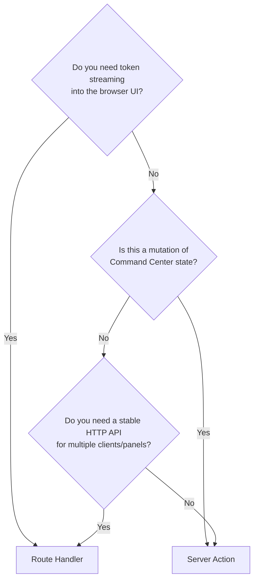

# Native Local-AI Command Center Masterplan (Next.js 15 App Router + TypeScript)

## Command Center system architecture and runtime selection

**Section 1 — System Architecture Diagram**

```mermaid
flowchart LR
  subgraph UI[Next.js 15 App Router UI (Browser)]
    A[Multi-panel Command Center\n(Parallel Routes)]
    A1[Panel: Inference Console]
    A2[Panel: Model Manager]
    A3[Panel: RAG / Indexes]
    A4[Panel: Agents / Tools]
    A5[Panel: Monitoring]
    A6[Panel: Prompt Ops / Eval]
    A --> A1
    A --> A2
    A --> A3
    A --> A4
    A --> A5
    A --> A6
  end

  subgraph API[Next.js Server Layer (Node Runtime)]
    B[Route Handlers\n(REST + Streaming)]
    C[Server Actions\n(Mutations)]
    D[Orchestrator Service\n(Routing / Fallback / Budgets)]
    E[Job Runner\n(Queues + Retries)]
    F[Metrics Collector\n(OS + Ollama)]
  end

  subgraph RUNTIME[Local Model Runtime]
    G[Ollama HTTP Server]
    G1[/api/* Native API\n(NDJSON streaming)]
    G2[/v1/* OpenAI compatibility\n(SDK-friendly)]
  end

  subgraph RAG[RAG Subsystem]
    H[Ingestion Pipeline\n(parse → chunk → embed)]
    I[Vector Store\n(Chroma/LanceDB/Qdrant/pgvector)]
    J[Retriever + Re-ranker\n(BM25 + Vector + RRF)]
  end

  subgraph DB[Local Persistence]
    K[(SQLite or PGlite)]
  end

  UI -->|fetch: HTTP(S)| B
  UI -->|fetch: HTTP(S)| C

  B -->|REST: HTTP| D
  C -->|in-process call| D

  D -->|REST: HTTP| G
  G -->|REST: HTTP| G1
  G -->|REST: HTTP| G2

  D -->|SQL| K
  H -->|SQL| K

  D -->|REST/IPC| H
  H -->|Vector DB API\n(HTTP/gRPC/Embedded)| I
  D -->|Vector search\n(HTTP/gRPC/Embedded)| I
  D -->|rerank: REST/embedded| J

  F -->|OS probes (Node)| B
  F -->|REST: HTTP| G
  B -->|SSE: text/event-stream| UI
  UI -->|SSE client| A5

  E -->|SQL| K
  E -->|REST: HTTP| G
  E -->|Vector DB API| I
```

**Node descriptions (one sentence each):**

- **Multi-panel Command Center**: A browser-only, parallel-routes UI that exposes multiple operator panels simultaneously (not a chat wrapper).
- **Route Handlers**: Same-origin endpoints that proxy streaming + non-streaming inference, RAG queries, and live monitoring to the browser using Web Request/Response primitives. citeturn2search7
- **Server Actions**: Mutation-only server functions for “write paths” like updating configs, saving prompts, and scheduling jobs (not ideal for token streaming). citeturn20search1turn20search2
- **Orchestrator Service**: The policy engine that routes tasks to models, enforces context budgets, and implements fallbacks.
- **Job Runner**: A durable local queue for ingestion + agent tool jobs persisted to SQLite/PGlite.
- **Metrics Collector**: A Node-only subsystem using OS probes + Ollama state endpoints to compute live stats. citeturn9search4turn4view1
- **Ollama HTTP Server**: Primary local inference backend, exposing both a native `/api/*` surface and an OpenAI-compatible `/v1/*` surface. citeturn9search10turn19view0
- **Native `/api/*`**: NDJSON streaming endpoints for low-level control and local-first features. citeturn19view1turn9search31
- **OpenAI `/v1/*`**: Compatibility endpoints to reuse existing SDKs by changing base URL to `http://localhost:11434/v1/`. citeturn19view0
- **Ingestion Pipeline**: Local document→chunks→embeddings→index pipeline, designed for Node execution (not Python-first).
- **Vector Store**: Local vector database choice (embedded or server) powering retrieval. citeturn7search24turn7search29turn6search3turn7search14
- **SQLite/PGlite**: Local system-of-record for all Command Center metadata (conversations, configs, pipelines, tasks, evaluations). citeturn18search3turn17search7turn18search2

**Critical deployment constraint (browser-first, local inference):** If you serve the UI over HTTPS (e.g., a hosted domain) but call `http://localhost:11434` from the browser, modern browsers can block insecure (HTTP) subrequests from secure origins (“mixed content”). citeturn17search5turn19view0  
**Architectural consequence:** This Command Center should run as a **local Next.js server** (same machine as Ollama) so the browser talks same-origin to Next.js, and Next.js talks to Ollama over localhost.

---

**Section 2 — Runtime Comparison Table**

The table below focuses on local runtimes that can back a Next.js browser-first Command Center (no Electron/Tauri), using 2024–2026 primary sources.

| Runtime                      | OpenAI API Compatible                                                               | Streaming Protocol                                                             | Multimodal                                         | GPU Utilization                                                                         | Next.js Integration Friction                                                           | Maintenance Status (early 2026)       | Best For                                                                                                                                 |
| ---------------------------- | ----------------------------------------------------------------------------------- | ------------------------------------------------------------------------------ | -------------------------------------------------- | --------------------------------------------------------------------------------------- | -------------------------------------------------------------------------------------- | ------------------------------------- | ---------------------------------------------------------------------------------------------------------------------------------------- |
| **Ollama**                   | **Partial/experimental** `/v1/*` + full native `/api/*`                             | **NDJSON** (`application/x-ndjson`) on `/api/*`; non-stream via `stream:false` | Vision supported (model-dependent)                 | Loads models into GPU/CPU depending on fit; running-model view via `/api/ps`            | **Low** (simple local HTTP)                                                            | Active releases into Mar 2026         | Best default “developer runtime” with model mgmt + embeddings + native controls citeturn19view0turn19view1turn10view0turn15search0 |
| **llama.cpp HTTP server**    | Yes — OpenAI-compatible routes                                                      | OpenAI-style streaming (server supports OpenAI routes)                         | Multimodal documented                              | CPU-first + optional GPU backends; extensive knobs                                      | Medium (binary/build + config)                                                         | Extremely active (frequent releases)  | Performance + control for GGUF fleets, plus server-grade features citeturn19view2turn14search0                                       |
| **LocalAI**                  | Yes — OpenAI alternative                                                            | OpenAI-style streaming                                                         | Audio + multimodal (backend-dependent)             | Backend-dependent; unified backends mentioned                                           | Medium–High (broader system)                                                           | Active releases Feb 2026              | “One server for many backends” when you want breadth (ASR/TTS/vision/etc.) citeturn14search1turn14search9                            |
| **LM Studio server mode**    | Yes — `/v1/models`, `/v1/chat/completions`, `/v1/responses`, `/v1/embeddings`, etc. | OpenAI-style streaming                                                         | Model-dependent                                    | Desktop-managed engine; depends on app                                                  | High (requires desktop app running; violates “no desktop packaging” as a primary path) | Active app builds Feb 2026            | Personal dev convenience; not ideal as a foundational runtime for this stack citeturn14search3turn15search10                         |
| **vLLM (incl. CPU support)** | Yes — OpenAI-compatible server                                                      | Streaming outputs supported                                                    | Primarily text; multimodal via vLLM-Omni ecosystem | GPU-optimized (PagedAttention, batching); CPU support exists with platform requirements | High (Python ops + heavier serving)                                                    | Very active (biweekly cadence target) | Throughput-critical serving on dedicated hardware; not “local dev default” citeturn15search13turn15search29turn15search5            |

### Weighted recommendation score (Python-computed)

To satisfy the “compute if helpful” requirement, I computed a **feature-weighted score** using only capabilities evidenced in the sources (OpenAI-compat, streaming present, multimodal presence, GPU orientation, maintenance) plus a clearly labeled “integration friction” rating (architect judgment). This is not a benchmark. **Treat it as a routing heuristic for what to spike first.**

| Runtime                  | Weighted score (0–1) |
| ------------------------ | -------------------: |
| llama.cpp HTTP server    |                0.918 |
| vLLM (incl. CPU support) |                0.880 |
| Ollama                   |                0.871 |
| LocalAI                  |                0.859 |
| LM Studio server mode    |                0.754 |

**Architect interpretation:** Even if llama.cpp scores highest on “control + breadth,” your stack constraints explicitly require **Ollama as the primary runtime**, so the practical result is: **build against Ollama first**, but design the runtime adapter so llama.cpp and LocalAI can be “drop-in” adapters later via OpenAI-compatible `/v1/*` endpoints. citeturn19view0turn19view2turn14search1

## Next.js 15 Command Center architecture deep dive

**Section 3 — Next.js Architecture Deep Dive**

### Route groups and parallel route layout for a multi-panel Command Center

Parallel routes give you **named slots** for panels that can render independently under a shared layout (critical for a “control surface” UI). citeturn2search0  
Route groups let you segment app structure without changing URLs, which is ideal for isolating “Command Center” concerns (e.g., `(cc)`, `(auth)`, `(settings)`) and scoping loading states. citeturn2search1turn9search29

**Proposed file structure (App Router):**

```txt
app/
  (cc)/
    layout.tsx                 # common shell: topbar + resizable grid
    page.tsx                   # default landing composition
    @inference/page.tsx        # Inference console
    @models/page.tsx           # Model manager
    @rag/page.tsx              # RAG pipeline
    @agents/page.tsx           # Agents/tools
    @monitor/page.tsx          # Monitoring panel
    @prompts/page.tsx          # Prompt ops/evals
    api/
      ollama/
        chat/route.ts          # proxy /api/chat
        generate/route.ts      # proxy /api/generate
        embed/route.ts         # proxy /api/embed
      monitoring/
        stream/route.ts        # SSE to browser
      rag/
        ingest/route.ts        # ingestion job enqueue
        query/route.ts         # retrieval + rerank + generate
      admin/
        export/route.ts        # data export for audits
  (auth)/
    login/page.tsx
```

### Server runtime selection (Node vs Edge)

You will need the **Node.js runtime** for this stack: local SQLite libraries, OS-level monitoring, filesystem ingestion, and long-lived streaming proxies are “Node-shaped” workloads. Next.js documents that it has two runtimes—Node.js (default, full Node APIs) and Edge (limited APIs)—and Edge does **not** support all Node APIs. citeturn24search1turn24search0

**Hard rule:** Put inference proxy + SQLite + monitoring in Node routes (Route Handlers). Use Edge only for lightweight routing/security if you choose (but not required for a localhost app). citeturn24search1turn24search0

### Server Actions vs Route Handlers decision tree (for inference calls)



**Rationale (sourced):**

- Route Handlers are the correct primitive when you need explicit HTTP semantics (methods, headers, streaming bodies) in App Router. citeturn2search7
- Server Actions are designed for “updating data” (mutations), work well with form submissions, and offer an ergonomic mutation path in App Router; they’re not positioned as a general-purpose streaming transport. citeturn20search1turn20search2

### Streaming implementation patterns with Ollama (TypeScript)

Ollama streams certain endpoints (e.g., `/api/generate`) by default using **newline-delimited JSON** (`application/x-ndjson`), and you can disable streaming with `{"stream": false}` to get a single JSON payload. citeturn19view1turn9search31

#### Pattern A: Proxy NDJSON → browser `ReadableStream` (raw passthrough)

Use this when your client can parse NDJSON (recommended for maximum fidelity & lowest overhead).

```ts
// app/(cc)/api/ollama/generate/route.ts
export const runtime = 'nodejs'

export async function POST(req: Request) {
  const body = await req.json()

  const upstream = await fetch('http://127.0.0.1:11434/api/generate', {
    method: 'POST',
    headers: { 'Content-Type': 'application/json' },
    body: JSON.stringify(body),
  })

  // Pass through upstream headers when safe; keep streaming.
  return new Response(upstream.body, {
    status: upstream.status,
    headers: {
      'Content-Type': upstream.headers.get('Content-Type') ?? 'application/x-ndjson',
      'Cache-Control': 'no-store',
    },
  })
}
```

Why this works: Next.js Route Handlers return standard Web `Response` objects, so streaming bodies are supported as long as the deployment/runtime supports it. citeturn2search7turn19view1

#### Pattern B: Convert NDJSON → SSE for browser simplicity

Use SSE (`text/event-stream`) when you want easy incremental UI updates without building NDJSON parsing on the client.

```ts
// app/(cc)/api/ollama/generate-sse/route.ts
export const runtime = 'nodejs'

export async function POST(req: Request) {
  const body = await req.json()

  const upstream = await fetch('http://127.0.0.1:11434/api/generate', {
    method: 'POST',
    headers: { 'Content-Type': 'application/json' },
    body: JSON.stringify(body),
  })

  const encoder = new TextEncoder()
  const reader = upstream.body?.getReader()
  if (!reader) return new Response('No upstream body', { status: 502 })

  const stream = new ReadableStream({
    async start(controller) {
      controller.enqueue(encoder.encode(`event: open\ndata: {}\n\n`))
      let buf = ''
      while (true) {
        const { value, done } = await reader.read()
        if (done) break
        buf += new TextDecoder().decode(value, { stream: true })

        // NDJSON → one JSON per line
        let idx
        while ((idx = buf.indexOf('\n')) >= 0) {
          const line = buf.slice(0, idx).trim()
          buf = buf.slice(idx + 1)
          if (!line) continue

          controller.enqueue(encoder.encode(`event: chunk\ndata: ${line}\n\n`))
        }
      }
      controller.enqueue(encoder.encode(`event: close\ndata: {}\n\n`))
      controller.close()
    },
  })

  return new Response(stream, {
    headers: {
      'Content-Type': 'text/event-stream',
      'Cache-Control': 'no-store',
      Connection: 'keep-alive',
    },
  })
}
```

This design is directly motivated by Ollama’s NDJSON streaming contract. citeturn19view1

### WebSocket viability in App Router

Next.js App Router does not provide “first-class” WebSocket support inside Route Handlers; community discussions repeatedly point out the mismatch with the request/response model and serverless constraints. citeturn2search3  
**Architect recommendation:** Prefer **SSE for server→browser** streaming (monitoring, token streams). Use WebSockets only if you introduce a separate long-lived Node server process (which complicates a browser-first “run it on localhost” posture).

### Vercel AI SDK against local Ollama

- `useChat` provides a streaming chat UI hook and (in v5+) uses a transport-based architecture. citeturn16search0
- Ollama can expose OpenAI-compatible `/v1/*` endpoints at `http://localhost:11434/v1/`, enabling “swap base URL” existing client patterns. citeturn19view0
- The AI SDK ecosystem explicitly lists community Ollama providers. citeturn16search9

**Practical stance:** Use AI SDK’s `useChat` only where it helps (chat-like panes, tool-call traces). For a Command Center, many panels are **not** “chat”; they’re dashboards, job queues, configs, and inspectors, so build custom streams + state stores for most panels.

## Multi-model orchestration and RAG pipeline architecture

**Section 4 — Multi-Model Orchestration Patterns**

### Core concept: task-first routing, not “chat model switching”

Ollama exposes both model inference and model management endpoints in its native API docs (generate/chat/embed plus model operations like pull/show/delete/copy/create). citeturn9search10turn19view0  
This enables you to treat models as **managed resources** in your Command Center, not UI-only toggles.

### Orchestrator contract (TypeScript)

```ts
export type ModelKind = 'chat' | 'completion' | 'embedding' | 'vision'

export interface ModelConfig {
  id: string // internal UUID
  runtime: 'ollama'
  model: string // e.g., "qwen3:8b"
  kind: ModelKind
  // guardrail constraints:
  maxContextTokens: number
  supportsTools: boolean
  supportsVision: boolean
  defaultParams: {
    temperature?: number
    top_p?: number
    num_ctx?: number // Ollama option
    seed?: number
  }
}

export interface InferenceTask {
  taskId: string
  type: 'chat' | 'summarize' | 'extract' | 'classify' | 'embed' | 'rerank'
  input: unknown // messages / text / docs / etc.
  constraints: {
    latencyBudgetMs?: number
    costBudget?: 'low' | 'medium' | 'high' // “cost” = local compute time
    requireVision?: boolean
    requireTools?: boolean
    requiredKind?: ModelKind
  }
}

export interface Orchestrator {
  route(task: InferenceTask): Promise<ModelConfig>
  execute(task: InferenceTask): Promise<{ model: ModelConfig; output: unknown }>
}
```

### Parallel inference patterns (TypeScript)

Use concurrency for:

- **Speculative panel updates** (e.g., generate a title + summary + tags in parallel).
- **Model comparison panel** (run N models on same input concurrently).
- **RAG fusion** (parallel retrieval methods, then fuse).

**Safety/throughput constraint (Ollama):** Ollama queues requests when overloaded and exposes knobs like `OLLAMA_MAX_QUEUE` for queue sizing; it also explains concurrency limits based on memory/VRAM (models must fit in VRAM for concurrent GPU loads). citeturn10view0

**Pattern: bounded concurrency**

```ts
import pLimit from 'p-limit'

const limit = pLimit(2) // tune: CPU cores / VRAM

const results = await Promise.all(selectedModels.map((m) => limit(() => runTaskWithModel(m, task))))
```

### Fallback chains with structured error handling

A robust fallback chain should distinguish:

- **Deterministic failures** (model not present; context too large; tool schema rejected).
- **Resource failures** (503 overload).
- **Quality failures** (low confidence / eval score below threshold).

Ollama documents overload behavior (`503`) and queueing configuration. citeturn10view0

**Fallback policy sketch:**

1. Try fastest “small” model within latency budget.
2. If overloaded (503), retry with exponential backoff + jitter; if still overloaded, downgrade to a smaller model or defer via job queue.
3. If output fails schema/policy, retry with structured output mode where supported.

### Context window budget management across model switches

Ollama supports non-streaming responses for “simpler to process” cases and **structured outputs** via the `format` parameter (“json” or JSON Schema). citeturn19view1turn9search31  
Use this to:

- compress long histories into a structured “state object”
- carry state across model swaps without replaying full transcripts

---

**Section 5 — RAG Pipeline Architecture**

### Node-side ingestion pipeline design (Next.js deployment context)

You need a local, Node-executed ingestion pipeline because:

- you want 100% local inference,
- you likely need filesystem ingestion and local DB writes (Node runtime),
- browser-only ingestion is limited by user file selection unless you use File System Access APIs.

The File System Access API allows directory picking in secure contexts but is still marked “experimental” and requires careful browser-support validation. citeturn17search0turn17search4

**Recommended ingestion stages:**

1. **Acquire**: upload files via browser or directory picker (optional).
2. **Parse**: text extraction (PDF/MD/HTML/code) in Node route/job.
3. **Normalize**: unify text + metadata (source path, timestamps, tags).
4. **Chunk**: doc-type-specific strategies (below).
5. **Embed**: local embedding model via Ollama embeddings endpoints or embedding models.
6. **Index**: write vectors + metadata into vector store; write doc records into SQLite/PGlite.

### Embedding model comparison table

| Model                      | Strengths                                                                     | Tradeoffs                                      | Sources                                                                 |
| -------------------------- | ----------------------------------------------------------------------------- | ---------------------------------------------- | ----------------------------------------------------------------------- |
| **nomic-embed-text**       | Strong general-purpose local embeddings; widely used with Ollama ecosystems   | Final quality depends on corpus/domain         | Nomic embed docs + model/paper context citeturn6search4turn6search8 |
| **mxbai-embed-large**      | Popular high-quality embeddings (often chosen for RAG)                        | Larger footprint than smallest embed models    | Model card + Ollama catalog entry citeturn6search1turn6search9      |
| **snowflake-arctic-embed** | Designed/marketed for retrieval use; Snowflake publishes embedding model work | Verify latency/quality locally for your corpus | Model card + Snowflake launch info citeturn6search2turn6search10    |

**Integration note:** If you standardize on **Ollama embeddings endpoints**, you can swap embedding models without rewriting the ingestion pipeline. Ollama’s API surface explicitly includes embeddings endpoints, alongside generate/chat and model management. citeturn9search10turn19view0

### Vector store comparison table (local-first)

| Vector Store       | Deployment Mode             | Next.js fit                              | Notes                                                       | Sources                                          |
| ------------------ | --------------------------- | ---------------------------------------- | ----------------------------------------------------------- | ------------------------------------------------ |
| **Chroma**         | Embedded (client) or server | Good for local dev; server adds ops      | “Run locally, self-host” posture; CLI exists                | citeturn7search24turn7search16turn7search20 |
| **LanceDB**        | Embedded DB + files         | Strong for “in-process” Node usage       | Has JS/TS SDK + LangChain JS integration                    | citeturn7search25turn7search29turn7search9  |
| **Qdrant (local)** | Server (Docker/native)      | Great when you want “real DB” semantics  | Strong standalone vector DB; local quickstart               | citeturn6search3turn6search7                 |
| **pgvector**       | Postgres extension          | Best if you want “SQL + vectors” unified | Actively maintained; recent releases include security fixes | citeturn7search14turn7search18turn7search2  |

### Chunking strategy guide by document type

Chunking choice measurably affects retrieval quality; Chroma Research explicitly shows chunking strategy can significantly impact retrieval performance. citeturn21search12  
However, semantic chunking may not consistently justify its computational cost; a 2024 evaluation reports inconsistent gains vs fixed-size chunking. citeturn21search3

**Pragmatic defaults (Command Center posture):**

- Start with **recursive splitting** as a baseline (fast, robust). LangChain’s recursive splitter integration exists in JS docs. citeturn21search5
- Add specialized strategies per document type only when you can validate with evals (Section 8).

**By document type:**

- **Markdown / prose docs**: recursive splitter with headings as “soft boundaries”.
- **Code**: chunk by file + function/class boundaries; keep imports close to usage.
- **PDFs / papers**: paragraph-based or section-aware chunking can preserve structure; chunking is explicitly framed as critical in RAG literature. citeturn21search11turn21search30
- **Tables/CSVs**: chunk by row blocks + include header context.

### Hybrid BM25 + vector search and re-ranking without cloud APIs

BM25 is a standard lexical ranker and can be used as a retrieval stage or reranker; LangChain JS docs include a BM25 retriever integration. citeturn12search10  
For fusing multiple ranked lists, reciprocal rank fusion (RRF) is a well-known method used for hybrid queries in production search systems. citeturn13search15

**Recommended hybrid retrieval design (Node):**

1. Run vector search topK=50.
2. Run BM25 topK=50.
3. Fuse via RRF (or weighted sum).
4. Re-rank topK=20 with a local cross-encoder reranker model.

**Local re-ranker options (2024–2026 sources):**

- **BAAI bge-reranker-v2-m3** (open reranker; updated 2024). citeturn13search0turn13search4
- **Jina Reranker v2** (released June 2024 per vendor docs). citeturn13search5turn13search1
- **Mixedbread mxbai-rerank-v2** (2025 blog claims stronger benchmarks + longer context). citeturn13search10turn13search14

**Next.js deployment reality:** re-rankers are often not “one fetch call” unless you run them behind a local server (or embed them via ONNX/wasm). Keep reranking behind the same job runner abstraction you use for ingestion.

## Agents, MCP integration, and tool execution layer

**Section 6 — Agent and MCP Integration**

### MCP local setup guide (alongside Ollama)

MCP is defined as an open protocol/spec and is implemented by an official TypeScript SDK. citeturn8search0turn8search3  
The TS SDK runs on Node and provides server/client libraries and transports including stdio and “Streamable HTTP.” citeturn8search3turn8search7

**Recommended local topology:**

- Command Center (Next.js) acts as **agent host + MCP client**
- MCP servers (tools) run as local processes with **stdio transport** (simplest security story)
- Ollama remains the LLM runtime; agent loop calls Ollama, then invokes MCP tools as needed

MCP’s spec notes that stdio-based transports typically pull credentials from environment rather than using the HTTP auth framework. citeturn8search24turn8search0

### Function calling support by model family (table)

Interpretation used here: “function calling support” means the model family has documented tool/function calling patterns or officially supported function calling in its ecosystem; actual reliability must be validated per model + template.

| Model family          | Tool/function calling posture                                                                         | Notes for Ollama + local stack                                                                 | Primary sources                                                                                         |
| --------------------- | ----------------------------------------------------------------------------------------------------- | ---------------------------------------------------------------------------------------------- | ------------------------------------------------------------------------------------------------------- |
| **Llama 3.x**         | Tool use is discussed in ecosystem guides; verify per checkpoint/template                             | In Ollama, tool calling is a platform capability; Llama reliability depends on prompt/template | Ollama tool calling capability citeturn22search2 + ecosystem recipe (secondary) citeturn26search8 |
| **Mistral / Mixtral** | Vendor documents “function calling” capability                                                        | Good for tool pipelines when you can align to expected schemas                                 | Mistral function calling docs citeturn26search2                                                      |
| **Qwen 2.5**          | Official docs discuss function calling templates and procedure                                        | Strong candidate for tool-centric agents; still test locally                                   | Qwen function calling docs citeturn26search13turn26search9                                          |
| **Gemma 3**           | Gemma 3 is multimodal; Google released a specialized FunctionGemma variant tuned for function calling | Prefer function-tuned variants for high tool-call fidelity                                     | Gemma 3 model card citeturn26search3 + FunctionGemma announcement citeturn26search7               |

### ReAct loop implementation in TypeScript (agent runner)

LangChain’s JS agents docs explain the core agent loop: tools + model reasoning, iterating until stop conditions (final output or iteration limit). citeturn22search0

**Minimal local agent loop (framework-agnostic):**

```ts
export interface ToolSpec<I = unknown, O = unknown> {
  name: string
  description: string
  inputSchemaJson: unknown // JSON Schema or Zod->JSON Schema
  execute: (input: I) => Promise<O>
}

export interface AgentState {
  runId: string
  step: number
  messages: Array<{ role: 'system' | 'user' | 'assistant' | 'tool'; content: any }>
  toolTrace: Array<{ tool: string; input: any; output: any; startedAt: number; endedAt: number }>
  status: 'running' | 'needs_tool' | 'complete' | 'failed'
  error?: string
}

export async function runAgent({
  model,
  tools,
  maxSteps = 8,
}: {
  model: ModelConfig
  tools: ToolSpec[]
  maxSteps?: number
}): Promise<AgentState> {
  // Pseudocode:
  // 1) Ask model for next step with tool schema list
  // 2) If tool call, execute tool, append tool result
  // 3) Repeat until "final"
  return { runId: crypto.randomUUID(), step: 0, messages: [], toolTrace: [], status: 'complete' }
}
```

### Tool registry design pattern

**Goals:** discoverability, type safety, least-privilege execution.

- Registry stored in SQLite with versioning.
- Each tool spec has schema + allowlists + rate limits.
- If exposed via MCP, the MCP server wraps the tool and enforces policy.

### Agent task queue with SQLite persistence schema (job state, retry logic)

Use a job queue because:

- tool calls can be slow/IO-bound,
- you need retries and audit trails,
- you need resumability.

Ollama’s API and docs support tool calling as a platform feature. citeturn22search2turn9search10

**SQLite tables (conceptual):**

- `agent_runs`
- `agent_steps`
- `tool_invocations`
- `jobs` (generic queue)

(Concrete Drizzle schema is provided in Section 9.)

## Real-time monitoring, prompt ops, and evaluation workflows

**Section 7 — Real-Time Monitoring Panel**

### Metric collection strategy (macOS + Linux)

Combine three telemetry sources:

1. **OS-level metrics via Node**: `systeminformation` is a Node system/OS information library with broad platform support and frequent updates. citeturn9search0turn9search4
2. **Ollama runtime state**: `/api/ps` lists running models and provides runtime visibility (but does not cover all low-level GPU metrics). citeturn4view1turn9search10
3. **Inference timings from responses**: Ollama’s streaming final payload includes generation stats, and the docs describe how to compute tokens/sec from `eval_count` and `eval_duration`. citeturn9search2turn19view1

### Transport: SSE vs WebSocket (recommendation)

- **SSE advantages**: one-way server→browser streaming fits “live dashboard” updates, maps cleanly to Route Handlers returning streaming `Response`s. citeturn2search7
- **WebSockets in Next.js App Router**: not first-class in Route Handlers; community consensus highlights the mismatch/constraints. citeturn2search3

**Recommendation:** Use **SSE** for monitoring updates; reserve WebSockets for a separate custom server only if you truly need bidirectional realtime control.

### Charting library comparison (for streaming dashboards)

- **Recharts**: actively maintained React chart library built with React + D3; frequent releases and TypeScript support. citeturn23search0turn23search12
- **Tremor**: dashboard component library built on Tailwind and Recharts (good match for your Tailwind + shadcn/ui stack). citeturn23search1turn23search4
- **Observable Plot**: concise JS plotting library for exploratory visualization (great for “analysis panels,” less for dashboard widgets). citeturn23search2

**Recommendation for this Command Center:** **Tremor components + occasional raw Recharts** for realtime charts, because Tremor is explicitly Tailwind-based and built atop Recharts, aligning with your UI stack. citeturn23search1turn23search0

### Polling overhead model (Python-computed)

If you poll metrics instead of SSE, request volume grows quickly:

Assuming **4 KB payload per poll** (JSON stats), total transfer is:

| Interval | Requests/min | Data/min | Data/hour |
| -------: | -----------: | -------: | --------: |
|     0.5s |          120 |   480 KB |  28.12 MB |
|     1.0s |           60 |   240 KB |  14.06 MB |
|     2.0s |           30 |   120 KB |   7.03 MB |
|     5.0s |           12 |    48 KB |   2.81 MB |

**Interpretation:** Polling at sub-second intervals is wasteful for a local dashboard; SSE provides lower overhead by keeping one connection open and pushing updates only when needed.

---

**Section 8 — Prompt Pipeline Management**

### Versioned prompt template schema (TypeScript)

```ts
export interface PromptTemplateVersion {
  id: string // UUID
  slug: string // stable identifier, e.g. "rag.answer.v1"
  version: number // monotonically increasing
  createdAt: string // ISO
  updatedAt: string // ISO
  notes?: string

  // Template content:
  system?: string
  user: string

  // Variables expected by template:
  variables: Array<{
    name: string
    type: 'string' | 'number' | 'boolean' | 'json'
    required: boolean
    default?: unknown
  }>

  // Guardrails / output shaping:
  output: {
    mode: 'text' | 'json'
    jsonSchema?: unknown // used with Ollama "format" when applicable
  }

  // Preferred execution defaults:
  defaultModel: string // e.g. "qwen3:8b"
  defaultParams: Record<string, unknown>
}
```

Ollama supports structured outputs via `format` (“json” or JSON Schema), which makes prompt runs more evaluable and comparable. citeturn9search31turn19view1

### Local evaluation scoring options (RAGAS-like, but JS-first)

**promptfoo** is an open-source CLI/library for evaluating prompts, agents, and RAGs, with scoring and metrics. citeturn12search20turn12search0  
It supports using **Ollama as a local grading provider** for model-graded assertions. citeturn12search1  
promptfoo’s expected-outputs system covers deterministic and model-graded evaluation. citeturn12search25turn12search9

**Recommended evaluation stack (all local inference):**

- Deterministic checks (regex, JSON schema validation)
- Embedding similarity checks (for “answer similarity”)
- LLM-as-judge rubric scoring using a local Ollama model (promptfoo Ollama provider)

### A/B prompt experiment tracking pattern

- Define “experiment” as: `{prompt_version_a, prompt_version_b, model_config, dataset_slice, metric_set}`.
- Store each run: inputs, outputs, latency, token stats, score breakdown.
- For UI: a “diff inspector” panel showing output diffs + score deltas.

### Complete SQLite schema for prompt runs (Drizzle ORM)

(Concrete schema provided in Section 9 so persistence stays centralized.)

## Persistence layer recommendation, security, and network isolation

**Section 9 — Persistence Layer Recommendation**

### Step-by-step ORM tradeoff analysis (Next.js App Router context)

#### Drizzle ORM + better-sqlite3 (SQLite file)

- Drizzle provides code-first migrations: schema as source of truth → generate SQL migrations via drizzle-kit. citeturn18search2turn18search10
- better-sqlite3 is a Node-native SQLite binding (native addon architecture), which implies Node runtime requirement. citeturn17search7turn17search19
- Next.js Edge runtime does not support native Node APIs; Node runtime does. citeturn24search1turn24search0

**Implication:** This pairing is excellent for a **localhost Node server** Command Center, but it is not Edge-friendly.

#### Prisma + SQLite

- Prisma documents SQLite connector support and provides a SQLite quickstart. citeturn18search0turn18search22
- Developer experience is strong (Prisma Client, migrations), but Prisma’s engine model can feel heavyweight for an offline/local-only tool (architect judgment).

#### PGlite (Postgres WASM) + Drizzle

- Drizzle’s PGlite guide describes PGlite as a WASM Postgres build runnable in browser/Node/Bun, enabling Postgres locally without installing Postgres. citeturn18search3turn5search3
- PGlite supports ORM/query-builder integrations (including Drizzle guidance). citeturn18search7turn18search3

**Implication:** PGlite is compelling if you want **Postgres semantics locally** (and potential vector similarity via pgvector), but you must validate performance and operational ergonomics.

### Comparison table

| Option                   | Edge compatibility                                           | Migration tooling (2026)                                               | Type safety        | Embedding similarity query performance            | DX                        | Verdict                                       |
| ------------------------ | ------------------------------------------------------------ | ---------------------------------------------------------------------- | ------------------ | ------------------------------------------------- | ------------------------- | --------------------------------------------- |
| Drizzle + better-sqlite3 | Node-only (native addon) citeturn17search19turn24search1 | Strong (drizzle-kit) citeturn18search2turn18search10               | Excellent TS-first | Needs extra tooling if you want vectors in SQLite | Excellent for local-first | **Best default** for this stack               |
| Prisma + SQLite          | Node-oriented                                                | Mature migrations + tooling citeturn18search22turn18search0        | Excellent          | Similar: needs extra tooling for vectors          | Great                     | Good alternative if team already standardized |
| PGlite + Drizzle         | Browser/Node                                                 | Drizzle migrations; PGlite evolving citeturn18search3turn18search2 | Excellent          | Potentially strong if you use pgvector semantics  | Good but validate         | Consider for “SQL + vectors unified”          |

### Final recommendation (explicit rationale)

**Choose: Drizzle ORM + SQLite (better-sqlite3) for the primary persistence layer** because:

- you are building a **localhost-first** Command Center where Node runtime is acceptable/expected, citeturn24search1turn24search0
- Drizzle’s migration flow is TS schema-first and ergonomic, citeturn18search2turn18search10
- SQLite is operationally trivial for local persistence (single file), and better-sqlite3 is a widely used Node SQLite library. citeturn17search7turn17search19

Keep PGlite as an optional “advanced mode” if you later want Postgres/pgvector semantics without requiring a Postgres install. citeturn18search3turn18search7

### Complete entity schema (six data types) — Drizzle ORM (TypeScript)

```ts
import { sqliteTable, text, integer, real, blob, index } from 'drizzle-orm/sqlite-core'

// 1) Conversations
export const conversations = sqliteTable('conversations', {
  id: text('id').primaryKey(),
  title: text('title'),
  createdAt: integer('created_at').notNull(), // unix ms
  updatedAt: integer('updated_at').notNull(),
})

// 2) Messages
export const messages = sqliteTable(
  'messages',
  {
    id: text('id').primaryKey(),
    conversationId: text('conversation_id').notNull(),
    role: text('role').notNull(), // system|user|assistant|tool
    contentJson: text('content_json').notNull(),
    model: text('model'),
    createdAt: integer('created_at').notNull(),
  },
  (t) => ({
    byConversation: index('idx_messages_conversation').on(t.conversationId, t.createdAt),
  })
)

// 3) Model configs
export const modelConfigs = sqliteTable('model_configs', {
  id: text('id').primaryKey(),
  name: text('name').notNull(),
  runtime: text('runtime').notNull(), // 'ollama'
  model: text('model').notNull(), // 'qwen3:8b'
  kind: text('kind').notNull(), // chat|completion|embedding|vision
  supportsTools: integer('supports_tools', { mode: 'boolean' }).notNull(),
  supportsVision: integer('supports_vision', { mode: 'boolean' }).notNull(),
  maxContextTokens: integer('max_context_tokens').notNull(),
  paramsJson: text('params_json').notNull(),
  createdAt: integer('created_at').notNull(),
  updatedAt: integer('updated_at').notNull(),
})

// 4) Pipeline definitions (RAG pipelines + ingestion definitions)
export const pipelines = sqliteTable('pipelines', {
  id: text('id').primaryKey(),
  name: text('name').notNull(),
  type: text('type').notNull(), // rag|ingest|eval|agent
  configJson: text('config_json').notNull(), // chunking, embedding model, vector store, etc.
  createdAt: integer('created_at').notNull(),
  updatedAt: integer('updated_at').notNull(),
})

// 5) Agent task logs (agent runs + jobs)
export const jobs = sqliteTable(
  'jobs',
  {
    id: text('id').primaryKey(),
    type: text('type').notNull(), // ingest|agent|eval|export
    status: text('status').notNull(), // queued|running|succeeded|failed|retrying
    attempts: integer('attempts').notNull(),
    maxAttempts: integer('max_attempts').notNull(),
    payloadJson: text('payload_json').notNull(), // input spec
    resultJson: text('result_json'),
    error: text('error'),
    createdAt: integer('created_at').notNull(),
    startedAt: integer('started_at'),
    finishedAt: integer('finished_at'),
  },
  (t) => ({
    byStatus: index('idx_jobs_status').on(t.status, t.createdAt),
  })
)

// 6) Prompt evaluation runs
export const promptRuns = sqliteTable(
  'prompt_runs',
  {
    id: text('id').primaryKey(),
    promptSlug: text('prompt_slug').notNull(),
    promptVersion: integer('prompt_version').notNull(),
    modelConfigId: text('model_config_id').notNull(),
    inputJson: text('input_json').notNull(),
    outputJson: text('output_json').notNull(),
    latencyMs: integer('latency_ms').notNull(),
    // Optional “scoring”
    scoreOverall: real('score_overall'),
    scoreJson: text('score_json'),
    createdAt: integer('created_at').notNull(),
  },
  (t) => ({
    byPrompt: index('idx_prompt_runs_slug_version').on(t.promptSlug, t.promptVersion, t.createdAt),
  })
)
```

**Section 10 — Security and Network Isolation**

### Ollama binding configuration (localhost-only, explicit)

Ollama binds to `127.0.0.1:11434` by default, and you can change the bind address using `OLLAMA_HOST`. citeturn10view0  
Ollama also documents CORS origin configuration via `OLLAMA_ORIGINS`. citeturn10view0

**Recommendation:**

- Keep Ollama bound to localhost (`127.0.0.1`) for default safe posture.
- If you must expose to LAN, do it intentionally (and add auth at the proxy layer).

### Air-gapped operation

Ollama provides a way to disable cloud features via config (`disable_ollama_cloud`) or `OLLAMA_NO_CLOUD=1`. citeturn10view0  
This aligns with your “100% local inference” requirement.

### Optional local auth (NextAuth/Auth.js v5)

Auth.js documents a Credentials provider for arbitrary credentials; it is not intended to persist users by default and is designed for “existing auth systems.” citeturn25search0turn25search11  
The Auth.js migration guide frames v5 as a major rewrite with minimal breaking changes. citeturn25search1

**Recommendation:** For a localhost Command Center, default to “no auth” (developer workstation), but support an optional **Credentials** gate for shared machines:

- Use a single local admin password stored as a salted hash in SQLite.
- Disable signup; no OAuth required; no external calls.

### Environment variable management patterns

- Centralize runtime endpoints (Ollama host, vector DB host) in server-only environment variables.
- Emit a “runtime diagnostics panel” that shows which endpoints are reachable (without leaking secrets).

## Open-source reference audit, phased roadmap, and verification gaps

**Section 11 — Open-Source Reference Audit**

**Open WebUI**: Strong evidence of an offline-first posture and broad runner support (including Ollama) stated directly in its repository description, and rapid ongoing maintenance via frequent releases. Borrowable patterns: plugin-like runtime adapters, admin-grade feature gating, and strong config surfaces; watch for complexity/technical debt from being a large multi-feature platform rather than a minimal command center. citeturn11search0turn11search8turn11search4

**AnythingLLM**: Positions itself as a full-stack “chat with your docs” platform (workspaces + selectable LLM/vector DB), which is useful to study for ingestion UX and workspace/document abstraction; likely carries architectural compromises for supporting many providers and deployment modes (you should selectively borrow UX flows, not the full stack). citeturn11search1turn11search5

**LibreChat**: Feature-rich chat platform with agents and MCP support; it’s valuable as a reference specifically for **multi-provider endpoint abstractions** and “enterprise-ish” auth patterns, but it is structurally a chat platform and includes broad cloud provider coverage (which you are explicitly excluding as primary). Borrow patterns: MCP integration patterns and agent trace UX, but avoid inheriting a monolithic provider layer. citeturn11search2turn11search6turn11search18

**Lobe Chat**: Next.js-based chat framework with an extensible plugin system; it’s a good reference for Next.js UI architecture, state management patterns, and deployment ergonomics, but you must avoid “chat-first” assumptions and refactor toward panel-first workflows. Borrow patterns: plugin registry + settings UX, but replace chat-centric state with pipeline/job-centric state. citeturn11search3turn11search11

---

**Section 12 — Phased Build Roadmap**

### Phase 1: Core inference + model switching

Deliverables: multi-panel shell + routing, Ollama connection diagnostics, inference console (streaming), model manager (list/pull/show/delete), persisted model configs. Complexity: **L**. Dependencies: Ollama `/api/*`, `/v1/*`, Route Handlers streaming (NDJSON/SSE). Primary risk: streaming + cancellation UX correctness under overload/queueing. citeturn19view1turn9search10turn10view0

### Phase 2: RAG + embeddings

Deliverables: ingestion job queue, chunking configurator, embeddings generation, vector store adapter, retrieval panel, citations view. Complexity: **XL**. Dependencies: embeddings models + vector store selection; chunking evaluation harness. Primary risk: retrieval quality regressions due to chunking/index settings. citeturn21search12turn12search10turn7search24turn7search25

### Phase 3: Agents + MCP

Deliverables: MCP client integration, tool registry, agent run panel, job/state persistence, tool permissioning. Complexity: **XL**. Dependencies: MCP TS SDK + Ollama tool calling. Primary risk: tool misuse and safety—needs strong “human-in-the-loop” controls. citeturn8search3turn8search0turn22search2

### Phase 4: Monitoring + prompt evals

Deliverables: monitoring SSE stream, charts, inference performance breakdown, prompt versioning, prompt A/B tests, eval dashboards. Complexity: **L–XL** depending on depth. Dependencies: systeminformation + /api/ps + promptfoo evaluation harness. Primary risk: noisy metrics and misleading dashboards without consistent measurement definitions. citeturn9search4turn4view1turn12search1turn12search25

---

**Section 13 — Unverified / Needs Hands-On Testing**

Exactly five items:

1. **Claim:** Tool calling with `/api/chat` can be streamed while also returning tool call structures reliably.  
   **Why unverified:** Ollama streaming is documented (NDJSON) and tool calling is documented, but “tool calls + streaming + client parsing” is highly model/template dependent. citeturn19view1turn22search2  
   **Experiment:** Run `/api/chat` with `tools` across 3 models (Qwen, Gemma, Mistral) and verify deterministic tool-call JSON emission under both streaming and non-streaming.

2. **Claim:** Vercel AI SDK `useChat` configured against Ollama `/v1/chat/completions` supports all required features for a Command Center (tool call traces, reconnection, abort).  
   **Why unverified:** AI SDK documents `useChat`, and Ollama documents `/v1/*`, but end-to-end behavior depends on streaming semantics and provider adapters. citeturn16search0turn19view0turn16search9  
   **Experiment:** Build a spike panel using `useChat` + Ollama `/v1/*`, test abort, reconnect, long responses, tool calls, and structured outputs.

3. **Claim:** systeminformation provides accurate per-process GPU/VRAM utilization on both macOS and Linux sufficient for a “GPU panel.”  
   **Why unverified:** systeminformation is broadly capable, but GPU/VRAM detail varies by OS/driver and is not guaranteed to meet “command center” needs. citeturn9search4turn9search0  
   **Experiment:** Compare systeminformation outputs against `nvidia-smi` (Linux NVIDIA) and native macOS tooling for the same inference workload.

4. **Claim:** PGlite + pgvector-like workloads are performant enough for >100k chunks on commodity machines (browser/Node) for real-time RAG.  
   **Why unverified:** PGlite is positioned as WASM Postgres for browser/Node, but large-scale vector workloads need profiling. citeturn18search3turn18search7turn7search18  
   **Experiment:** Load 100k–500k embeddings, measure query latency for topK=20 cosine search under realistic concurrency.

5. **Claim:** Chroma vs LanceDB vs Qdrant retrieval latency and memory footprint in a Next.js localhost deployment are consistent with expectations without tuning.  
   **Why unverified:** All support local operation, but performance is workload- and configuration-dependent. citeturn7search24turn7search25turn6search3  
   **Experiment:** Run a standardized benchmark: 50k docs, same embeddings, measure p50/p95 query latency, ingest throughput, and resident memory.

---

**Architect’s Verdict (max 150 words)**  
The single highest-risk architectural decision is **how the browser reaches a “local-only” Ollama runtime** without introducing mixed-content blocks or a fragile cross-origin story. citeturn17search5turn19view0  
Mitigation path A: run the entire Command Center as a localhost Next.js Node server (same-origin UI → Route Handlers → Ollama). This is the simplest, most reliable, and matches your local-inference constraint.  
Mitigation path B: if you must host the UI remotely, introduce a secure local proxy/agent (TLS termination + auth + tunnel) so the browser never calls `http://localhost` directly.  
Recommended: **Path A** for correctness, simplicity, and debuggability; add Path B only if you later need remote access.

---

## Works Cited

[1] “Mixed content errors,” Cloudflare Docs. `https://developers.cloudflare.com/ssl/troubleshooting/mixed-content-errors/` (crawled 2026-03-17). citeturn17search5  
[2] “OpenAI compatibility,” Ollama API Reference. `https://docs.ollama.com/api/openai-compatibility` (crawled 2026-03-17). citeturn19view0  
[3] “Streaming,” Ollama API Reference. `https://docs.ollama.com/api/streaming` (crawled 2026-03-17). citeturn19view1  
[4] “Generate a response,” Ollama API Reference. `https://docs.ollama.com/api/generate` (crawled 2026-03-17). citeturn9search31  
[5] “API (docs/api.md),” ollama/ollama (GitHub). `https://github.com/ollama/ollama/blob/main/docs/api.md` (crawled 2026-03-17). citeturn9search10  
[6] “FAQ (OLLAMA_HOST, OLLAMA_NO_CLOUD, concurrency, origins),” Ollama Docs. `https://docs.ollama.com/faq` (crawled 2026-03-17). citeturn10view0  
[7] “LLaMA.cpp HTTP Server README,” ggml-org/llama.cpp (GitHub). `https://github.com/ggml-org/llama.cpp/blob/master/tools/server/README.md` (crawled 2026-03-17). citeturn19view2  
[8] “Releases,” ggml-org/llama.cpp (GitHub). `https://github.com/ggml-org/llama.cpp/releases` (crawled 2026-03-17). citeturn14search0  
[9] “Releases,” mudler/LocalAI (GitHub). `https://github.com/mudler/LocalAI/releases` (crawled 2026-03-17). citeturn14search1  
[10] “LocalAI repository (roadmap notes),” mudler/LocalAI (GitHub). `https://github.com/mudler/LocalAI` (crawled 2026-03-17). citeturn14search9  
[11] “OpenAI Compatibility Endpoints,” LM Studio Docs. `https://lmstudio.ai/docs/developer/openai-compat` (crawled 2026-03-17). citeturn14search3  
[12] “LM Studio Changelog (0.4.5, LM Link, tool calling notes),” LM Studio. `https://lmstudio.ai/changelog` (crawled 2026-03-17). citeturn15search10  
[13] “vLLM repository README,” vllm-project/vllm (GitHub). `https://github.com/vllm-project/vllm` (crawled 2026-03-17). citeturn15search13  
[14] “Release process and cadence,” vllm-project/vllm (GitHub). `https://github.com/vllm-project/vllm/blob/main/RELEASE.md` (crawled 2026-03-17). citeturn15search29  
[15] “Releases,” vLLM (release listing). `https://vllm.ai/releases` (crawled 2026-03-17). citeturn15search5  
[16] “Parallel Routes,” Next.js Docs. `https://nextjs.org/docs/app/building-your-application/routing/parallel-routes` (crawled 2026-03-17). citeturn2search0  
[17] “Route Groups,” Next.js Docs. `https://nextjs.org/docs/app/building-your-application/routing/route-groups` (crawled 2026-03-17). citeturn2search1  
[18] “Route Handlers,” Next.js Docs. `https://nextjs.org/docs/app/building-your-application/routing/route-handlers` (crawled 2026-03-17). citeturn2search7  
[19] “Getting Started: Updating Data (Server Actions),” Next.js Docs. `https://nextjs.org/docs/app/getting-started/updating-data` (crawled 2026-03-17). citeturn20search1  
[20] “next.config.js: serverActions,” Next.js Docs. `https://nextjs.org/docs/app/api-reference/config/next-config-js/serverActions` (crawled 2026-03-17). citeturn20search2  
[21] “Edge Runtime,” Next.js Docs. `https://nextjs.org/docs/app/api-reference/edge` (crawled 2026-03-17). citeturn24search1  
[22] “Using Node.js Modules in Edge Runtime,” Next.js error docs. `https://nextjs.org/docs/messages/node-module-in-edge-runtime` (crawled 2026-03-17). citeturn24search0  
[23] “WebSocked support docs discussion,” vercel/next.js (GitHub Discussion #58698). `https://github.com/vercel/next.js/discussions/58698` (crawled 2026-03-17). citeturn2search3  
[24] “AI SDK UI: useChat,” Vercel AI SDK Docs. `https://ai-sdk.dev/docs/reference/ai-sdk-ui/use-chat` (crawled 2026-03-17). citeturn16search0  
[25] “Community Providers: Ollama,” Vercel AI SDK Docs. `https://ai-sdk.dev/providers/community-providers/ollama` (crawled 2026-03-17). citeturn16search9  
[26] “systeminformation (overview),” systeminformation.io. `https://systeminformation.io/` (crawled 2026-03-17). citeturn9search4  
[27] “systeminformation (npm),” npm. `https://www.npmjs.com/package/systeminformation` (crawled 2026-03-17). citeturn9search0  
[28] “/api/ps (List Running Models),” Ollama API docs. `https://github.com/ollama/ollama/blob/main/docs/api.md` (crawled 2026-03-17). citeturn4view1turn9search10  
[29] “Recharts repository,” recharts/recharts (GitHub). `https://github.com/recharts/recharts` (crawled 2026-03-17). citeturn23search0  
[30] “Tremor (Tailwind + Recharts),” Tremor NPM site / repo. `https://npm.tremor.so/` and `https://github.com/tremorlabs/tremor-npm` (crawled 2026-03-17). citeturn23search1turn23search4  
[31] “Observable Plot repository,” observablehq/plot (GitHub). `https://github.com/observablehq/plot` (crawled 2026-03-17). citeturn23search2  
[32] “Drizzle migrations,” Drizzle ORM Docs. `https://orm.drizzle.team/docs/migrations` (crawled 2026-03-17). citeturn18search2  
[33] “drizzle-kit (CLI migrator),” npm. `https://www.npmjs.com/package/drizzle-kit` (crawled 2026-03-17). citeturn18search10  
[34] “SQLite connector,” Prisma Docs. `https://www.prisma.io/docs/orm/core-concepts/supported-databases/sqlite` (crawled 2026-03-17). citeturn18search0  
[35] “Quickstart: Prisma ORM with SQLite,” Prisma Docs. `https://www.prisma.io/docs/prisma-orm/quickstart/sqlite` (crawled 2026-03-17). citeturn18search22  
[36] “PGlite (Drizzle integration),” Drizzle Docs + PGlite docs. `https://orm.drizzle.team/docs/connect-pglite` and `https://pglite.dev/docs/orm-support` (crawled 2026-03-17). citeturn18search3turn18search7  
[37] “better-sqlite3 (npm) + native addon architecture,” npm / docs. `https://www.npmjs.com/package/better-sqlite3` and `https://deepwiki.com/WiseLibs/better-sqlite3/4.2-native-addon-architecture` (crawled 2026-03-17). citeturn17search7turn17search19  
[38] “pgvector releases (0.8.0, 0.8.2 CVE fix),” PostgreSQL.org. `https://www.postgresql.org/about/news/pgvector-080-released-2952/` and `https://www.postgresql.org/about/news/pgvector-082-released-3245/` (crawled 2026-03-17). citeturn7search14turn7search18  
[39] “Chroma overview + CLI,” Chroma Docs / GitHub. `https://docs.trychroma.com/docs/overview/introduction` and `https://docs.trychroma.com/docs/cli/install` (crawled 2026-03-17). citeturn7search24turn7search16  
[40] “LanceDB JS/TS SDK + LangChain integration,” LanceDB docs / LangChain docs. `https://lancedb.github.io/lancedb/` and `https://docs.langchain.com/oss/javascript/integrations/vectorstores/lancedb` (crawled 2026-03-17). citeturn7search25turn7search29  
[41] “Qdrant quickstart/local,” Qdrant Docs. `https://qdrant.tech/documentation/quickstart/` (crawled 2026-03-17). citeturn6search3  
[42] “Chunking evaluation + semantic chunking study,” Chroma Research + arXiv. `https://research.trychroma.com/evaluating-chunking` and `https://arxiv.org/abs/2410.13070` (crawled 2026-03-17). citeturn21search12turn21search3  
[43] “LangChain Recursive Text Splitter (JS),” LangChain Docs. `https://docs.langchain.com/oss/javascript/integrations/splitters/recursive_text_splitter` (crawled 2026-03-17). citeturn21search5  
[44] “BM25 retriever (JS),” LangChain Docs. `https://docs.langchain.com/oss/javascript/integrations/retrievers/bm25` (crawled 2026-03-17). citeturn12search10  
[45] “Reciprocal Rank Fusion in hybrid search,” Microsoft Learn. `https://learn.microsoft.com/en-us/azure/search/hybrid-search-ranking` (crawled 2026-03-17). citeturn13search15  
[46] “BAAI bge-reranker-v2-m3 model card,” Hugging Face / ModelScope. `https://huggingface.co/BAAI/bge-reranker-v2-m3` (crawled 2026-03-17). citeturn13search0turn13search4  
[47] “Jina Reranker v2,” Jina AI + model card. `https://jina.ai/reranker/` and `https://huggingface.co/jinaai/jina-reranker-v2-base-multilingual` (crawled 2026-03-17). citeturn13search5turn13search1  
[48] “mxbai-rerank-v2,” Mixedbread blog + model card. `https://www.mixedbread.com/blog/mxbai-rerank-v2` and `https://huggingface.co/mixedbread-ai/mxbai-rerank-large-v2` (crawled 2026-03-17). citeturn13search10turn13search14  
[49] “Model Context Protocol (MCP) spec + TypeScript SDK,” MCP GitHub. `https://github.com/modelcontextprotocol/modelcontextprotocol` and `https://github.com/modelcontextprotocol/typescript-sdk` (crawled 2026-03-17). citeturn8search0turn8search3  
[50] “MCP TypeScript SDK docs,” ts.sdk.modelcontextprotocol.io. `https://ts.sdk.modelcontextprotocol.io/` (crawled 2026-03-17). citeturn8search7  
[51] “Tool calling,” Ollama Docs. `https://docs.ollama.com/capabilities/tool-calling` (crawled 2026-03-17). citeturn22search2  
[52] “Agents (JS),” LangChain Docs. `https://docs.langchain.com/oss/javascript/langchain/agents` (crawled 2026-03-17). citeturn22search0  
[53] “Function Calling,” Mistral Docs. `https://docs.mistral.ai/capabilities/function_calling` (crawled 2026-03-17). citeturn26search2  
[54] “Function Calling (Qwen),” Qwen Docs + repo. `https://qwen.readthedocs.io/en/v2.0/framework/function_call.html` and `https://github.com/mx4ai/qwen2.5` (crawled 2026-03-17). citeturn26search13turn26search9  
[55] “Gemma 3 model card + FunctionGemma,” Google AI. `https://ai.google.dev/gemma/docs/core/model_card_3` and `https://blog.google/innovation-and-ai/technology/developers-tools/functiongemma/` (crawled 2026-03-17). citeturn26search3turn26search7  
[56] “Credentials Provider (Auth.js),” Auth.js Docs. `https://authjs.dev/getting-started/providers/credentials` (crawled 2026-03-17). citeturn25search0  
[57] “Migrating to v5,” Auth.js Docs. `https://authjs.dev/getting-started/migrating-to-v5` (crawled 2026-03-17). citeturn25search1  
[58] “Open WebUI repository + releases,” open-webui/open-webui (GitHub). `https://github.com/open-webui/open-webui` and releases page (crawled 2026-03-17). citeturn11search0turn11search8  
[59] “AnythingLLM repository,” Mintplex-Labs/anything-llm (GitHub). `https://github.com/Mintplex-Labs/anything-llm` (crawled 2026-03-17). citeturn11search1  
[60] “LibreChat repository + roadmap,” danny-avila/LibreChat + LibreChat blog. `https://github.com/danny-avila/LibreChat` and `https://www.librechat.ai/blog/2026-02-18_2026_roadmap` (crawled 2026-03-17). citeturn11search2turn11search6  
[61] “LobeChat repository,” oakband/lobechat (GitHub). `https://github.com/oakband/lobechat` (crawled 2026-03-17). citeturn11search3
