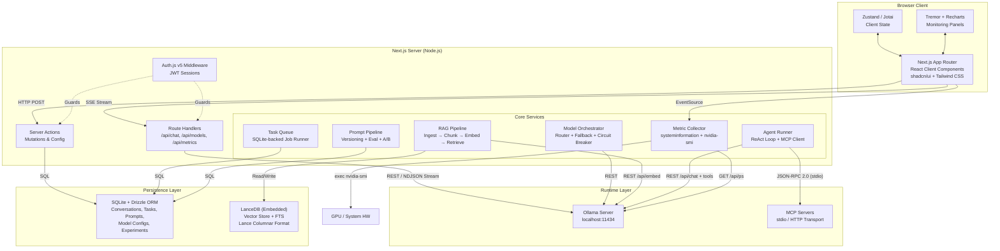

# Local AI Command Center: Technical Masterplan

**Ollama + Next.js 15 App Router — a 100% local inference platform** for multi-model orchestration, RAG pipelines, agent task runners, real-time monitoring, and developer-grade configuration. This masterplan synthesizes primary-source research across 11 technical domains into an actionable architecture. Every major claim is backed by 2024–2026 documentation; conflicts and uncertainties are surfaced explicitly.

The highest-leverage architectural bet is **Ollama as the unified runtime** behind a Next.js App Router shell using Route Handler streaming, Drizzle ORM + better-sqlite3 for persistence, LanceDB for vector storage, and SSE for real-time metrics. The stack avoids Python dependencies entirely, runs inference at **zero cloud cost**, and can be phased from a working chat UI to a full agent platform in four increments.

---

## Section 1: System architecture in Mermaid



**Protocol legend:** Browser↔Server uses **SSE** for streaming inference and metrics, **HTTP POST** for mutations. Server↔Ollama uses **REST with NDJSON** streaming (native API) or **SSE** (OpenAI-compatible endpoints). Server↔MCP uses **JSON-RPC 2.0** over stdio or Streamable HTTP. All persistence is **synchronous SQL** via better-sqlite3 or embedded LanceDB file I/O.

---

## Section 2: Runtime comparison table

| Runtime              | OpenAI API Compatible                                                                                | Streaming                  | Multimodal                                                    | GPU Utilization                                                            | Next.js Integration Friction                                        | Maintenance (2026)                                      | Best For                                                                  |
| -------------------- | ---------------------------------------------------------------------------------------------------- | -------------------------- | ------------------------------------------------------------- | -------------------------------------------------------------------------- | ------------------------------------------------------------------- | ------------------------------------------------------- | ------------------------------------------------------------------------- |
| **Ollama**           | ✅ Full (`/v1/chat/completions`, `/v1/embeddings`, `/v1/models`, `/v1/responses`) + Anthropic compat | SSE (v1) + NDJSON (native) | ✅ Vision (LLaVA, Gemma 3, Llama 3.2-vision)                  | CUDA, ROCm 7, Metal, Vulkan; `OLLAMA_NUM_PARALLEL` up to 4                 | **Low** — official `ollama-js` TS client; community AI SDK provider | Extremely active (165K+ stars, monthly releases, v0.18) | **Primary pick**: dev-friendly, one-command setup, broadest model support |
| **llama.cpp server** | ⚠️ Partial (no strict compliance claim)                                                              | SSE                        | ✅ Vision via `--mmproj`                                      | CUDA, ROCm, Metal, Vulkan, SYCL; configurable `--parallel N` slots         | **Medium** — no official JS SDK; use OpenAI SDK                     | Extremely active (daily commits, ggml-org)              | Max hardware control, edge/ARM, single-model serving                      |
| **LocalAI**          | ✅ Most comprehensive (images, audio, TTS, Anthropic, Responses API)                                 | SSE                        | ✅ Best (text + image gen + audio + video + object detection) | CUDA, ROCm, Metal, Vulkan; CPU-first design                                | **Medium** — Docker recommended; OpenAI SDK works                   | Very active (v3.10.0, Jan 2026)                         | Full multimodal stack behind single API                                   |
| **LM Studio**        | ✅ Full + Anthropic + native API with enhanced stats                                                 | SSE                        | ✅ Vision (VLMs via MLX/llama.cpp)                            | Metal (excellent), CUDA, Vulkan (including iGPUs)                          | **Lowest** — dedicated `@lmstudio/sdk` TS client                    | Active (proprietary; frequent product updates)          | Prototyping, model discovery, Apple Silicon dev                           |
| **vLLM**             | ✅ Most standards-compliant (incl. rerank endpoints)                                                 | SSE                        | ✅ Vision + audio (Whisper)                                   | **Best-in-class**: PagedAttention, continuous batching, tensor parallelism | **Medium-High** — Python-centric; OpenAI SDK works                  | Extremely active ("Linux of GenAI Inference")           | Production throughput, multi-user APIs, enterprise scale                  |

**Conflicts noted:** A November 2025 comparison blog (glukhov.org) rated Ollama's tool calling as "limited." However, Ollama's official docs now document full `tool_calls` support with streaming, and tool calling has been verified across Llama 3.x, Qwen 2.5/3, and Mistral families. The limitation was likely accurate for the blog's publication date but has since been addressed.

**Recommendation:** Ollama as the primary runtime for this Command Center. It offers the lowest integration friction, broadest model catalog via one-command pull, and sufficient concurrency for single-developer use. For benchmarking panels, expose an option to point at llama.cpp server for raw performance comparison.

---

## Section 3: Next.js architecture deep dive

### App Router structure for the Command Center

```
app/
├── (auth)/
│   ├── login/page.tsx
│   └── layout.tsx                    # Minimal layout, no sidebar
├── (command-center)/
│   ├── layout.tsx                    # Sidebar + header shell
│   ├── dashboard/
│   │   ├── layout.tsx                # Parallel route host
│   │   ├── page.tsx                  # Overview / home
│   │   ├── @chat/
│   │   │   ├── page.tsx              # Chat panel
│   │   │   ├── loading.tsx           # Independent skeleton
│   │   │   └── default.tsx
│   │   ├── @monitoring/
│   │   │   ├── page.tsx              # GPU/CPU/VRAM metrics
│   │   │   ├── loading.tsx
│   │   │   └── default.tsx
│   │   └── @tools/
│   │       ├── page.tsx              # Active tools/agents
│   │       ├── loading.tsx
│   │       └── default.tsx
│   ├── models/page.tsx               # Model registry + switching
│   ├── rag/page.tsx                  # RAG pipeline config
│   ├── agents/page.tsx               # Agent task runners
│   ├── prompts/page.tsx              # Prompt pipeline + eval
│   ├── benchmarks/page.tsx           # Model benchmarking
│   └── settings/page.tsx             # Developer config surfaces
├── api/
│   ├── chat/route.ts                 # SSE streaming → Ollama
│   ├── models/route.ts               # Model registry CRUD
│   ├── metrics/route.ts              # SSE metric stream
│   ├── rag/ingest/route.ts           # Document upload
│   ├── agents/route.ts               # Agent task submission
│   └── prompts/route.ts              # Prompt CRUD + eval
└── layout.tsx                        # Root layout
```

Route groups `(auth)` and `(command-center)` share no layout chrome—navigating between them triggers a full layout swap. Parallel routes (`@chat`, `@monitoring`, `@tools`) render independently within the dashboard layout, each with isolated loading and error states.

### Server Actions vs Route Handlers: the decision tree

**Use Route Handlers** when the response must stream (LLM inference, metric feeds, SSE connections), when an external client may call the endpoint, or when you need full HTTP control (headers, status codes). **Use Server Actions** for all mutations: saving model configs, creating prompt templates, enqueuing agent tasks, toggling pipeline settings. Server Actions cannot natively stream responses—they are POST-only and designed for form submissions and state mutations.

The Vercel AI SDK v6 introduced experimental Server Action support for `useChat`, but this works by internally wrapping the streaming protocol. For maximum control and debuggability in a local Command Center, **Route Handlers remain the recommended streaming path**.

### Streaming implementation: Ollama NDJSON → client SSE

Ollama's native `/api/chat` returns **NDJSON** (newline-delimited JSON), not SSE. The `/v1/chat/completions` endpoint returns standard SSE. The Route Handler below proxies the native API and transforms the stream:

```typescript
// app/api/chat/route.ts
export const runtime = 'nodejs'
export const dynamic = 'force-dynamic'

export async function POST(request: Request) {
  const { messages, model } = await request.json()
  const ollamaRes = await fetch('http://127.0.0.1:11434/api/chat', {
    method: 'POST',
    headers: { 'Content-Type': 'application/json' },
    body: JSON.stringify({ model, messages, stream: true }),
  })
  if (!ollamaRes.ok || !ollamaRes.body) {
    return new Response('Ollama unavailable', { status: 502 })
  }
  const transform = new TransformStream({
    transform(chunk, controller) {
      const text = new TextDecoder().decode(chunk)
      for (const line of text.split('\n').filter(Boolean)) {
        try {
          const json = JSON.parse(line)
          if (json.message?.content) {
            controller.enqueue(
              new TextEncoder().encode(
                `data: ${JSON.stringify({ content: json.message.content })}\n\n`
              )
            )
          }
          if (json.done) {
            controller.enqueue(
              new TextEncoder().encode(
                `data: ${JSON.stringify({
                  done: true,
                  metrics: {
                    eval_count: json.eval_count,
                    eval_duration: json.eval_duration,
                    tokens_per_sec: json.eval_count / (json.eval_duration / 1e9),
                  },
                })}\n\n`
              )
            )
            controller.terminate()
          }
        } catch {
          /* partial JSON across chunk boundary — buffer in production */
        }
      }
    },
  })
  return new Response(ollamaRes.body.pipeThrough(transform), {
    headers: {
      'Content-Type': 'text/event-stream',
      'Cache-Control': 'no-cache, no-transform',
      'X-Accel-Buffering': 'no',
    },
  })
}
```

**Critical gotcha:** Chunk boundaries can split JSON objects mid-line. Production code must maintain a line buffer that holds incomplete lines until the next chunk completes them.

### Vercel AI SDK + Ollama integration

There is **no official first-party Ollama provider** for the AI SDK. Three community providers exist: `ollama-ai-provider` (~130K weekly downloads, by sgomez), `ollama-ai-provider-v2` (by nordwestt), and `ai-sdk-ollama` (by jagreehal, uses the official `ollama` npm client). For tool calling reliability, `ai-sdk-ollama` is recommended. Usage pattern:

```typescript
import { createOllama } from 'ollama-ai-provider'
import { streamText } from 'ai'

const ollama = createOllama({ baseURL: 'http://localhost:11434/api' })
const result = streamText({ model: ollama('llama3.2'), messages })
return result.toDataStreamResponse()
```

### WebSocket viability

**Next.js App Router does not support WebSocket upgrades** in Route Handlers. This is a known limitation—Route Handlers use the Web `Request`/`Response` API, which lacks the `upgrade` event. A feature request exists (vercel/next.js#58698) but remains unmerged as of March 2026. Workarounds include the `next-ws` patch package or a separate WebSocket server on another port. **SSE is the correct choice** for this use case—LLM streaming and metric feeds are unidirectional (server→client), making WebSockets unnecessary overhead.

---

## Section 4: Multi-model orchestration patterns

### Model registry that syncs with Ollama

The registry wraps Ollama's `GET /api/tags` (which returns all locally available models with family, parameter size, quantization, and format metadata) and `GET /api/ps` (which reports loaded models with VRAM usage). Capability annotations must be maintained manually since Ollama does not expose per-model capability tags:

```typescript
type ModelCapability = 'chat' | 'code' | 'vision' | 'embedding' | 'tool_calling' | 'thinking'

interface ModelMetadata {
  name: string // 'llama3.2:3b-instruct-q4_K_M'
  family: string // 'llama'
  parameterSize: string // '3.0B'
  quantization: string // 'Q4_K_M'
  contextWindow: number // 131072
  capabilities: ModelCapability[]
  speedTier: 'fast' | 'medium' | 'slow'
  sizeBytes: number
  isLoaded: boolean
  vramBytes: number
  avgLatencyMs?: number
}
```

The registry polls `/api/tags` on startup and every 30 seconds, with `/api/ps` polled every 5 seconds for loaded-state updates. Capabilities and context windows are stored in the local SQLite `model_configs` table, editable through the developer config surface.

### Parallel inference and routing

Use `Promise.allSettled` for multi-model comparison (benchmarking panels) and `Promise.any` for latency-optimized racing. Concurrency is controlled via **p-queue** (v8.x, priority queue with timeout and AbortSignal support) rather than p-limit, because the task queue needs priority ordering and per-task timeouts:

```typescript
import PQueue from 'p-queue'
const queue = new PQueue({ concurrency: 2, timeout: 30_000 })
// High-priority chat request
await queue.add(() => ollama.chat({ model: 'llama3.2', messages }), { priority: 10 })
// Lower-priority background eval
await queue.add(() => ollama.chat({ model: 'mistral', messages }), { priority: 1 })
```

**Routing logic** chains three strategies: (1) **capability filter** narrows candidates to models supporting the required capability; (2) **circuit breaker filter** excludes models in OPEN state (≥3 consecutive failures trigger a 30-second cooldown); (3) **latency sort** selects the fastest available model based on a rolling 50-sample average. For task-type routing, a regex-based classifier detects code, summarization, vision, and analysis intents from the prompt, mapping each to a preferred model chain.

### Context window budget management

Token counting uses **js-tiktoken** (pure JS, no WASM, edge-compatible) with `cl100k_base` encoding as a reasonable approximation for Llama/Mistral tokenizers. When switching from a high-context model (128K) to a lower one (4K), the budget manager applies a two-stage strategy: first, **truncate** by keeping the system prompt plus the most recent messages that fit; if truncation alone loses critical context, **summarize** the older messages using a fast local model (e.g., `llama3.2:3b`) and prepend the summary as a system message. The `reserveForOutput` budget (default 1024 tokens) ensures the model has room to generate.

---

## Section 5: RAG pipeline architecture

### Ingestion pipeline

| Format    | Library                                                      | Approach                                                    |
| --------- | ------------------------------------------------------------ | ----------------------------------------------------------- |
| PDF       | `pdf-parse` v2                                               | Extract text; for layout-aware extraction, use `pdfjs-dist` |
| Markdown  | `remark` (unified)                                           | Parse to AST for header-aware splitting                     |
| Code      | LangChain.js `RecursiveCharacterTextSplitter.fromLanguage()` | Language-specific separators (function/class boundaries)    |
| Web pages | `@mozilla/readability` + `turndown`                          | Extract article → convert to Markdown                       |

### Embedding model comparison

| Model                       | Dimensions               | Context      | Size (Ollama) | MTEB Overall | MTEB Retrieval | Best For                                                                     |
| --------------------------- | ------------------------ | ------------ | ------------- | ------------ | -------------- | ---------------------------------------------------------------------------- |
| **nomic-embed-text**        | 768 (Matryoshka: 64–768) | 8,192 tokens | ~274 MB       | ~62.4        | ~49.0          | **Recommended default** — best balance of quality, speed, and context length |
| **mxbai-embed-large**       | 1,024                    | 512 tokens   | ~669 MB       | ~64.7        | ~54.4          | Highest quality; limited by 512-token context                                |
| **snowflake-arctic-embed2** | 1,024 (MRL: 128–1024)    | 8,192 tokens | ~1.2 GB       | High         | High           | Multilingual + long context                                                  |
| **all-minilm**              | 384                      | 256 tokens   | ~46 MB        | ~56          | Lower          | Prototyping, constrained environments                                        |

**Recommendation:** `nomic-embed-text` as the default. Its **8,192-token context window** avoids the silent truncation trap of mxbai-embed-large's 512-token limit, and its Matryoshka support allows dimension reduction for faster retrieval at the cost of marginal quality loss.

### Vector store comparison

| Feature                    | **LanceDB** ⭐             | ChromaDB        | PGlite + pgvector       | Qdrant                   |
| -------------------------- | -------------------------- | --------------- | ----------------------- | ------------------------ |
| Fully embedded (no server) | ✅ Rust FFI, in-process    | ❌ Needs server | ✅ WASM Postgres        | ❌ Needs Docker          |
| npm package                | `@lancedb/lancedb`         | `chromadb`      | `@electric-sql/pglite`  | `@qdrant/js-client-rest` |
| Built-in hybrid search     | ✅ FTS (Tantivy) + vector  | ⚠️ Vector-first | ✅ tsvector + pgvector  | ✅ Sparse + dense        |
| Persistence                | File system (Lance format) | Server-managed  | File system / IndexedDB | Server-managed           |
| Scale ceiling              | Billions of vectors        | Moderate        | <100K (WASM overhead)   | Millions                 |
| Versioning                 | ✅ Automatic               | ❌              | Manual                  | ❌                       |

**Recommendation:** **LanceDB** as the primary vector store. Truly embedded (no separate process), native TypeScript SDK, built-in full-text search via Tantivy enables hybrid retrieval without additional BM25 libraries, and automatic versioning enables RAG pipeline rollback. PGlite + pgvector is the runner-up for teams wanting SQL + vector in one queryable database.

### Chunking strategy

The default strategy is **recursive character splitting at 400–512 tokens with 10–20% overlap**, validated by multiple benchmarks (NVIDIA 2024, Vecta 2026, Firecrawl 2025). For markdown, split on header boundaries first, then apply recursive splitting within sections. For code, split on function/class boundaries using language-specific separators. A NAACL 2025 paper found that fixed 200-word chunks can match semantic chunking at a fraction of the compute cost, so semantic chunking is deferred to a later optimization phase.

### Hybrid search and re-ranking

LanceDB's built-in FTS + vector search with **Reciprocal Rank Fusion** (RRF, k=60) combines keyword and semantic results without score normalization. For re-ranking, **Transformers.js v3** (`@huggingface/transformers`) runs ONNX cross-encoder models directly in Node.js—`jina-reranker-v2-base-multilingual` or `cross-encoder/ms-marco-MiniLM-L-6-v2` are verified working. This keeps the entire RAG pipeline in JavaScript with zero Python dependencies.

---

## Section 6: Agent and MCP integration

### MCP specification and setup

The Model Context Protocol spec version is **2025-11-25**, released on MCP's first anniversary. In December 2025, Anthropic donated MCP to the **Agentic AI Foundation (AAIF)** under the Linux Foundation. MCP uses **JSON-RPC 2.0** messages between three roles: Host (the LLM application), Client (maintains 1:1 connection with a server), and Server (provides tools, resources, and prompts). Transports include stdio (local processes) and Streamable HTTP (remote).

**Ollama does not natively act as an MCP client.** The Command Center's agent runner must implement the MCP client itself using `@modelcontextprotocol/sdk`, then bridge tool results into Ollama's `/api/chat` tool-calling interface. Community bridges like MCPHost (Go) exist but introduce non-JS dependencies.

```typescript
import { Client } from '@modelcontextprotocol/sdk/client/index.js'
import { StdioClientTransport } from '@modelcontextprotocol/sdk/client/stdio.js'

const transport = new StdioClientTransport({ command: 'node', args: ['./mcp-server.js'] })
const mcpClient = new Client({ name: 'command-center', version: '1.0.0' })
await mcpClient.connect(transport)

const tools = await mcpClient.listTools() // Discover available tools
const result = await mcpClient.callTool({ name: 'get_weather', arguments: { city: 'NYC' } })
```

### Function calling by model family

| Model Family           | Native Tool Calling        | Ollama `tools` Param | Parallel Calls | Notes                                                               |
| ---------------------- | -------------------------- | -------------------- | -------------- | ------------------------------------------------------------------- |
| Llama 3.1/3.2/3.3      | ✅                         | ✅                   | ❌             | JSON format; best open-source FC reliability                        |
| Mistral / Mistral Nemo | ✅                         | ✅                   | ✅             | Parallel tool calls supported                                       |
| Qwen 2.5 / Qwen 3      | ✅                         | ✅                   | ✅             | Hermes-style JSON; Qwen 3 recommended                               |
| Gemma 2 / Gemma 3      | ❌ Prompt engineering only | ❌                   | N/A            | Uses `tool_code`/`tool_output` blocks; not in Ollama tools category |
| Phi-4                  | ✅                         | ✅                   | ❌             | 14B; good quality for size                                          |

**Critical finding:** Gemma 3 does **not** support Ollama's native `tools` parameter. Tool calling requires custom prompt engineering with pythonic `tool_code` blocks. For the Command Center's agent runner, **Qwen 3 or Llama 3.3** are the recommended tool-calling models.

### ReAct loop implementation

The agent runner implements a Thought→Action→Observation loop using Ollama's tool-calling API. The loop sends messages with `tools` schemas, checks for `tool_calls` in the response, executes matching tools from the registry, and feeds results back as `role: "tool"` messages. A `maxIterations` guard (default 10) prevents infinite loops. The tool registry uses Zod for input validation and JSON Schema generation, matching both Ollama's expected format and MCP's tool schema structure.

### Task queue with SQLite persistence

Agent tasks persist through a SQLite-backed job queue with five states: `pending → running → completed` or `running → retrying → running → ... → failed`. Retry uses exponential backoff with jitter: `delay = min(1000 × 2^(attempts-1), 60000) + random(0, 1000)`. The queue uses SQLite's `UPDATE ... RETURNING` (requires SQLite 3.35+) for atomic task claiming, preventing duplicate processing. WAL journal mode enables concurrent reads during writes.

---

## Section 7: Real-time monitoring panel

### Metric collection strategy

Three data sources feed the monitoring panel:

**Ollama `/api/ps`** returns currently loaded models with `size` (total memory), `size_vram` (GPU memory), `expires_at` (unload countdown), and model details. GPU/CPU split is derivable: `gpu_percent = size_vram / size * 100`. No documented rate limits—polling every **3 seconds** is safe.

**`systeminformation` npm** (v5.x, ~20M weekly downloads, v6 TypeScript rewrite in progress) provides CPU load (`si.currentLoad()`), CPU temperature (`si.cpuTemperature()`), and memory stats (`si.mem()`). It does **not** provide real-time GPU utilization, VRAM usage, or GPU temperature—only static GPU info.

**`nvidia-smi` direct parsing** fills the GPU gap. The lightest approach: `child_process.execSync('nvidia-smi --query-gpu=utilization.gpu,memory.used,memory.total,temperature.gpu --format=csv,noheader,nounits')` returns a single CSV line per GPU, parsed in <1ms. Poll every **2 seconds**. The `@quik-fe/node-nvidia-smi` package wraps this with convenience methods. **Note:** `@nvidia/cuda-detector` does **not exist** as an npm package. `gpu.js` is a GPGPU compute library (last published 3+ years ago), **not** a monitoring tool.

### SSE vs WebSocket: SSE is the clear winner

Dashboard metrics are **unidirectional** (server→client). SSE works natively in App Router Route Handlers, auto-reconnects via the browser's `EventSource` API, multiplexes over HTTP/2, and avoids the WebSocket limitations of Next.js App Router (no native upgrade support). Named events (`event: cpu`, `event: gpu`, `event: ollama`) allow multiple metric types on a single connection. Polling at 2-second intervals via `setInterval` + `fetch` is a viable simpler alternative with negligible HTTP/2 overhead.

### Charting: Tremor + Recharts

**Tremor** (acquired by Vercel, 16K+ stars, built on Recharts + Tailwind + Radix) is the primary recommendation. It provides **35+ dashboard-purpose components** including KPI cards, sparklines, progress bars, and trackers that perfectly suit a monitoring panel—not just charts. Its built-in chart components (Area, Line, Bar) handle 2–5 second update intervals comfortably.

For scenarios requiring >10K data points with sub-second updates (e.g., historical latency plots), **uPlot** (Canvas 2D, 47KB, renders 166K points in 25ms) is the performance fallback—but its poor documentation and lack of official React wrapper make it a specialized tool rather than the default.

---

## Section 8: Prompt pipeline management

### Versioned template schema

```typescript
interface PromptTemplate {
  id: string
  slug: string // 'summarize-article'
  version: number // Incremental integer
  label?: 'production' | 'staging' | 'draft' | string
  content: string // 'Summarize: {{document}}'
  systemPrompt?: string
  variables: {
    name: string
    type: 'string' | 'number' | 'json'
    required: boolean
    defaultValue?: unknown
  }[]
  modelConfig: { model: string; temperature: number; maxTokens: number; topP?: number }
  parentVersion?: number // Links version chain
  createdAt: Date
  createdBy: string
}
```

Interpolation uses `{{variable}}` syntax with runtime validation against the declared variable schema. Incremental integer versioning (not semver) is preferred for prompts—prompts lack the "breaking change" semantics that semver encodes. Promotion uses labels: `draft → staging → production`.

### Local evaluation scoring

**Promptfoo** (TypeScript/CLI, open-source) is the primary evaluation framework—it natively supports Ollama as a provider and runs entirely locally. For G-Eval (LLM-as-judge), a local model (Qwen 3 or Llama 3.3 70B) scores outputs on a 1–5 scale using chain-of-thought evaluation criteria. Smaller judge models (~7B) achieve lower human alignment than GPT-4 (~85%) but remain useful for relative comparisons within experiments.

**RAGAS has no official TypeScript implementation.** A community `ragas-lib-typescript` package exists (by ikrigel) but has near-zero adoption (0 stars, 7 commits) and should be treated as [UNCERTAIN] for production use.

### A/B experiment tracking and SQLite schema

Experiments define variants (each pointing to a template version + model config), traffic splits, and metric definitions. Each run records input, compiled prompt, output, latency, token usage, and scores. Statistical significance uses the Wilcoxon signed-rank test for paired comparisons on the same inputs.

```typescript
// Drizzle ORM schema for prompt pipeline
export const promptTemplates = sqliteTable('prompt_templates', {
  id: text('id')
    .primaryKey()
    .$defaultFn(() => crypto.randomUUID()),
  slug: text('slug').notNull(),
  version: integer('version').notNull(),
  label: text('label'),
  content: text('content').notNull(),
  systemPrompt: text('system_prompt'),
  variables: text('variables', { mode: 'json' }).$type<TemplateVariable[]>(),
  modelConfig: text('model_config', { mode: 'json' }).$type<ModelConfig>(),
  createdAt: integer('created_at', { mode: 'timestamp' })
    .notNull()
    .default(sql`(unixepoch())`),
})

export const promptRuns = sqliteTable('prompt_runs', {
  id: text('id')
    .primaryKey()
    .$defaultFn(() => crypto.randomUUID()),
  templateId: text('template_id').references(() => promptTemplates.id),
  experimentId: text('experiment_id'),
  variantName: text('variant_name'),
  input: text('input', { mode: 'json' }).notNull(),
  compiledPrompt: text('compiled_prompt').notNull(),
  output: text('output').notNull(),
  model: text('model').notNull(),
  latencyMs: integer('latency_ms').notNull(),
  promptTokens: integer('prompt_tokens'),
  completionTokens: integer('completion_tokens'),
  score: real('score'),
  scoreMethod: text('score_method'),
  scoreDetails: text('score_details', { mode: 'json' }),
  createdAt: integer('created_at', { mode: 'timestamp' })
    .notNull()
    .default(sql`(unixepoch())`),
})

export const experiments = sqliteTable('experiments', {
  id: text('id')
    .primaryKey()
    .$defaultFn(() => crypto.randomUUID()),
  name: text('name').notNull(),
  status: text('status', { enum: ['draft', 'running', 'completed', 'cancelled'] }).notNull(),
  trafficSplit: text('traffic_split', { mode: 'json' }),
  significanceLevel: real('significance_level').default(0.05),
  createdAt: integer('created_at', { mode: 'timestamp' })
    .notNull()
    .default(sql`(unixepoch())`),
})
```

---

## Section 9: Persistence layer recommendation

### ORM comparison

| Feature           | Drizzle + better-sqlite3                    | Prisma + SQLite                            | PGlite                   |
| ----------------- | ------------------------------------------- | ------------------------------------------ | ------------------------ |
| Bundle size       | **~7.4 KB**                                 | ~1.6 MB (Prisma 7)                         | ~3 MB (WASM)             |
| Cold start        | Near-instant                                | Competitive (Prisma 7 removed Rust engine) | Moderate (WASM init)     |
| Type generation   | Instant inference (no codegen step)         | Requires `prisma generate`                 | Via Drizzle adapter      |
| Edge runtime      | ✅ via libsql driver                        | Partial (needs Accelerate)                 | Experimental             |
| Migration tooling | `drizzle-kit generate` + `drizzle-kit push` | `prisma migrate dev`                       | Via Drizzle targeting PG |
| SQL dialect       | SQLite                                      | SQLite                                     | PostgreSQL               |
| Extensions        | None                                        | None                                       | pgvector, live queries   |

### Recommendation: Drizzle ORM + better-sqlite3

**Drizzle wins** on bundle size (200× smaller than Prisma 7), instant type inference without a generate step, and SQL-first philosophy that matches the "developer-grade" ethos of a Command Center. better-sqlite3 is synchronous—ideal for Server Components and Server Actions where async overhead is unnecessary. The connection pattern is trivial: create once, reuse everywhere.

```typescript
import { drizzle } from 'drizzle-orm/better-sqlite3'
import Database from 'better-sqlite3'
const sqlite = new Database('command-center.db')
sqlite.pragma('journal_mode = WAL')
sqlite.pragma('busy_timeout = 5000')
export const db = drizzle(sqlite)
```

PGlite is reserved for the RAG pipeline if pgvector-based retrieval is needed as an alternative to LanceDB. Prisma's SQLite support has long-standing limitations (no enforced enums, limited ALTER TABLE) that make it less suitable.

### Core schema (all entities, Drizzle syntax)

```typescript
export const conversations = sqliteTable('conversations', {
  id: text('id')
    .primaryKey()
    .$defaultFn(() => crypto.randomUUID()),
  title: text('title'),
  modelId: text('model_id'),
  metadata: text('metadata', { mode: 'json' }),
  createdAt: integer('created_at', { mode: 'timestamp' })
    .notNull()
    .default(sql`(unixepoch())`),
  updatedAt: integer('updated_at', { mode: 'timestamp' })
    .notNull()
    .default(sql`(unixepoch())`),
})

export const messages = sqliteTable('messages', {
  id: text('id')
    .primaryKey()
    .$defaultFn(() => crypto.randomUUID()),
  conversationId: text('conversation_id')
    .notNull()
    .references(() => conversations.id, { onDelete: 'cascade' }),
  role: text('role', { enum: ['system', 'user', 'assistant', 'tool'] }).notNull(),
  content: text('content').notNull(),
  thinking: text('thinking'),
  toolCalls: text('tool_calls', { mode: 'json' }),
  tokenCount: integer('token_count'),
  latencyMs: integer('latency_ms'),
  model: text('model'),
  createdAt: integer('created_at', { mode: 'timestamp' })
    .notNull()
    .default(sql`(unixepoch())`),
})

export const modelConfigs = sqliteTable('model_configs', {
  id: text('id')
    .primaryKey()
    .$defaultFn(() => crypto.randomUUID()),
  name: text('name').notNull(),
  ollamaTag: text('ollama_tag').notNull(),
  capabilities: text('capabilities', { mode: 'json' }).$type<string[]>(),
  contextWindow: integer('context_window').default(4096),
  temperature: real('temperature').default(0.7),
  maxTokens: integer('max_tokens').default(4096),
  systemPrompt: text('system_prompt'),
  isDefault: integer('is_default', { mode: 'boolean' }).default(false),
  createdAt: integer('created_at', { mode: 'timestamp' })
    .notNull()
    .default(sql`(unixepoch())`),
})

export const pipelineDefinitions = sqliteTable('pipeline_definitions', {
  id: text('id')
    .primaryKey()
    .$defaultFn(() => crypto.randomUUID()),
  name: text('name').notNull(),
  type: text('type', { enum: ['rag', 'agent', 'chain'] }).notNull(),
  steps: text('steps', { mode: 'json' }).notNull(),
  version: integer('version').notNull().default(1),
  isActive: integer('is_active', { mode: 'boolean' }).default(true),
  createdAt: integer('created_at', { mode: 'timestamp' })
    .notNull()
    .default(sql`(unixepoch())`),
})

export const agentTaskLogs = sqliteTable('agent_task_logs', {
  id: text('id')
    .primaryKey()
    .$defaultFn(() => crypto.randomUUID()),
  taskType: text('task_type').notNull(),
  status: text('status', {
    enum: ['pending', 'running', 'completed', 'failed', 'retrying'],
  }).notNull(),
  payload: text('payload', { mode: 'json' }).notNull(),
  result: text('result', { mode: 'json' }),
  error: text('error'),
  attempts: integer('attempts').default(0),
  maxAttempts: integer('max_attempts').default(3),
  nextRetryAt: integer('next_retry_at'),
  latencyMs: integer('latency_ms'),
  createdAt: integer('created_at', { mode: 'timestamp' })
    .notNull()
    .default(sql`(unixepoch())`),
})
```

---

## Section 10: Security and network isolation

### Ollama binding configuration

Ollama binds to `127.0.0.1:11434` **by default**—only the local machine can reach it. This is the correct setting for the Command Center. Do not change `OLLAMA_HOST` to `0.0.0.0` unless explicitly needed for Docker networking.

`OLLAMA_ORIGINS` controls CORS policy for browser-initiated requests. The **recommended architecture** is to **never call Ollama directly from the browser**—all Ollama calls route through Next.js Route Handlers (server-to-server), which eliminates CORS entirely. If direct browser access is needed during development: `OLLAMA_ORIGINS="http://localhost:3000"`.

To disable Ollama's cloud features: set `OLLAMA_NO_CLOUD=1` or add `{ "disable_ollama_cloud": true }` to `~/.ollama/server.json`.

### Auth pattern: Auth.js v5 with credentials provider

Auth.js v5 (successor to NextAuth.js v4) with the **credentials provider** and **JWT session strategy** provides local-only authentication without OAuth dependencies. Users are stored in the same SQLite database. The `authorize` callback validates bcrypt-hashed passwords.

**Critical security note:** CVE-2025-29927 (March 2025) exposed a middleware bypass via `x-middleware-subrequest` header spoofing, patched in Next.js ≥15.2.3. **Always re-validate sessions in Server Components and API routes**, not just middleware.

### Environment variable management

All secrets (`AUTH_SECRET`, `OLLAMA_URL`, optional cloud API keys for hybrid tools) live in `.env.local` (gitignored) and are accessed server-side only. Never prefix secrets with `NEXT_PUBLIC_`. Provide `.env.example` with placeholder values for documentation. TypeScript declarations in `env.d.ts` enforce type safety.

### Network isolation layers

For maximum local isolation, five layers apply:

1. **Ollama default binding** — `127.0.0.1:11434` (already localhost-only)
2. **Next.js binding** — `next start -H 127.0.0.1 -p 3000`
3. **Server-side proxy** — browser never touches Ollama directly
4. **Firewall rules** — `iptables -A INPUT -p tcp --dport 11434 -j DROP` with localhost exception (Linux); PF anchor rules on macOS
5. **Docker `internal: true` network** (optional) — prevents container internet access entirely; published ports bound to `127.0.0.1`

---

## Section 11: Open-source reference audit

**Open WebUI** (123K stars, SvelteKit + Python/FastAPI) is the most feature-complete and community-proven project, with production-grade OpenTelemetry observability and Redis-backed horizontal scaling. Its most significant technical debt is a **dual ORM system** (legacy Peewee coexisting with SQLAlchemy), creating migration complexity and contributor confusion. The database-backed dynamic configuration pattern (update settings at runtime without restarts) and the Pipelines Plugin Framework (sidecar processes connected via OpenAI-compatible URL routing) are directly borrowable.

**AnythingLLM** (54.5K stars, React + Node.js/Express + Electron) achieves the simplest deployment—a single Docker container houses frontend, API server, and document collector. Its **factory pattern for LLM/VectorDB/Embedding providers** (runtime selection via `getXProvider()`) is the cleanest provider abstraction of the four and ports directly to TypeScript generics. The workspace concept (document-to-context isolation per project) is excellent for multi-project RAG. Key weakness: the entire codebase is JavaScript with JSDoc only—no TypeScript—limiting type safety at scale, and its 830-line `updateENV` function is becoming a god function.

**LibreChat** (33.8K stars, React + Express.js, both TypeScript) has the strongest enterprise validation—Shopify runs a 3-server cluster serving 15,000+ users, and Daimler Truck has deployed globally. Its **abstract BaseClient pattern** for AI providers is the best provider abstraction found, with clean separation between provider-specific logic and shared conversation management. The **YAML + Zod declarative configuration** system is far superior to scattered `.env` variables. Anti-patterns include complex multi-container deployment (API + MongoDB + MeiliSearch + Redis + Python RAG service) and single-maintainer risk.

**Lobe Chat** (56K stars for lobe-chat, 73K for lobehub rebrand, Next.js + Zustand + Ant Design) is the most architecturally relevant since it uses the same framework. Its **plugin SDK + gateway + marketplace architecture** is the gold standard for Next.js extensibility. The most important lesson from Lobe Chat: **the team explicitly concluded that React Server Components cause performance issues for high-frequency interactive AI apps**, leading to a 2.0 rewrite abandoning RSC for client-side rendering with API routes. This directly informs the Command Center architecture—use client components for interactive panels, server components only for initial data loading and layout.

---

## Section 12: Phased build roadmap

### Phase 1 — Core chat + model switching (Weeks 1–3)

**Deliverables:** Working chat UI with streaming, model selector dropdown, model registry syncing with Ollama, conversation persistence, basic auth.

**Complexity:** Medium. The streaming pipeline (Ollama NDJSON → Route Handler → SSE → client) is the critical path and must handle chunk boundary edge cases correctly.

**Key dependencies:** Next.js 15, Drizzle ORM + better-sqlite3, `ollama-js`, shadcn/ui, Zustand for client state, Auth.js v5 with credentials provider.

**Risks:** Community Ollama AI SDK providers may have undocumented quirks with specific model families. Mitigate by implementing both raw fetch streaming and AI SDK integration, toggling between them.

### Phase 2 — RAG + embeddings (Weeks 4–6)

**Deliverables:** Document upload (PDF, markdown, code), chunking pipeline, embedding via `nomic-embed-text`, LanceDB vector store, hybrid search (FTS + vector + RRF), retrieval-augmented chat mode, RAG config panel.

**Complexity:** High. Document ingestion has many edge cases (scanned PDFs, code with unusual formatting, large files). Chunking strategy tuning is empirical.

**Key dependencies:** LanceDB (`@lancedb/lancedb`), `pdf-parse`, `@mozilla/readability`, `turndown`. Ollama `/api/embed` endpoint.

**Risks:** LanceDB's Node.js SDK (v0.23.x) is pre-1.0 and may have breaking API changes. Pin the exact version and vendor the type definitions. Re-ranking via Transformers.js adds ~300MB of ONNX model weight to the deployment.

### Phase 3 — Agents + MCP (Weeks 7–10)

**Deliverables:** ReAct agent loop, tool registry with Zod validation, MCP client integration (`@modelcontextprotocol/sdk`), agent task queue with SQLite persistence, agent config panel, at least 3 built-in MCP server tools (filesystem, web search, calculator).

**Complexity:** High. Function calling reliability varies by model family (Gemma 3 requires custom prompt engineering). The MCP client↔Ollama bridge is custom integration code with no established pattern.

**Key dependencies:** `@modelcontextprotocol/sdk` (v2), Zod, p-queue. Requires models with native tool calling (Qwen 3 or Llama 3.3 recommended).

**Risks:** MCP spec evolved rapidly in 2025 (three revisions). The SDK may introduce breaking changes. The bridge between MCP tool results and Ollama's expected `role: "tool"` message format needs careful testing. **Highest-risk phase.**

### Phase 4 — Monitoring + prompt evals (Weeks 11–14)

**Deliverables:** Real-time GPU/CPU/VRAM dashboard (Tremor charts), inference latency tracking, model benchmarking panel (parallel inference across models), prompt template versioning, A/B experiment runner, evaluation scoring via local LLM judge, system health alerts.

**Complexity:** Medium. The monitoring infrastructure is straightforward (SSE + systeminformation + nvidia-smi). Prompt evaluation requires careful prompt engineering for the judge model.

**Key dependencies:** Tremor, `systeminformation`, Promptfoo (optional CLI integration). nvidia-smi available on the host.

**Risks:** GPU metrics via nvidia-smi are NVIDIA-only. AMD (ROCm) and Apple Silicon (Metal) lack equivalent CLI tools for real-time stats. The `systeminformation` package does not provide dynamic GPU metrics on any platform. [UNCERTAIN] whether `rocm-smi` parsing provides equivalent data for AMD GPUs.

---

## Section 13: Unverified claims requiring hands-on testing

**1. Ollama concurrent streaming with OLLAMA_NUM_PARALLEL=4.** Multiple sources claim 3–4× throughput with 20–40% per-request latency increase, but exact behavior under load with different model sizes and quantizations is workload-dependent. **Test:** Run 4 simultaneous `ollama.chat({ stream: true })` calls to the same model; measure per-stream tokens/sec vs. single-stream baseline. Vary `num_ctx` to observe VRAM scaling.

**2. LanceDB Node.js SDK hybrid search with RRF in production.** LanceDB documentation describes hybrid search, but the Node.js SDK (v0.23.x) is pre-1.0 and real-world retrieval quality with RRF on typical RAG workloads is not benchmarked in primary sources. **Test:** Ingest 1,000 markdown documents, run 50 retrieval queries, compare hybrid (FTS + vector + RRF) vs. vector-only recall@10. Measure query latency.

**3. Transformers.js v3 cross-encoder re-ranking performance in Node.js.** HuggingFace documents ONNX model support, but inference latency for `jina-reranker-v2-base-multilingual` on CPU in a Node.js process is not published. **Test:** Load the ONNX model via `@huggingface/transformers`, score 100 query-document pairs, measure latency per pair and memory footprint. Compare against LLM-as-reranker via Ollama.

**4. MCP TypeScript SDK v2 stability with stdio transport for long-running connections.** The SDK is recent and the stdio transport relies on child process management. Reconnection behavior after MCP server crashes is undocumented. **Test:** Start an MCP server via stdio, kill the server process mid-operation, verify the client detects the failure and can reconnect. Run for 24 hours to check for memory leaks.

**5. Ollama tool calling reliability across model families at small parameter sizes.** Ollama docs list tool calling support for Llama 3.2 (3B), Qwen 2.5 (0.5B–7B), and Phi-4, but smaller models may produce malformed JSON tool calls under complex schemas. **Test:** Define a 5-tool schema with nested parameters, run 100 tool-calling prompts against each model at their smallest available size, measure JSON parse success rate and argument accuracy.

---

## Architect's verdict

**Highest-risk decision: Building the MCP↔Ollama bridge as custom integration code.** Ollama has no native MCP client support, and the MCP spec underwent three revisions in 2025 alone. The bridge must translate between MCP's JSON-RPC tool protocol and Ollama's `/api/chat` tools format, handle async tool execution, and manage stdio child process lifecycles—all without an established reference implementation in TypeScript.

**Why it's risky:** Any MCP spec change or Ollama tool-calling format change breaks the bridge silently—malformed tool calls produce wrong agent behavior rather than hard errors.

**Mitigation path 1:** Abstract the bridge behind a `ToolExecutionProvider` interface so MCP, direct function calls, and future protocols are swappable without agent logic changes.

**Mitigation path 2:** Defer MCP to Phase 3 and ship Phase 1–2 with a direct tool registry (no MCP), buying time for the ecosystem to stabilize and for Ollama to potentially add native MCP client support.

**Recommendation:** Ship with the direct tool registry first; add MCP as an optional provider behind the abstraction layer in Phase 3.
