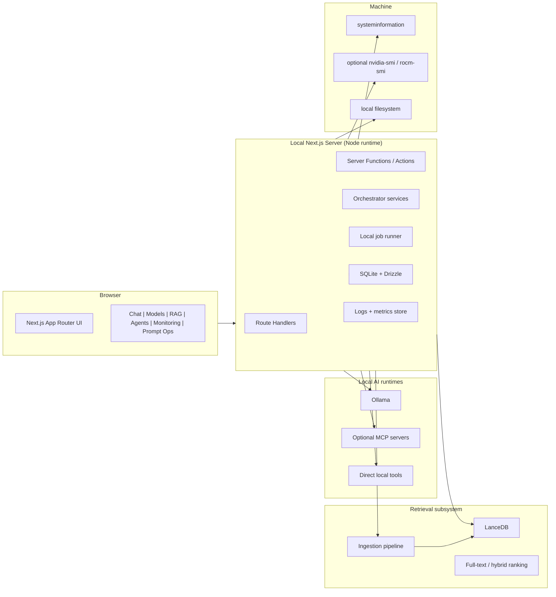

# Local AI Command Center Master Guide

**Canonical architecture, implementation plan, and verification guide**  
**Status:** consolidated and superseding `1.md`–`7.md`  
**Date:** March 17, 2026

---

## 0. What this guide is

This guide replaces the overlapping architecture drafts in this project with a single canonical reference.

It does four things:

1. Consolidates and deduplicates the source material.
2. Resolves the major architecture fork in the drafts.
3. Adds missing implementation guidance, operational detail, and current-source verification.
4. Produces one buildable plan for a local-first AI Command Center.

This is not a neutral average of every draft. Where the source files disagree, this guide makes an explicit decision and explains why.

### The core decision

The Command Center should be built first as a **local Next.js 15 App Router application running on the same machine as the local model runtime**, with **Ollama as the default inference runtime**, **SQLite + Drizzle** as the transactional store, **LanceDB** as the default vector store, **SSE** as the default streaming transport, and a **direct local tool registry** as the first tool-execution layer. **MCP remains a supported integration path, but not the initial mandatory foundation.**[^i1][^i2][^i3][^w1][^w2][^w5][^w7]

### Why this is the right consolidation

The source corpus clearly splits into two branches:

- a **Tauri desktop branch** centered on static export and a Node sidecar (`1.md`), and
- a **local-server Next.js branch** centered on Route Handlers, Server Actions, same-origin browser access, and local orchestration (`2.md`, `6.md`, `7.md`).

The local-server branch is both more internally coherent and better aligned with the product goals in the majority of the drafts: multi-panel operations, streaming, RAG, agents, monitoring, and prompt/eval workflows. The Tauri branch is still valuable, but it should be treated as a **future packaging option**, not the canonical architecture.[^i1][^i2][^w4]

---

## 1. Source normalization and what was deduplicated

Before synthesizing architecture, the source set must be normalized.

### 1.1 Source map

| File   | Role in synthesis                                                  | Status                                        |
| ------ | ------------------------------------------------------------------ | --------------------------------------------- |
| `1.md` | Tauri-first desktop architecture with static export + Node sidecar | retained as future-path appendix, not primary |
| `2.md` | Next.js local-server masterplan                                    | absorbed into canonical guide                 |
| `3.md` | Next.js blueprint                                                  | deduplicated                                  |
| `4.md` | exact duplicate of `3.md`                                          | removed from canonical reasoning set          |
| `5.md` | most exhaustive technical detail set                               | mined heavily for implementation patterns     |
| `6.md` | best articulation of browser/local-runtime deployment constraints  | absorbed into canonical guide                 |
| `7.md` | strongest concise Next.js local-server architecture                | absorbed into canonical guide                 |

### 1.2 Deduplication conclusions

The project had four forms of duplication:

**First, duplicated documents.**  
`3.md` and `4.md` are exact duplicates and should be treated as one source.[^i4]

**Second, duplicated architecture branches.**  
`2.md`, `6.md`, and `7.md` all describe roughly the same local-server architecture with different levels of detail.[^i1]

**Third, repeated decision tables.**  
Ollama, LanceDB, SQLite/Drizzle, SSE, and MCP show up repeatedly in slightly different prose, but the underlying decisions are broadly consistent.

**Fourth, duplicated implementation snippets.**  
The drafts repeat many of the same patterns: Route Handlers for streaming, SQLite for state, LanceDB for RAG, systeminformation for metrics, and MCP or a tool layer for agent capabilities.

### 1.3 What changed in this guide

This guide intentionally removes or demotes several ideas that appeared in individual drafts:

- **Tauri as the primary architecture** is demoted to an appendix path.
- **tRPC** is removed from the foundational stack. It can be added later, but Next.js Route Handlers + Server Functions already cover the main needs.
- **PGlite as the default primary datastore** is demoted to a fallback/experimental path.
- **WebSockets as the default stream transport** are replaced with SSE for the initial build.
- **MCP as a mandatory first-step execution layer** is deferred behind a direct tool-registry abstraction.
- **AI SDK provider glue as the primary runtime boundary** is demoted; the native Ollama API becomes the primary backend contract.

Those changes are deliberate refinements, not omissions.

---

## 2. Product definition

The Command Center is not "a chat UI with extras." It is a **local AI operations console**.

### 2.1 Product statement

The product is a **local-first, panel-driven control surface** for:

- interactive model inference,
- local multi-model routing,
- document ingestion and retrieval,
- tool and agent execution,
- runtime monitoring,
- prompt engineering and evaluation,
- and local operational governance.

### 2.2 Primary user

The primary user is a technically capable operator or developer running local models on a workstation or lab machine, who wants:

- more control than a consumer chat UI,
- less infrastructure than a distributed cloud AI stack,
- and better observability, reproducibility, and workflow support than "just hitting Ollama directly."

### 2.3 Non-goals

The initial build is **not**:

- a multi-tenant SaaS,
- a hosted cloud inference platform,
- a generic enterprise workflow engine,
- or a broad plugin marketplace.

Those can become later expansion paths, but the first build must optimize for **single-machine local operation**.

---

## 3. Canonical architecture decision record

This section is the center of gravity for the whole guide.

## ADR-001: Primary deployment model

**Decision:** Build the Command Center as a **local Next.js server application** running on the same machine as Ollama and any local tool or indexing processes.[^i1][^w1][^w2]

**Why:**

- It preserves **Route Handlers** and **Server Functions**.
- It keeps the browser on the same origin as the app server.
- It avoids the Tauri constraint that Next.js must be statically exported.
- It avoids mixed-content and localhost-from-hosted-origin headaches.
- It keeps architecture simpler for streaming, ingestion, monitoring, and file-backed persistence.[^w1][^w2][^w4]

**Consequence:** browser requests go to Next.js; Next.js talks to Ollama, SQLite, LanceDB, and local tools.

## ADR-002: Frontend shell

**Decision:** Use **Next.js 15 App Router** with **parallel routes**, **route groups**, **Tailwind CSS**, and **shadcn/ui**.

**Why:**

- The product is naturally multi-panel.
- App Router layouts and parallel routes fit a panelized operations console.
- The shell needs streaming and server-side orchestration, not just static pages.

## ADR-003: Backend pattern inside Next.js

**Decision:** Use **Route Handlers** for streaming and browser-facing non-UI endpoints; use **Server Functions / Server Actions** for mutations; use direct server-side service calls from Server Components rather than routing through internal HTTP whenever possible.[^w1][^w2][^w3]

**Why:**

- Next.js explicitly positions Route Handlers as custom request handlers in `app`.
- Next.js also advises that Server Components should fetch from the source directly, not via internal Route Handlers.
- Server Actions are designed primarily for mutations and are invoked over POST.[^w1][^w2][^w3]

**Consequence:** do not build a needless internal microservice layer inside the app.

## ADR-004: Inference runtime

**Decision:** **Ollama** is the primary runtime. Additional runtimes are optional adapters.

**Why:**

- It already exposes the features this project needs: chat, embeddings, model enumeration, running-model state, tool calling, thinking, and structured outputs.[^w5]
- It is local-first and ergonomically strong for a developer workstation.
- The source corpus strongly converges on it.

## ADR-005: Primary API surface to Ollama

**Decision:** Use Ollama's **native `/api/*` endpoints** as the primary contract. Use `/v1/*` only for compatibility cases.[^w5]

**Why:**

- The native API is the least lossy surface for Ollama-specific features.
- Tool calling, thinking, structured outputs, model state, and embeddings are all documented there.[^w5]
- OpenAI compatibility is documented as compatibility with **parts** of the OpenAI API, not the total surface.[^w5]

## ADR-006: Transactional persistence

**Decision:** Use **SQLite + Drizzle** as the system-of-record for local state.

**Why:**

- It fits the single-machine architecture.
- It keeps operational overhead low.
- Drizzle has direct SQLite support, and Next.js explicitly documents Node package opt-out support for `better-sqlite3` and Prisma-related packages in server code paths.[^w9][^w13]

## ADR-007: Vector store

**Decision:** Use **LanceDB** as the default vector store, with a storage abstraction so PGlite/pgvector can be added later.

**Why:**

- The source corpus consistently prefers LanceDB for local embedded operation.
- Current LanceDB docs explicitly support vector, full-text, and hybrid search, with built-in reranking via reciprocal rank fusion by default.[^w7]

## ADR-008: Initial tool execution layer

**Decision:** Implement a **direct tool registry** first. Add **MCP** as an optional provider behind the same abstraction.

**Why:**

- It reduces moving parts in the initial build.
- It avoids coupling the whole agent layer to the timing and maturity of MCP adoption.
- The TypeScript MCP SDK is real and useful, but the bridge should stay behind an interface.[^w6]

## ADR-009: Stream transport

**Decision:** Use **SSE** as the default browser transport for LLM streaming and live metrics.

**Why:**

- The core streams are mostly server-to-client.
- SSE works naturally with Route Handlers.
- It is operationally simpler than making WebSockets foundational.

## ADR-010: Authentication posture

**Decision:** Default to **localhost-only with no auth** for a single-user developer workstation, with **optional Auth.js Credentials** support for shared-machine mode.[^w11]

**Why:**

- The project is explicitly local-first.
- Auth.js Credentials provides a simple path for an optional gate without dragging in OAuth or remote identity providers.[^w11]

---

## 4. High-level system architecture

### 4.1 Runtime topology



### 4.2 Trust boundaries

The architecture should be reasoned about in four trust zones:

| Zone                     | What lives there                                | Trust posture                   |
| ------------------------ | ----------------------------------------------- | ------------------------------- |
| Browser                  | UI state, forms, SSE consumers                  | untrusted input boundary        |
| App server               | orchestration, persistence, auth, routing       | trusted application boundary    |
| Local tools and runtimes | Ollama, ingestion workers, optional MCP servers | semi-trusted execution boundary |
| Host machine             | OS metrics, files, process spawning             | highest privilege boundary      |

This matters because the system is local, but **local does not mean automatically safe**. Tool execution, filesystem access, and agent autonomy all cross important boundaries.

### 4.3 Design principles

The canonical architecture follows seven design principles:

1. **Local-first by default.**  
   No remote dependency should be required for core inference, retrieval, monitoring, or evaluation.

2. **Panel-first, not chat-first.**  
   Chat is one panel, not the entire product.

3. **Service boundaries inside one process.**  
   Keep code modular, but do not prematurely fragment into pseudo-microservices.

4. **Operational simplicity over stack maximalism.**  
   The best local architecture is the one that is easy to start, inspect, repair, and back up.

5. **Feature adapters over hard coupling.**  
   Runtimes, vector stores, and tool protocols should all sit behind narrow interfaces.

6. **Evaluation and observability are first-class, not post-MVP extras.**

7. **Human approval must remain possible wherever tools can mutate state.**

---

## 5. Canonical stack

### 5.1 Final stack table

| Layer                         | Chosen default                                              | Why                                                                                              |
| ----------------------------- | ----------------------------------------------------------- | ------------------------------------------------------------------------------------------------ |
| App shell                     | Next.js 15 App Router                                       | best fit for panelized UI + local server orchestration                                           |
| UI components                 | Tailwind CSS + shadcn/ui                                    | fast local product iteration and clear hierarchy                                                 |
| Client UI state               | Zustand                                                     | ideal for pane layout, filters, local ephemeral state                                            |
| Data mutation pattern         | Server Functions / Actions                                  | best for settings, prompt saves, job submissions[^w2][^w3]                                       |
| Streaming / browser endpoints | Route Handlers                                              | best for SSE, uploads, model proxying[^w1]                                                       |
| Inference runtime             | Ollama                                                      | local-first breadth: chat, embeddings, model ops, thinking, structured output, tool calling[^w5] |
| Optional provider bridge      | AI SDK community providers                                  | useful adapter layer, not the core contract[^w6]                                                 |
| Transaction DB                | SQLite                                                      | best fit for local metadata and queue state                                                      |
| ORM                           | Drizzle                                                     | direct, explicit, SQLite-friendly[^w9]                                                           |
| SQLite driver                 | better-sqlite3                                              | mature local fit; compatible via Next.js server package opt-out support[^w13]                    |
| Vector store                  | LanceDB                                                     | embedded, hybrid search and reranking support[^w7]                                               |
| Alternate vector path         | PGlite + pgvector                                           | useful experimental SQL-centric path[^w8]                                                        |
| Tool execution                | direct tool registry                                        | simplest safe first implementation                                                               |
| Optional tool protocol        | MCP TypeScript SDK                                          | standard integration path when needed[^w6]                                                       |
| Monitoring                    | systeminformation + Ollama `/api/ps` + optional vendor CLIs | low-friction local observability[^w5][^w10]                                                      |
| Eval harness                  | Promptfoo                                                   | local eval + red-team posture[^w12]                                                              |
| Optional auth                 | Auth.js Credentials                                         | simple local gate when required[^w11]                                                            |

### 5.2 What is explicitly not in the foundational stack

The following are useful but non-foundational:

- tRPC
- Prisma
- Tauri
- WebSockets as the default stream transport
- fully remote vector DBs
- remote auth providers
- cloud inference gateways
- hard MCP dependency on day one

That keeps the first system understandable.

---

## 6. App structure and code organization

### 6.1 Recommended route structure

```txt
app/
  (command-center)/
    layout.tsx
    page.tsx
    @chat/page.tsx
    @models/page.tsx
    @rag/page.tsx
    @agents/page.tsx
    @monitoring/page.tsx
    @prompts/page.tsx
  api/
    chat/route.ts
    models/route.ts
    metrics/route.ts
    rag/
      ingest/route.ts
      search/route.ts
    jobs/route.ts
    tools/
      [name]/route.ts
  auth/
    login/page.tsx
  actions/
    settings.ts
    prompts.ts
    jobs.ts
lib/
  app/
    services/
    orchestration/
    runtime/
    rag/
    tools/
    monitoring/
    persistence/
  db/
    schema.ts
    client.ts
```

### 6.2 Responsibility split

| Layer             | Responsibility                                               |
| ----------------- | ------------------------------------------------------------ |
| UI components     | rendering, local interactions, streaming consumption         |
| Server Components | assemble data for initial views by calling services directly |
| Server Functions  | mutate persistent state and enqueue work                     |
| Route Handlers    | streaming endpoints, uploads, browser-facing machine APIs    |
| Services          | business logic and orchestration                             |
| Persistence layer | Drizzle models, queries, transactions                        |
| Runtime adapters  | Ollama calls and future runtime compatibility                |
| Tool layer        | discovery, validation, execution, approval gates             |

### 6.3 One important refinement from research

The source drafts sometimes blur the line between internal service calls and internal HTTP calls. The refined rule is:

- if the caller is a **browser**, use a Route Handler or Server Function;
- if the caller is **server-side Next.js code**, call the service directly unless there is a real reason to cross HTTP.[^w2]

This keeps latency down and code easier to debug.

### 6.4 State model

Use the simplest state model that matches the system:

- **Server state**: fetched or derived on the server where possible.
- **Persistent application state**: SQLite.
- **Client transient state**: Zustand (active panel, filters, splitter sizes, visible trace sections, unsaved form state).
- **Long-lived streaming state**: event reducer/store in the browser, backed by persisted records on the server.

Avoid building a global client data cache unless real complexity proves it necessary.

---

## 7. Inference architecture

### 7.1 Core rule

The app server should own the inference workflow. The browser should never become the system integrator.

The browser sends a request to the Command Center. The Command Center:

1. validates the request,
2. resolves the model and runtime policy,
3. enriches context if needed,
4. streams or returns the response,
5. records metrics and artifacts.

### 7.2 Ollama usage model

Use Ollama as the runtime for:

- chat generation,
- single-turn generation,
- embeddings,
- model listing,
- loaded-model inspection,
- structured output generation,
- optional reasoning traces,
- and tool-calling-capable turns.[^w5]

Relevant documented capabilities include:

- `POST /api/chat`
- `POST /api/generate`
- `POST /api/embed`
- `GET /api/tags`
- `GET /api/ps`
- structured outputs via `format`
- reasoning via `think`
- tool calling, including streaming behavior[^w5]

### 7.3 Native API first, compatibility API second

**Primary surface:** native `/api/*` endpoints.  
**Secondary surface:** `/v1/*` compatibility endpoints for reused SDKs or experiments.[^w5]

This is a meaningful refinement over the draft set. It avoids designing the core system around a compatibility surface when the native surface already exposes the exact features the app needs.

### 7.4 Model registry

Maintain a local registry table that merges three types of data:

1. **actual installed models** from `/api/tags`,[^w5]
2. **currently loaded models** from `/api/ps`,[^w5]
3. **local annotations** maintained by the app.

Local annotations should include:

- human-friendly label,
- intended role (`general`, `code`, `reasoning`, `vision`, `embedding`, `router`, `judge`),
- known strengths,
- known weaknesses,
- preferred parameters,
- maximum safe context budget,
- tool-calling reliability,
- structured-output reliability,
- benchmark notes,
- and last-known latency statistics.

This avoids pretending the runtime can infer all capabilities itself.

### 7.5 Model routing

Use **task-first routing** rather than a simple "switch model" dropdown. The router should choose a model based on required capabilities.

#### Recommended routing dimensions

| Dimension            | Examples                                                                      |
| -------------------- | ----------------------------------------------------------------------------- |
| task type            | chat, coding, summarization, extraction, retrieval-augmented answer, tool use |
| output shape         | free text, JSON schema, citation-required, deterministic extraction           |
| special capabilities | vision, tool calling, thinking                                                |
| latency budget       | fast, balanced, deep                                                          |
| context budget       | short, medium, long                                                           |
| reliability priority | cheap-first, safe-first, best-first                                           |

A route request should resolve to a **model profile**, not just a raw model name.

### 7.6 Thinking and structured output

Two Ollama capabilities deserve first-class design treatment:

**Thinking traces.**  
Ollama documents a `think` field for supported models, with the reasoning trace returned separately from final answer content.[^w5]

**Structured outputs.**  
Ollama documents schema-constrained output via the `format` field.[^w5]

Use them deliberately:

- use **thinking** when the operator wants to inspect reasoning,
- use **structured outputs** for routing decisions, extraction, state compression, scoring outputs, and machine-readable eval artifacts.

Do not make raw natural-language parsing the backbone of orchestration when structured output is available.

### 7.7 Streaming design

Browser streaming should use **SSE from Next.js Route Handlers**.

Internally, the handler can consume Ollama's native stream, accumulate partial content safely, and emit normalized events such as:

- `token`
- `thinking`
- `tool_call`
- `metrics`
- `done`
- `error`

Normalize the stream once at the server boundary so the browser only handles one event grammar.

### 7.8 Cancellation, backpressure, and timeouts

The source drafts mention streaming, but the guide needs stronger operational detail.

#### Required behaviors

- user can abort an active generation,
- server stops forwarding downstream data,
- generation record is marked `cancelled`,
- partial output is persisted as partial output,
- downstream runtime call is aborted where supported,
- queue pressure is visible in metrics.

#### Timeout policy

Use at least three timeout classes:

| Timeout class         | Purpose                           |
| --------------------- | --------------------------------- |
| connect timeout       | local runtime unavailable or hung |
| first-token timeout   | model loaded but not producing    |
| total runtime timeout | runaway generation                |

Store timeout type in logs and job records so failures are diagnosable.

### 7.9 Example response lifecycle

1. Browser submits message.
2. Server validates conversation and model profile.
3. Server computes context budget.
4. If RAG enabled, retrieval runs.
5. Server opens Ollama stream.
6. Server normalizes chunks to SSE events.
7. Browser updates panel state.
8. Server stores final message, usage, timing, and optional trace summary.
9. Monitoring receives counters and latency buckets.

---

## 8. Context and memory management

### 8.1 Why this needs to be explicit

Several drafts correctly note that context overflow and "lost in the middle" problems become serious fast. This guide tightens the operational pattern.

### 8.2 Recommended conversation memory model

For each conversation store:

- recent verbatim turns,
- rolling summary,
- pinned instructions,
- optional retrieved evidence pack,
- token budget metadata,
- and model profile used.

### 8.3 Budget algorithm

At generation time:

1. reserve completion tokens,
2. reserve safety margin,
3. reserve space for retrieved evidence if enabled,
4. include pinned system instructions,
5. include rolling summary,
6. include most recent verbatim turns until the budget is full,
7. if needed, compress older turns into a refreshed summary.

### 8.4 When to summarize

Summarize when one of these is true:

- prompt budget would otherwise exceed safe capacity,
- model is switching to a smaller context model,
- conversation has become operationally long,
- or the operator explicitly requests conversation distillation.

### 8.5 Summary format

Use a structured summary object rather than free prose when possible:

```json
{
  "user_goal": "...",
  "open_questions": ["..."],
  "constraints": ["..."],
  "decisions_made": ["..."],
  "artifacts_created": ["..."],
  "next_actions": ["..."]
}
```

This is more reusable across model switches and eval flows than an unconstrained paragraph.

---

## 9. RAG architecture

### 9.1 RAG design goals

The retrieval subsystem should optimize for:

- local operation,
- source traceability,
- controllable chunking,
- hybrid retrieval,
- clean evidence packing,
- and easy evaluation.

### 9.2 Ingestion pipeline

Use a staged pipeline:

1. **Acquire**  
   upload file, import path, or select watched directory.

2. **Parse**  
   extract text and lightweight structure.

3. **Normalize**  
   convert into a unified internal document model.

4. **Annotate metadata**  
   source, timestamps, content type, section path, author if known, tags.

5. **Chunk**  
   apply document-type-specific chunking.

6. **Embed**  
   use Ollama embeddings against a single configured embedding model.

7. **Index**  
   write chunks + metadata to LanceDB and write document records to SQLite.

8. **Version**  
   record ingest run, chunking config, embedding model, and index version.

### 9.3 Recommended document model

Use three logical layers:

| Layer        | Purpose                                  |
| ------------ | ---------------------------------------- |
| document     | the original artifact record             |
| section/span | normalized structural unit               |
| chunk        | retrieval unit tied back to source spans |

The key design rule: **chunks must be traceable back to exact source spans or structural positions**. Retrieval without traceability produces poor operator trust.

### 9.4 Chunking defaults

The drafts discuss chunking, but the consolidated guide should make defaults concrete.

#### Prose and markdown

- split first by heading and subheading where possible,
- then recursively split into approximately 400-800 token chunks,
- use 10-15% overlap only when needed.

#### Code

- chunk by file, then function/class/module boundaries,
- keep imports and closely related declarations near usage,
- attach metadata for repository path, language, symbol name, and parent module.

#### PDFs and reports

- preserve section boundaries first,
- avoid arbitrary flat chunking if layout structure is recoverable,
- prefer paragraph blocks with section labels.

#### Tables and CSVs

- chunk by row groups,
- include headers with every chunk,
- include document-level table identity and schema metadata.

### 9.5 Embeddings

Use a single default embedding space per index. Do not mix embedding models inside the same retrieval collection.

**Recommended default:** `nomic-embed-text` through Ollama, unless benchmarking proves another model materially better for the corpus.

The important operational rule is not the brand of model; it is **embedding consistency**.

### 9.6 Why LanceDB is the default

LanceDB is the best default here because it matches the product's actual needs:

- embedded local storage,
- vector search,
- full-text search,
- hybrid search,
- and reranking support, including default reciprocal rank fusion behavior in hybrid flows.[^w7]

That makes it a better default than prematurely forcing all retrieval into the transactional SQL store.

### 9.7 Retrieval pipeline

The default retrieval should be **two-stage**.

#### Stage 1: candidate generation

- vector search top-K
- full-text search top-K
- fuse via RRF

#### Stage 2: reranking

- optional reranker on the fused candidate set
- then context packing into the answer prompt

The key refinement over the source drafts is that this should be implemented as a **retrieval policy**, not as one hard-coded algorithm. That allows later variation by corpus and benchmark results.

### 9.8 Context packing

Once candidates are reranked, pack them into the final prompt using rules that avoid context waste:

- deduplicate near-identical chunks,
- prefer fewer high-information chunks over many noisy ones,
- keep citation metadata next to each chunk,
- enforce max evidence budget,
- keep chunk order stable when order matters.

### 9.9 Retrieval output contract

A retrieval call should return structured data like:

```ts
type RetrievedChunk = {
  chunkId: string
  documentId: string
  score: number
  rerankScore?: number
  sourceLabel: string
  citationLabel: string
  text: string
  metadata: Record<string, unknown>
}
```

The answer layer should never receive raw vector rows without source semantics.

### 9.10 RAG quality loop

Promptfoo's current RAG evaluation guide explicitly recommends evaluating **retrieval** and **generation** separately.[^w12]

That should become a hard practice in this project.

Track at least:

- retrieval recall,
- context relevance,
- answer grounding,
- answer correctness,
- citation correctness,
- and latency.

### 9.11 RAG security posture

Promptfoo's current RAG red-teaming guide explicitly calls out prompt injection, sensitive-data exposure, and permission concerns in RAG applications.[^w12]

Therefore the RAG subsystem should include:

- source allowlists,
- document trust labels,
- retrieval-time metadata filters,
- answer-time citation rendering,
- and red-team fixtures specifically for injection and exfiltration attempts.

---

## 10. Tooling, agents, and MCP

### 10.1 Consolidated position

The source drafts are right that tools and agents are a core feature. But the build order matters.

The correct implementation order is:

1. direct tool registry,
2. agent runner using the tool registry,
3. approval and safety layers,
4. optional MCP adapter behind the same tool interface.

This is safer and easier to debug than making the first agent implementation depend on MCP from day one.

### 10.2 Tool registry contract

Represent every executable capability as a typed tool descriptor:

```ts
type ToolDescriptor = {
  name: string
  description: string
  inputSchema: unknown
  outputSchema?: unknown
  riskLevel: 'low' | 'medium' | 'high'
  requiresApproval: boolean
  executor: (input: unknown, ctx: ToolContext) => Promise<unknown>
}
```

### 10.3 Tool classes

The initial tool surface should be narrow and useful:

| Tool class                   | Examples                                        | Default approval           |
| ---------------------------- | ----------------------------------------------- | -------------------------- |
| read-only local info         | read file, list models, inspect DB, get metrics | auto                       |
| bounded local transforms     | summarize file, index file, extract schema      | auto                       |
| side-effectful local actions | write file, delete file, modify config          | manual                     |
| shell / code execution       | run script, execute tests                       | manual                     |
| networked actions            | optional web fetch or cloud APIs                | manual and visibly labeled |

### 10.4 Agent runner

The agent runner should be intentionally boring:

1. build system prompt,
2. present tool schemas,
3. run model turn,
4. detect tool call,
5. validate arguments,
6. require approval if needed,
7. execute tool,
8. append tool result,
9. continue until completion or limit reached.

No hidden autonomy. No uncontrolled background behavior.

### 10.5 MCP integration strategy

The MCP TypeScript SDK documents support for both building MCP clients and servers and using stdio and Streamable HTTP transports.[^w6]

That makes MCP a good **optional interoperability layer**, but not a required early dependency.

#### Recommended MCP topology when added

- Command Center acts as MCP client/host.
- Local MCP servers run as separate processes.
- `stdio` is preferred for local process-spawned tools.
- Streamable HTTP is preferred only when there is a real multi-client or service lifecycle reason.[^w6]

### 10.6 Safety model for tools

Tools need four lines of defense:

1. **schema validation**
2. **capability scoping**
3. **approval gates**
4. **audit logging**

Every tool invocation should record:

- who or what triggered it,
- arguments,
- approval status,
- runtime duration,
- result summary,
- and failure mode.

### 10.7 Job queue

Long-running work should not live inside request-response cycles.

The queue should handle:

- document ingestion,
- batch evals,
- red-team runs,
- export jobs,
- agent runs that exceed interactive thresholds,
- and reindexing.

A SQLite-backed state machine is enough for the first version:

`queued -> running -> succeeded | failed | retrying | cancelled`

### 10.8 Why MCP is not first

This is an important synthesis decision.

MCP is worth supporting because it standardizes tool exposure, but the project does not need to bet initial correctness on a custom MCP-to-agent bridge. The bridge belongs behind `ToolExecutionProvider`, not in the center of the app.

That retains interoperability without over-complicating the first milestone.

---

## 11. Persistence design

### 11.1 Why SQLite is the system of record

The product is a single-machine local application. That means the transactional store should optimize for:

- simplicity,
- reliability,
- inspectability,
- local backups,
- zero extra services.

SQLite is the correct default.

### 11.2 Why Drizzle is the ORM

Drizzle keeps the schema explicit and close to SQL, and it is well aligned with local SQLite development.[^w9]

### 11.3 Compatibility note from current Next.js docs

Current Next.js docs state that server-side dependencies are automatically bundled, and that `better-sqlite3`, `@prisma/client`, and `prisma` are on the framework's current automatic opt-out list for server package compatibility handling.[^w13]

That does not mean every pattern is free of edge cases, but it reduces friction for using a Node-native SQLite driver in Route Handlers and server code.

### 11.4 Core entities

At minimum, persist these entities:

| Entity            | Purpose                                    |
| ----------------- | ------------------------------------------ |
| conversations     | chat sessions and high-level metadata      |
| messages          | user, assistant, tool, and system messages |
| model_profiles    | local app metadata for installed models    |
| runtime_snapshots | model inventory and loaded-model state     |
| documents         | source documents                           |
| chunks            | retrieval units                            |
| indexes           | vector index versions and configs          |
| jobs              | background work                            |
| tool_runs         | tool audit trail                           |
| prompt_templates  | versioned prompt definitions               |
| prompt_runs       | prompt/eval executions                     |
| experiments       | A/B or benchmark groupings                 |
| metrics_rollups   | sampled operational metrics                |
| settings          | app configuration                          |

### 11.5 Suggested relational split

Keep **transactional metadata** in SQLite and **high-volume vectors** in LanceDB.

Do not force vectors into SQLite just because it is convenient to have one store. Retrieval and transactional state have different access patterns.

### 11.6 Backup model

Support three backup/export modes:

1. SQLite export,
2. LanceDB index snapshot,
3. zipped project state bundle including settings and prompt templates.

A local tool is only truly local-first if it is easy to back up and restore.

---

## 12. Monitoring and observability

### 12.1 Metrics sources

Use three classes of telemetry:

1. **Application metrics**
   - request counts
   - latency
   - queue depth
   - failures
   - cancellations

2. **Runtime metrics**
   - loaded models
   - model VRAM footprint
   - context length
   - generation token rates
   - embedding throughput

3. **Host metrics**
   - CPU load
   - RAM
   - storage
   - network
   - GPU controller and VRAM info

### 12.2 Source selection

Current systeminformation docs describe it as a backend/server-side Node package for hardware, OS, process, and load information, with dedicated docs for `graphics()` and `currentLoad()`; the stats documentation also notes that rate-like values become meaningful on the second poll rather than the first.[^w10]

That gives us a clean monitoring baseline.

Combine it with Ollama's documented `/api/ps` endpoint for loaded-model state such as `size_vram` and `context_length`.[^w5]

### 12.3 Monitoring transport

Use SSE for the first monitoring panel. Suggested cadence:

- 1s for core system panel
- 2-5s for heavier history charts
- event-driven updates for queue transitions when convenient

### 12.4 Monitoring views

The monitoring area should have at least five views:

1. **System health**
2. **Inference performance**
3. **Loaded models**
4. **Queue and jobs**
5. **RAG ingestion / index status**

### 12.5 Logging

Use structured logs with event categories:

- `inference`
- `retrieval`
- `tool`
- `queue`
- `auth`
- `metrics`
- `system`

Persist summary-level events to SQLite and rotate verbose logs to files.

### 12.6 Retention

Recommended retention policy:

| Data                        | Retention                |
| --------------------------- | ------------------------ |
| fine-grained system samples | 7 days                   |
| rolled-up hourly metrics    | 90 days                  |
| prompt/eval results         | keep unless pruned       |
| queue history               | 30-90 days               |
| inference summaries         | keep unless user deletes |

---

## 13. Prompt operations and evaluation

### 13.1 Why this is a first-class subsystem

The project drafts consistently include prompt versioning and evaluations, and they are right to do so. In a tool like this, prompt engineering is part of operations.

### 13.2 Prompt template model

Each prompt template should have:

- stable slug,
- semantic version,
- variable schema,
- render rules,
- intended tasks,
- supported model profiles,
- eval notes,
- and status (`draft`, `active`, `deprecated`).

### 13.3 Prompt runs

Every significant model run should be attributable to:

- prompt version,
- model profile,
- input variables,
- retrieval config if any,
- tool policy,
- latency,
- output,
- and optional score.

### 13.4 Eval harness recommendation

Promptfoo currently positions itself as an open-source local CLI/library for evaluation and red-teaming of LLM apps, and its RAG evaluation guide explicitly recommends separating retrieval evaluation from output evaluation.[^w12]

That makes it a strong default harness for this project.

### 13.5 What to evaluate

At minimum evaluate:

| Area           | Metrics                                                   |
| -------------- | --------------------------------------------------------- |
| prompt quality | correctness, structure, brevity, refusal behavior         |
| model choice   | latency, failure rate, output quality                     |
| RAG retrieval  | recall, context relevance, citation hit rate              |
| RAG generation | grounding, answer correctness, hallucination rate         |
| tool use       | argument correctness, approval behavior, failure recovery |
| agent behavior | task completion, retry quality, unsafe action rate        |

### 13.6 Red-teaming

Promptfoo's current documentation includes RAG red-teaming and MCP security testing guides.[^w12]

Use that as a concrete reason to include red-team fixtures early for:

- prompt injection,
- retrieval poisoning,
- PII leakage,
- role bypass,
- and unsafe tool escalation.

### 13.7 Eval datasets

Store local evaluation datasets in plain text or structured JSON files, versioned with the app or user workspace. Avoid hiding eval logic inside notebooks or ad hoc scripts.

### 13.8 Release gate

No change to model defaults, retrieval policy, or agent behavior should be promoted without:

- a small regression suite,
- a retrieval benchmark if RAG is affected,
- and a quick safety test if tools are affected.

---

## 14. Security, privacy, and network model

### 14.1 Default network posture

The app should default to:

- Next.js bound locally,
- Ollama bound locally,
- no remote callbacks required,
- no silent cloud fallback.

### 14.2 Ollama local binding

Ollama documents configurable host binding and OpenAI compatibility separately; keep it on localhost unless there is a conscious reason to expose it.[^w5]

### 14.3 Why hosted UI plus localhost runtime is not the primary path

Even when a browser can technically reach `localhost`, mixing a hosted secure UI with a local insecure runtime introduces avoidable origin and deployment complexity. The canonical architecture avoids that entirely by running the app server locally on the same machine.

### 14.4 Auth posture

For a developer workstation, **no auth** is acceptable if:

- the server binds only locally,
- no other user shares the machine,
- and dangerous tools are disabled by default.

For shared machines, add a local login gate using Auth.js Credentials.[^w11]

### 14.5 Secrets handling

If optional networked tools are enabled:

- store secrets only server-side,
- encrypt stored secrets where feasible,
- clearly label all cloud-assisted features,
- never expose secrets to browser code.

### 14.6 Tool permission model

Every tool should carry:

- scope,
- risk level,
- allowed roots or resources,
- approval requirement,
- and audit status.

### 14.7 Filesystem safety

If filesystem tools are enabled:

- use explicit allowed roots,
- deny path traversal,
- never execute arbitrary shell from raw model text,
- and treat file deletion, overwrite, and command execution as privileged actions.

### 14.8 RAG and agent threat model

The source drafts mention security, but the consolidated guide should make the risks concrete.

Key risks:

- prompt injection via retrieved documents,
- data exfiltration through tool use,
- unsafe shell/file actions,
- credential leakage,
- stale or misleading retrieval evidence,
- and over-trusting model-generated JSON or plans.

Mitigations:

- schema validation,
- approval gates,
- source trust labels,
- retrieval filtering,
- sandboxing,
- and red-team suites.

---

## 15. Phased implementation plan

### Phase 0 - foundation and diagnostics

**Goal:** establish the shell and runtime confidence.

Deliver:

- app shell with route groups and panels
- runtime diagnostics page
- installed model inventory
- loaded-model view
- persisted settings
- logging skeleton

Exit criteria:

- app starts locally
- Ollama connection can be tested
- model list and running models render correctly

### Phase 1 - interactive inference

**Goal:** excellent single-turn and chat streaming.

Deliver:

- SSE chat endpoint
- model profiles
- conversation persistence
- abort/cancel behavior
- structured-output utilities
- reasoning trace panel

Exit criteria:

- streaming is stable
- abort works
- latency/usage are logged
- model switching is reliable

### Phase 2 - RAG

**Goal:** indexed local knowledge workflows.

Deliver:

- ingestion pipeline
- document/chunk metadata
- LanceDB integration
- hybrid retrieval policy
- citations panel
- retrieval eval fixtures

Exit criteria:

- documents can be indexed, searched, cited, and reindexed
- retrieval and generation are evaluated separately

### Phase 3 - tools and agents

**Goal:** bounded useful automation.

Deliver:

- direct tool registry
- approval UI
- tool logs
- job queue
- agent runner
- optional MCP adapter interface

Exit criteria:

- tools are safe and inspectable
- agent runs can be resumed, cancelled, and audited

### Phase 4 - monitoring and prompt ops

**Goal:** make the system operationally mature.

Deliver:

- monitoring dashboard
- prompt versioning
- benchmark/eval views
- regression suite
- security tests
- export/import

Exit criteria:

- core operations visible
- prompt and retrieval changes can be evaluated before rollout

---

## 16. Verification matrix and open technical questions

This project should track open questions explicitly rather than burying them in prose.

| Question                                          | Why it matters                        | Test                                                                                              |
| ------------------------------------------------- | ------------------------------------- | ------------------------------------------------------------------------------------------------- |
| Streaming tool-call behavior across chosen models | tool reliability is central to agents | run standardized tool-call prompts in streaming and non-streaming mode across chosen local models |
| Structured-output reliability per model           | routing and extraction depend on it   | run JSON-schema eval suite against candidate models                                               |
| Retrieval quality by chunking policy              | chunking drives RAG quality           | benchmark fixed, heading-aware, and code-aware chunkers                                           |
| Hybrid retrieval latency                          | local UX depends on it                | measure p50/p95 with and without reranker                                                         |
| systeminformation GPU accuracy by OS              | monitoring quality depends on it      | compare with vendor CLI output under load                                                         |
| Queue crash recovery                              | durability matters for long jobs      | kill app mid-job and verify resumption logic                                                      |
| PGlite readiness for this workload                | useful fallback path                  | benchmark local corpus sizes before adopting as primary vector path                               |

### Required benchmark set before declaring the system "done"

1. chat latency benchmark
2. embedding throughput benchmark
3. retrieval quality benchmark
4. tool-call reliability benchmark
5. queue recovery test
6. injection and unsafe-tool red-team test

---

## 17. Anti-patterns to avoid

This section is intentionally blunt.

### 17.1 Do not build the primary product around Tauri first

It adds sidecar and static-export complexity too early.

### 17.2 Do not route server-side reads through your own Route Handlers

Next.js advises direct server-side fetching from the source for Server Components.[^w2]

### 17.3 Do not make MCP mandatory for basic tools

The first tool layer should work without it.

### 17.4 Do not treat `/v1/*` compatibility as the canonical Ollama contract

Use native `/api/*` first.[^w5]

### 17.5 Do not store transactional metadata and vectors in one store unless the workload proves it better

Different workloads deserve different storage choices.

### 17.6 Do not let the model decide dangerous actions without approval

Especially for filesystem, shell, or network side effects.

### 17.7 Do not make monitoring an afterthought

Without runtime visibility, local AI tools become opaque and hard to trust.

### 17.8 Do not evaluate RAG only at the final answer layer

Evaluate retrieval and generation separately.[^w12]

---

## 18. Future paths

### 18.1 Tauri packaging path

Tauri remains a valid future packaging route, but only after the local-server architecture is stable.

Why it is not primary:

- Tauri's Next.js guidance says to use static export via `output: 'export'`.
- Tauri does not support server-based Next.js solutions in that configuration.[^w4]

That means the moment Tauri becomes primary, you lose the natural use of Route Handlers and server orchestration and must push more logic into sidecars or the Rust core.

The better sequence is:

1. finish the local-server product,
2. identify what must be packaged,
3. then decide between:
   - Tauri wrapper with sidecar,
   - native installer for local server app,
   - or containerized local deployment.

### 18.2 Additional runtime adapters

After Ollama is stable, add adapters for:

- llama.cpp server
- LocalAI
- LM Studio server
- vLLM for heavier machines

But add them through a runtime adapter interface, not by scattering provider logic across panels.

### 18.3 Multi-user mode

Only after the single-user local system is strong:

- add auth by default,
- add stronger audit trails,
- add user-scoped workspaces,
- then consider remote access.

---

## 19. Final canonical recommendation

If the project needs one paragraph to govern all future work, it is this:

> Build the Command Center as a **local Next.js 15 App Router application running on the same machine as Ollama**, using **Route Handlers for streaming and machine APIs**, **Server Functions for mutations**, **SQLite + Drizzle for persistent state**, **LanceDB for retrieval**, **SSE for browser streaming**, and a **direct local tool registry** as the initial agent/tool layer. Keep **MCP**, **PGlite**, **additional runtimes**, and **Tauri packaging** behind clearly bounded abstractions or later phases. Optimize for **local operability, observability, evaluation, and safety**, not stack cleverness.

That is the architecture this guide recommends and the one future project work should assume unless an explicit ADR supersedes it.

---

## Appendix A - Minimal starter interfaces

### Runtime adapter

```ts
export interface RuntimeAdapter {
  id: string
  listModels(): Promise<RuntimeModel[]>
  listRunningModels(): Promise<RuntimeModelState[]>
  chat(req: ChatRequest, signal?: AbortSignal): Promise<ResponseStream>
  embed(req: EmbedRequest, signal?: AbortSignal): Promise<number[][]>
}
```

### Vector store adapter

```ts
export interface VectorStoreAdapter {
  upsertDocuments(docs: IndexedChunk[]): Promise<void>
  hybridSearch(query: SearchRequest): Promise<RetrievedChunk[]>
  deleteByDocument(documentId: string): Promise<void>
  listIndexes(): Promise<IndexRecord[]>
}
```

### Tool execution provider

```ts
export interface ToolExecutionProvider {
  listTools(): Promise<ToolDescriptor[]>
  executeTool(name: string, input: unknown, ctx: ToolContext): Promise<unknown>
}
```

These interfaces are the key to keeping the system evolvable.

---

## Appendix B - Suggested initial schema set

```txt
conversations
messages
model_profiles
runtime_snapshots
documents
chunks
indexes
jobs
tool_runs
prompt_templates
prompt_runs
experiments
metrics_rollups
settings
```

Keep the first schema small and legible. Expand only when real features need it.

---

## Appendix C - Research notes used to enrich this guide

This guide was enhanced with current-source verification from:

- current Next.js App Router docs for Route Handlers, Server Functions, server package compatibility, and Backend-for-Frontend guidance,
- current Tauri Next.js guidance,
- current Ollama docs for chat, embeddings, model listing, running-model inspection, tool calling, thinking, structured outputs, and OpenAI compatibility,
- current AI SDK community-provider docs for Ollama,
- current LanceDB hybrid-search docs,
- current PGlite docs,
- current Drizzle SQLite docs,
- current Auth.js Credentials docs,
- current systeminformation docs,
- and current Promptfoo evaluation and RAG red-team docs.

---

## Appendix D - Source notes

[^i1]: `2.md`, `6.md`, and `7.md` all converge on a local-server Next.js architecture with Ollama, local persistence, RAG, agents, and monitoring.

[^i2]: `1.md` is the divergent Tauri-first branch that requires static export and a stronger sidecar-based architecture.

[^i3]: `5.md` is the deepest technical draft and provided many of the strongest implementation patterns that were retained here.

[^i4]: `3.md` and `4.md` are exact duplicates and were treated as one source during consolidation.

[^w1]: Next.js official documentation, "Route Handlers," updated February 27, 2026. Route Handlers are custom request handlers in the `app` directory using the Web `Request` and `Response` APIs.

[^w2]: Next.js official documentation, "Backend for Frontend" and "Updating Data," updated March 2026. Server Components should fetch directly from the source instead of internal Route Handlers; Server Functions are designed for server-side mutations, and Route Handlers remain appropriate for browser-facing endpoints and parallel work.

[^w3]: Next.js official documentation, `serverActions` config reference, updated March 16, 2026. Server Actions became stable in Next.js 14 and are invoked over POST.

[^w4]: Tauri official documentation, "Next.js." Tauri's Next.js guidance requires static export via `output: 'export'` and states that Tauri does not support server-based solutions in that setup.

[^w5]: Ollama official documentation, including `api/chat`, `api/embed`, `api/tags`, `api/ps`, `tool-calling`, `thinking`, `structured-outputs`, and `openai-compatibility`, accessed March 2026.

[^w6]: Model Context Protocol official TypeScript SDK documentation, accessed March 2026. The SDK supports building clients and servers and documents stdio and Streamable HTTP transports.

[^w7]: LanceDB official documentation, "Hybrid Search," accessed March 2026. LanceDB documents hybrid search combining vector and full-text techniques and notes reciprocal rank fusion as the default reranker in its hybrid flow.

[^w8]: PGlite official documentation and Electric product documentation, accessed March 2026. PGlite is a lightweight WASM Postgres packaged for JavaScript runtimes and supports extensions including pgvector.

[^w9]: Drizzle official SQLite documentation, accessed March 2026. Drizzle supports SQLite drivers including `better-sqlite3`.

[^w10]: systeminformation official documentation, accessed March 2026. The package is a backend/server-side Node system information library; `graphics()` and `currentLoad()` are relevant here, and some rate metrics become meaningful on the second polling call.

[^w11]: Auth.js official documentation, accessed March 2026. The Credentials provider supports arbitrary local credentials and is appropriate when you do not need full external identity-provider complexity.

[^w12]: Promptfoo official documentation, updated March 2026. Promptfoo positions itself as an open-source local eval and red-team framework; its RAG evaluation guidance explicitly separates retrieval evaluation from generation evaluation, and its security docs include RAG and MCP-focused red-team guidance.

[^w13]: Next.js official documentation, `serverExternalPackages`, updated March 16, 2026. The current automatic opt-out list includes `better-sqlite3`, `@prisma/client`, and `prisma`.
